## {#title-custom .center background-color="white"}

:::{style="display: flex; justify-content: center; align-items: center; gap: 2.5em; margin-bottom: 1em;"}
{height=100}
{height=100}
:::

### Linearized AVO Inversion {style="margin-bottom: 0.1em;"}
#### Quantitative Interpretation of Seismic Amplitudes {style="color: #555; font-weight: normal;"}

**Felix J. Herrmann**

School of Earth & Atmospheric Sciences — Georgia Institute of Technology

Slides are adapted from Eric Verschuur

## Outline {.smaller}

:::: {.columns}
::: {.column width="50%"}

**Part I — Acoustic Reflection & Amplitudes**

- Factors affecting seismic amplitudes
- Normal-incidence reflection coefficient
- Linearization and impedance formulation
- Non-ray amplitude effects

**Part II — Linearized Acoustic Inversion**

- Convolutional model
- Matrix formulation: $\mathbf{d} = \mathbf{W}\mathbf{D}\mathbf{m}$
- Least-squares inversion for impedance

**Part III — Elastic Wave Equation & Zoeppritz**

- Elastic wave equation and body waves
- Boundary conditions and Snell's law
- Zoeppritz equations and their linearization

:::
::: {.column width="50%"}

**Part IV — Linearized Convolutional Model**

- Background media and their properties
- Ray-parameter-dependent $R_{PP}$
- Linearized convolutional model in $\tau$-$p$

**Part V — AVO/AVP Inversion Workflow**

- Linear Radon transform and angle gathers
- Relation between Radon amplitudes and reflection coefficients
- Damped least-squares inversion
- The spectral gap
- Practical workflow

:::
::::

# Part I — Acoustic Reflection & Amplitudes {background-color="#2c3e50" style="color: white;"}

## What Affects Seismic Amplitudes? {.smaller}

From a ray-theoretical point of view, three factors control the amplitudes of seismic waves:

. . .

::: {.incremental}

1. **Geometric spreading** — wavefront divergence reduces amplitude with distance

2. **Reflection and transmission coefficients** — amplitude partitioning at interfaces, governed by contrast in elastic properties

3. **Attenuation (damping)** — energy loss due to absorption and scattering

:::

. . .

::: {.callout-note}
## Transport equation
These amplitude effects are described by the **transport equation**, the second-order term in the asymptotic ray expansion of the wave equation solution.
:::

## The Eikonal and Transport Equations {.smaller}

The asymptotic ray expansion of the wave equation solution $u(\mathbf{x}, t) \approx A(\mathbf{x})\,f\!\bigl(t - T(\mathbf{x})\bigr)$ leads to two equations:

. . .

**Eikonal equation** (governs ray geometry — traveltimes):

$$
\boxed{|\nabla T|^2 = \frac{1}{c^2(\mathbf{x})}}
$$

. . .

**Transport equation** (governs amplitudes along rays):

$$
\boxed{2\,\nabla T \cdot \nabla A + A\,\nabla^2 T = 0}
$$

. . .

::: {.callout-note}
The eikonal equation determines the traveltime field $T(\mathbf{x})$ — ray paths are perpendicular to the wavefronts $T = \text{const}$. The transport equation determines how the amplitude $A(\mathbf{x})$ varies along these rays, accounting for geometric spreading.
:::

## Non-Ray Amplitude Effects {.smaller}

Beyond the ray-theoretical amplitude factors, several **wave-equation effects** influence recorded amplitudes:

::: {.incremental}
- **Multiple reflections** — interfering arrivals from multiple bounces
- **Thin-layer effects** — showing up as dispersion and apparent damping
- **Dispersive surface waves** — guided modes with frequency-dependent velocity
- **Resonances** — constructive interference in layered structures
- **Evanescent waves** — non-propagating waves
:::

. . .

::: {.callout-note}
These effects are **not captured** by the linearized convolutional model. Accounting for them requires full-waveform modeling or specialized corrections.
:::


## Normal-Incidence Acoustic Reflection Coefficient {.smaller}

Consider a planar interface separating two acoustic media with densities $\rho_1, \rho_2$ and velocities $c_1, c_2$.

. . .

The **normal-incidence reflection coefficient** is:

$$
\boxed{R = \frac{\rho_2 c_2 - \rho_1 c_1}{\rho_2 c_2 + \rho_1 c_1} = \frac{Z_2 - Z_1}{Z_2 + Z_1}}
$$

where the **acoustic impedance** is $Z = \rho \, c$.

. . .

::: {.callout-tip}
The reflection coefficient $R$ depends only on the impedance **contrast** across the interface. It ranges from $-1$ to $+1$.
:::

## Linearization of the Reflection Coefficient {.smaller}

For small impedance contrasts ($\Delta Z \ll \bar{Z}$), we write $Z_2 = \bar{Z} + \tfrac{1}{2}\Delta Z$ and $Z_1 = \bar{Z} - \tfrac{1}{2}\Delta Z$, where $\bar{Z} = \tfrac{1}{2}(Z_1 + Z_2)$:

$$
R = \frac{Z_2 - Z_1}{Z_2 + Z_1} = \frac{\Delta Z}{2\bar{Z}} 
$$

. . .

Since $\Delta \ln Z \approx \Delta Z / \bar{Z}$ for small contrasts:

$$
\boxed{R \approx \frac{1}{2}\Delta \ln Z}
$$

. . .

**Two equivalent expressions for the linearized acoustic reflection coefficient:**

::: {.incremental}
- In terms of impedance contrast: $R = \frac{1}{2}\frac{\Delta Z}{\bar{Z}}$
- In terms of log-impedance: $R \approx \frac{1}{2}\Delta \ln Z$
:::

## When Is the Linearized Approximation Valid? {.smaller}

The linearized reflection coefficient $R \approx \frac{1}{2}\Delta\ln Z$ is a good approximation when:

::: {.incremental}
- The impedance contrast is **small**: $|\Delta Z / \bar{Z}| \ll 1$
- In practice, contrasts of up to about **20%** still yield reasonable accuracy
- The linearization fails near **critical angles** and for **large contrasts** (e.g., salt–sediment or water–rock interfaces)
:::

. . .

::: {.callout-important}
## Validity condition
The linearized approximation is the foundation of AVO inversion. Its validity depends on the media having **small relative contrasts** in density and velocity across interfaces.
:::


# Part II — Linearized Acoustic Inversion {background-color="#2c3e50" style="color: white;"}

## The Convolutional Model {.smaller}

The linear convolutional model represents a seismic trace as the convolution of a **source wavelet** $w(t)$ with the earth's **reflectivity** series:

$$
d(t) = w(t) * r(t) = \sum_i R_i \, a_i \, w(t - t_i)
$$

where $R_i$ is the reflection coefficient at the $i$-th interface, $a_i$ accounts for propagation effects, and $t_i$ is the two-way traveltime.

. . .

**Key assumptions:**

::: {.incremental}
- Single scattering (no multiples)
- Amplitudes proportional to reflection coefficients
<!-- - Two-way transmission losses neglected -->
- Known source wavelet
:::

## From Reflectivity to Impedance {.smaller}

Using the linearized relation $R_i \approx \frac{1}{2}\Delta\ln Z_i$, the reflectivity at each interface is the **half-derivative of log-impedance**:

$$
r_i = \frac{1}{2}\left(\ln Z_{i+1} - \ln Z_i\right)
$$

. . .

In vector form with $\mathbf{m} = \begin{pmatrix} \ln Z_1, \ln Z_2, \ldots, \ln Z_N \end{pmatrix}^\top$, we can write:

$$
\mathbf{r} = \frac{1}{2}\mathbf{D}\,\mathbf{m}
$$

where $\mathbf{D}$ is the **first-difference matrix**:

$$
\mathbf{D} = \begin{pmatrix} -1 & 1 & 0 & \cdots \\ 0 & -1 & 1 & \cdots \\ & & \ddots & \ddots \end{pmatrix}
$$

## Matrix Formulation: $\mathbf{d} = \mathbf{A}\,\mathbf{m}$ {.smaller}

The seismic trace is a convolution of the wavelet with reflectivity, represented as:

$$
\mathbf{d} = \mathbf{W}\,\mathbf{r} = \frac{1}{2}\mathbf{W}\,\mathbf{D}\,\mathbf{m}
$$

. . .

where **$\mathbf{W}$** is the **wavelet convolution matrix** (Toeplitz), and **$\mathbf{D}$** is the **first-difference matrix**.

$$
\boxed{\mathbf{d} = \mathbf{A}\,\mathbf{m}, \quad \text{with} \quad \mathbf{A} = \tfrac{1}{2}\mathbf{W}\,\mathbf{D}}
$$

. . .

::: {.callout-important}
## Two key matrices
1. **$\mathbf{W}$** — the wavelet convolution matrix maps reflectivity to seismic data
2. **$\mathbf{D}$** — the derivative matrix maps log-impedance to reflectivity

Together they express the **linear relationship** between recorded amplitudes and the acoustic medium properties (log-impedance).
:::

## Least-Squares Inversion for Impedance {.smaller}

Inverting $\mathbf{d} = \mathbf{A}\,\mathbf{m}$ via least-squares:

$$
\hat{\mathbf{m}} = \left(\mathbf{A}^\top\mathbf{A}\right)^{-1}\mathbf{A}^\top\mathbf{d}
$$

. . .

**Challenges:**

- Potentially **unstable** (ill-conditioned $\mathbf{A}^\top\mathbf{A}$)
- **No recovery of low-frequency** component of impedance (the wavelet is band-limited)

## Impedance Inversion with a Background  {.smaller}

**Approach:** start with a low-frequency **background model** $\mathbf{m}_0$ and solve for perturbations $\delta\mathbf{m}$:

<!-- $$
\mathbf{d} = \mathbf{A}\,(\mathbf{m}_0 + \delta\mathbf{m}) \quad \Rightarrow \quad \mathbf{d} - \mathbf{A}\,\mathbf{m}_0 = \mathbf{A}\,\delta\mathbf{m}
$$ -->

. . .

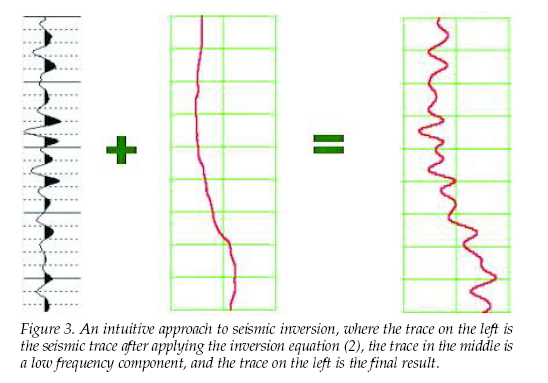{fig-align="center" width="55%"}

The low-frequency background comes from well logs or velocity analysis, and the band-limited perturbation is inverted from the seismic data.

## Application: Marlin Field (Gulf of Mexico){.smaller}

:::: {.columns}
::: {.column width="70%"}

<!-- {fig-align="center" width="100%"} -->
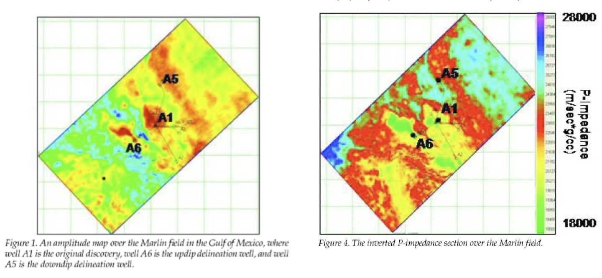{fig-align="center" width="100%"}

:::
::: {.column width="30%"}

Inverted **P-impedance section** over the Marlin Field, Gulf of Mexico.

- All wells correlate with amplitude anomalies
- Impedance inversion reveals gas-bearing zones at A1 and A6. Why?
- From @russell2006

:::
::::

# Part III — Elastic Wave Equation & Zoeppritz {background-color="#2c3e50" style="color: white;"}

## Goals

- Relate changes in the elastic properties to angle/offset/ray-parameter dependence of seismic amplitudes.

- Introduce elastic reflection coefficients derived from imposing boundary conditions at solid-solid interfaces.

## Stress–Strain Relations and the Stiffness Tensor {.smaller .scrollable}

The most general **linear elastic** stress–strain relationship (generalized Hooke's law) is:

$$
\tau_{ij} = c_{ijkl}\,\varepsilon_{kl}
$$

where $c_{ijkl}$ is the **fourth-order elastic stiffness tensor** with $3^4 = 81$ components.

. . .

**Symmetry reductions:**

::: {.incremental}

- **Stress symmetry** ($\tau_{ij} = \tau_{ji}$) $\;\Rightarrow\;$ $c_{ijkl} = c_{jikl}$ — reduces to 54 components
- **Strain symmetry** ($\varepsilon_{kl} = \varepsilon_{lk}$) $\;\Rightarrow\;$ $c_{ijkl} = c_{ijlk}$ — reduces to 36 components
- **Strain energy symmetry** ($c_{ijkl} = c_{klij}$) — reduces to **21 independent** components

:::

. . .

For an **isotropic** medium, symmetry under arbitrary rotation leaves only **2 independent** parameters — the Lamé constants $\lambda$ and $\mu$:

$$
c_{ijkl} = \lambda\,\delta_{ij}\delta_{kl} + \mu\left(\delta_{ik}\delta_{jl} + \delta_{il}\delta_{jk}\right)
$$

. . .

Substituting into $\tau_{ij} = c_{ijkl}\,\varepsilon_{kl}$ gives **Hooke's law for isotropic media**:

$$
\boxed{\tau_{ij} = \lambda\,\delta_{ij}\,\varepsilon_{kk} + 2\mu\,\varepsilon_{ij} = \lambda\,\delta_{ij}\,\nabla\cdot\mathbf{u} + \mu\left(\frac{\partial u_i}{\partial x_j} + \frac{\partial u_j}{\partial x_i}\right)}
$$

## The Elastic Wave Equation {.smaller}

**Hooke's law** for isotropic elastic media relates stress $\tau_{ij}$ to strain via the Lamé parameters $\lambda$ and $\mu$:

$$
\tau_{ij} = \lambda\,\delta_{ij}\,\nabla\cdot\mathbf{u} + \mu\left(\frac{\partial u_i}{\partial x_j} + \frac{\partial u_j}{\partial x_i}\right)
$$

. . .

Combined with Newton's second law $\rho\,\partial^2 u_i / \partial t^2 = \nabla\cdot\boldsymbol{\tau}_i$, we obtain the **elastic wave equation**:

$$
\boxed{\rho\,\frac{\partial^2\mathbf{u}}{\partial t^2} = (\lambda + \mu)\,\nabla(\nabla\cdot\mathbf{u}) + \mu\,\nabla^2\mathbf{u}}
$$

## Bulk & Shear Modulus, P- & S-Wave Speeds {.smaller}

The elastic medium is characterized by density $\rho(\mathbf{r})$, bulk modulus $K(\mathbf{r})$, and shear modulus $\mu(\mathbf{r})$.

. . .

:::: {.columns}
::: {.column width="50%"}

**Compressional (P-wave) velocity:**

$$
\alpha = c_P = \sqrt{\frac{K + \frac{4}{3}\mu}{\rho}} = \sqrt{\frac{\lambda + 2\mu}{\rho}}
$$

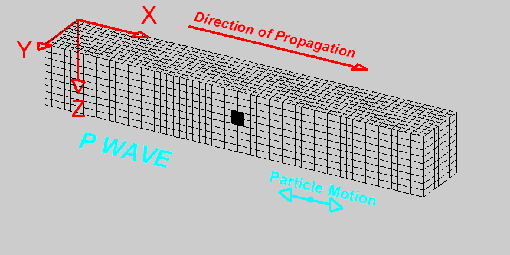{fig-align="center" width="85%"}

:::
::: {.column width="50%"}

**Shear (S-wave) velocity:**

$$
\beta = c_S = \sqrt{\frac{\mu}{\rho}}
$$

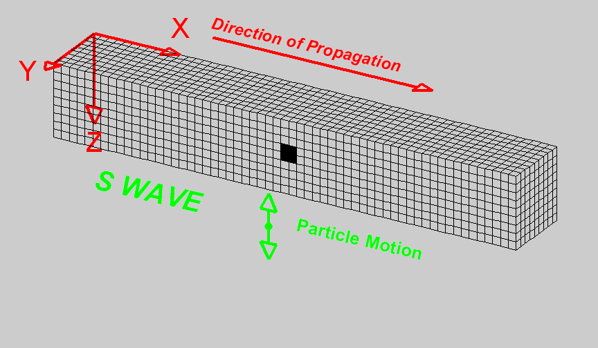{fig-align="center" width="85%"}

:::
::::

## P- and S-Waves from Helmholtz Decomposition {.smaller}

Taking the **divergence** of the elastic wave equation gives the **P-wave** equation:

$$
\rho\,\frac{\partial^2\vartheta}{\partial t^2} = (\lambda + 2\mu)\,\nabla^2\vartheta, \quad \vartheta \equiv \nabla\cdot\mathbf{u}
$$

. . .

Taking the **curl** gives the **S-wave** equation:

$$
\rho\,\frac{\partial^2\boldsymbol{\xi}}{\partial t^2} = \mu\,\nabla^2\boldsymbol{\xi}, \quad \boldsymbol{\xi} \equiv \nabla\times\mathbf{u}
$$

. . .

::: {.callout-note}
## Key result
P-waves propagate with velocity $c_P = \sqrt{(\lambda+2\mu)/\rho}$ and involve compressional motion. S-waves propagate with velocity $c_S = \sqrt{\mu/\rho}$ and involve shear motion. Since $\lambda + 2\mu > \mu$, we always have $c_P > c_S$.
:::

## Acoustic and Elastic Impedance {.smaller}

In the **acoustic** (fluid) case, impedance is defined as:

$$
Z_P = \rho\,\alpha
$$

which governs normal-incidence P-wave reflections: $R = (Z_{P,2} - Z_{P,1})/(Z_{P,2} + Z_{P,1})$.

. . .

In the **elastic** (solid) case, there is also a **shear impedance**:

$$
Z_S = \rho\,\beta
$$

. . .

:::: {.columns}
::: {.column width="50%"}

| Quantity | Symbol | Definition |
|:---------|:------:|:-----------|
| P-impedance | $Z_P$ | $\rho\,\alpha$ |
| S-impedance | $Z_S$ | $\rho\,\beta$ |
| Impedance ratio | $Z_S/Z_P$ | $\beta/\alpha$ |

:::
::: {.column width="50%"}

::: {.callout-note}
At normal incidence, only $Z_P$ matters. At oblique incidence, the reflection coefficients depend on **both** $Z_P$ and $Z_S$ — this is the physical basis for AVO analysis.
:::

:::
::::

## Boundary Conditions at an Elastic Interface {.smaller}

At an interface between two elastic layers, the boundary conditions require:

::: {.incremental}
1. **Continuity of particle velocity** $v_i$ — no slipping or separation
2. **Continuity of tractions** $\tau_{ij}\,n_j$ — force balance across the interface
:::

. . .

These boundary conditions, together with **Snell's law**:

$$
\frac{\sin\theta_{P1}}{c_{P1}} = \frac{\sin\theta_{S1}}{c_{S1}} = \frac{\sin\theta_{P2}}{c_{P2}} = \frac{\sin\theta_{S2}}{c_{S2}} = p \quad \text{(ray parameter)}
$$

lead to a system of equations coupling the amplitudes of all reflected and transmitted waves.

## Snell's Law and Mode Conversion {.smaller}

:::: {.columns}
::: {.column width="50%"}

<!-- ::: {style="font-family: monospace; font-size: 0.65em; line-height: 1.4; background: #f8f8f8; padding: 1em; border-radius: 6px;"}
```
     Reflected P          ↑ incident P
      θ_P1 ╲             ╱ θ_P1
             ╲           ╱
    Reflected S╲         ╱
      θ_S1  ╲  ╲       ╱
             ╲  ╲     ╱
══════════════════════════════════
  Layer 1: ρ₁, α₁, β₁  ↑
  ─────────────────────────────
  Layer 2: ρ₂, α₂, β₂  ↓
══════════════════════════════════
              ╱   ╲
             ╱     ╲
            ╱ θ_P2  ╲ θ_S2
           ╱         ╲
   Transmitted P   Transmitted S
```
::: -->

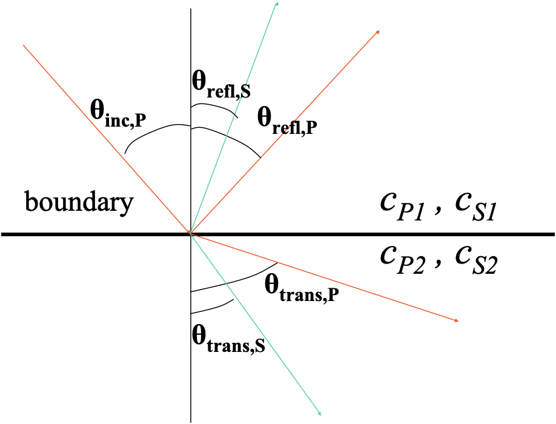

:::
::: {.column width="50%"}

An incident P-wave at a solid-solid interface generates **four** waves:

- Reflected P-wave (angle $\theta_{P1}^{\text{refl}}$)
- Reflected S-wave (angle $\theta_{S1}^{\text{refl}}$)
- Transmitted P-wave (angle $\theta_{P2}^{\text{trans}}$)
- Transmitted S-wave (angle $\theta_{S2}^{\text{trans}}$)

All angles are related through Snell's law via the common **ray parameter** $p$.

:::
::::

## Goals

- Get information on the elastic properties rather than the locations of the reflectors alone.
 
- Use information that reflection coefficients depend on the angle/ray-parameter (=offset).
 
- Devise an inversion scheme and workflow to estimate fluctuations in the elastic properties.

## Reflection and Transmission Coefficients {.smaller}

For an interface between layers with $(\rho_1, c_{P1}, c_{S1})$ and $(\rho_2, c_{P2}, c_{S2})$, we have **eight** coefficients:

. . .

:::: {.columns}
::: {.column width="50%"}

**Reflection coefficients:**

- $R_{PP}$ — P-to-P reflection
- $R_{PS}$ — P-to-S reflection
- $R_{SP}$ — S-to-P reflection
- $R_{SS}$ — S-to-S reflection

:::
::: {.column width="50%"}

**Transmission coefficients:**

- $T_{PP}$ — P-to-P transmission
- $T_{PS}$ — P-to-S transmission
- $T_{SP}$ — S-to-P transmission
- $T_{SS}$ — S-to-S transmission

:::
::::

. . .

These coefficients are functions of **angle of incidence** (or ray parameter $p$) and the **six medium parameters** $\rho_1, c_{P1}, c_{S1}, \rho_2, c_{P2}, c_{S2}$.

## The Zoeppritz Equations {.smaller}

The exact expressions for $R_{PP}$, $R_{PS_V}$, $T_{PP}$, $T_{PS_V}$ (and similarly for S-wave incidence) in terms of $\rho_1, \rho_2, \alpha_1, \alpha_2, \beta_1, \beta_2$ and angle of incidence are called the **Zoeppritz equations** [@zoeppritz1919].

. . .

These equations express each reflection and transmission coefficient as a nonlinear function of $\rho_1, \rho_2, \alpha_1, \alpha_2, \beta_1, \beta_2$ and the angle of incidence. For **small contrasts** across the interface, the Zoeppritz equations can be **linearized** in the logarithmic perturbations $\Delta\ln\rho$, $\Delta\ln\alpha$, and $\Delta\ln\beta$.

## The Zoeppritz Matrix System {.smaller .scrollable}

For an incident P-wave, the four unknown amplitudes $R_{PP}$, $R_{PS}$, $T_{PP}$, $T_{PS}$ satisfy a $4\times 4$ linear system derived from the boundary conditions:

$$
\begin{pmatrix}
-\sin\theta_1 & -\cos\phi_1 & \sin\theta_2 & \cos\phi_2 \\
\cos\theta_1 & -\sin\phi_1 & \cos\theta_2 & -\sin\phi_2 \\
\sin 2\theta_1 & \frac{\beta_1}{\alpha_1}\cos 2\phi_1 & \frac{\rho_2\beta_2^2\alpha_1}{\rho_1\beta_1^2\alpha_2}\sin 2\theta_2 & \frac{\rho_2\beta_2\alpha_1}{\rho_1\beta_1^2}\cos 2\phi_2 \\
-\cos 2\phi_1 & \frac{\beta_1}{\alpha_1}\sin 2\phi_1 & \frac{\rho_2\alpha_1}{\rho_1\alpha_2}\cos 2\phi_2 & -\frac{\rho_2\beta_2\alpha_1}{\rho_1\alpha_2\beta_1}\sin 2\phi_2
\end{pmatrix}
\begin{pmatrix} R_{PP} \\ R_{PS} \\ T_{PP} \\ T_{PS} \end{pmatrix}
=
\begin{pmatrix} \sin\theta_1 \\ \cos\theta_1 \\ -\sin 2\theta_1 \\ \cos 2\phi_1 \end{pmatrix}
$$

. . .

where the angles follow from Snell's law: $\sin\theta_1/\alpha_1 = \sin\phi_1/\beta_1 = \sin\theta_2/\alpha_2 = \sin\phi_2/\beta_2 = p$.

. . .

::: {.callout-note}
The Zoeppritz equations are exact but **nonlinear** in the medium parameters (through the angle dependencies). Direct inversion is impractical — hence the need for linearization.
:::

## Linearization of Zoeppritz for Small Contrasts {.smaller}

For **small contrasts**, the Zoeppritz equations can be linearized in $\Delta\ln\rho$, $\Delta\ln\alpha$, and $\Delta\ln\beta$ [@aki1980; @aki2002].

. . .

For contrasts of order $\delta \ll 1$, at **non-zero, pre-critical** angles:

$$
\begin{aligned}
R_{PP} &= O(\delta), \quad R_{PS_V} = O(\delta), \quad T_{PP} = O(1), \quad T_{PS_V} = O(\delta) \\
R_{S_VS_V} &= O(\delta), \quad R_{S_VP} = O(\delta), \quad T_{S_VS_V} = O(1), \quad T_{S_VP} = O(\delta)
\end{aligned}
$$

. . .

::: {.callout-important}
## Key observation
In reflection recordings over low-contrast media, the **leading amplitudes are $O(\delta)$**. These arrivals have been reflected only once and have not been mode-converted on transmission. Mode conversion may occur upon reflection ($R_{PS}$, $R_{SP}$).
:::

## Linearized Reflection Coefficients — All Modes {.smaller .scrollable}

For small contrasts $\Delta\ln\rho$, $\Delta\ln\alpha$, $\Delta\ln\beta$ and using $\gamma = \beta_0/\alpha_0$, the linearized reflection coefficients are [@aki1980; @aki2002]:

. . .

**P-to-P reflection** ($R_{PP}$):

$$
R_{PP}(p) = \frac{1}{2}\left(1 - 4\beta_0^2 p^2\right)\Delta\ln\rho + \frac{1}{2\left(1 - \alpha_0^2 p^2\right)}\Delta\ln\alpha - 4\beta_0^2 p^2\,\Delta\ln\beta
$$

. . .

**P-to-SV reflection** ($R_{PS}$):

$$
R_{PS}(p) = -\frac{p\,\alpha_0}{2\cos\phi}\left[\left(1 - 2\beta_0^2 p^2 + 2\beta_0^2\frac{p\cos\theta}{\alpha_0}\frac{p\cos\phi}{\beta_0}\right)\Delta\ln\rho + \frac{4\beta_0^2 p^2\cos\theta\cos\phi}{\alpha_0\beta_0\,p^2}\,\Delta\ln\alpha + \left(1 - 2\beta_0^2 p^2 + 2\frac{\beta_0\cos\phi}{\alpha_0\cos\theta}\right)\Delta\ln\beta\right]
$$

where $\cos\theta = \sqrt{1 - \alpha_0^2 p^2}$ and $\cos\phi = \sqrt{1 - \beta_0^2 p^2}$.

. . .

**SV-to-SV reflection** ($R_{SS}$):

$$
R_{SS}(p) = -\frac{1}{2}\left(1 - 4\beta_0^2 p^2\right)\Delta\ln\rho + 4\beta_0^2 p^2\,\Delta\ln\alpha + \frac{1}{2}\frac{1}{1 - \beta_0^2 p^2}\Delta\ln\beta
$$

. . .

::: {.callout-note}
For AVO inversion, the **PP reflection** is most commonly used because P-wave sources and receivers dominate exploration seismology. The other modes are important for multicomponent (ocean-bottom) data.
:::

# Part IV — Linearized Convolutional Model {background-color="#2c3e50" style="color: white;"}

## The Background Medium {.smaller}

In the linearized model, traveltimes $t_i$ are computed in a **background medium** with slowly varying properties $\rho_0(z)$, $\alpha_0(z)$, $\beta_0(z)$.

. . .

**Requirements for the background medium:**

::: {.incremental}
- Must **accurately match the traveltimes** in the real medium
- Must describe the **propagation factors** (geometric spreading, ray bending)
- Should be **smooth** — no sharp discontinuities
- Obtained from velocity analysis, well logs, or tomography
:::

## Well $c_p$ + smoothed well

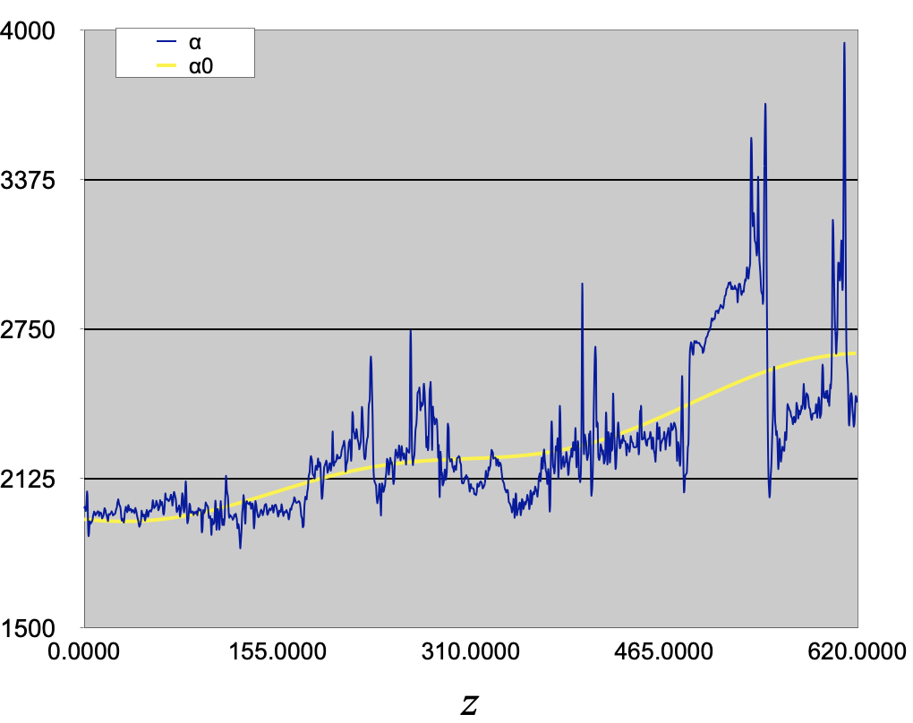{fig-align="center" width="55%"}


## Traveltimes

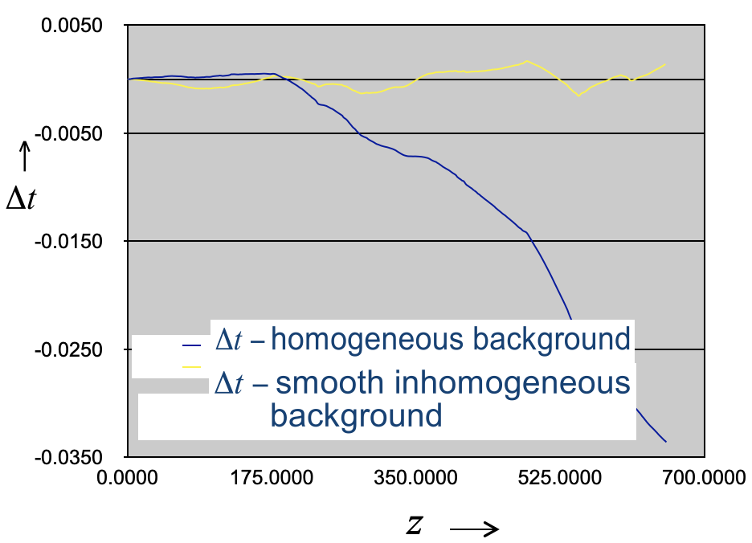{fig-align="center" width="60%"}


::: aside
$\Delta t=\int_0^z\mathrm{d}z' \frac{1}{\alpha(z')}-\frac{1}{\alpha_0(z')}$

Smooth inhomogeneous background (yellow) eliminates ~95% of kinematic inaccuracy compared to the true velocity (blue).
:::

## Linearized $R_{PP}$ in the Ray-Parameter Domain {.smaller}

Using the plane-wave decomposition, the linearized data model in the $\tau$-$p$ domain is:

$$
\hat{s}(p;\tau) = \sum_i R_i(p)\,w\!\left[\tau - t_i(p)\right]
$$

where $p = \sin\theta / \alpha_0$ is the horizontal ray parameter and $t_i(p) = \int_0^{z_i} \frac{\sqrt{1 - p^2\alpha_0^2}}{\alpha_0}\,dz$.

. . .

The **linearized P-to-P reflection coefficient** (Aki–Richards approximation, [@aki2002; @shuey1985]) is:

$$
\boxed{R_{PP}(p) = \frac{1}{2}\left(1 - 4\beta_0^2 p^2\right)\Delta\ln\rho + \frac{1}{2}\frac{1}{1 - \alpha_0^2 p^2}\Delta\ln\alpha - 4\beta_0^2 p^2\,\Delta\ln\beta}
$$

. . .

The property contrasts across the $i$-th interface are: $\Delta\ln\rho_i$, $\Delta\ln\alpha_i$, and $\Delta\ln\beta_i$.

## Structure of the Linearized $R_{PP}$ — The $\mathbf{M}$ Matrix {.smaller .scrollable} 

At the $i$-th interface, the linearized $R_{PP}$ is a **linear combination** of three contrasts. Writing this as a matrix–vector product:

$$
R_{PP}^{(i)}(p) = \underbrace{\begin{pmatrix} \tfrac{1}{2}(1 - 4\beta_0^2 p^2) & \tfrac{1}{2(1 - \alpha_0^2 p^2)} & -4\beta_0^2 p^2 \end{pmatrix}}_{\text{row of } \mathbf{M}(p)} \begin{pmatrix} \Delta\ln\rho_i \\ \Delta\ln\alpha_i \\ \Delta\ln\beta_i \end{pmatrix}
$$

. . .

At **normal incidence** ($p = 0$), the matrix reduces to:

$$
\mathbf{M}(0) = \begin{pmatrix} \tfrac{1}{2} & \tfrac{1}{2} & 0 \end{pmatrix} \quad \Rightarrow \quad R_{PP}^{(i)}(0) = \tfrac{1}{2}\bigl(\Delta\ln\rho_i + \Delta\ln\alpha_i\bigr) = \tfrac{1}{2}\Delta\ln Z_P
$$

recovering the **acoustic result**. The shear contribution enters only at oblique incidence ($p > 0$).

. . .

::: {.callout-note}
The matrix $\mathbf{M}(p)$ encodes the **sensitivity** of the reflection coefficient to each elastic parameter. At normal incidence only $\rho$ and $\alpha$ contribute; at oblique incidence all three parameters are needed.
:::

{CLAUDE: Please also derive linearization in terms of impedances and velocities and explain the difference. Hint. one may not depend on the angle...}

## Linearized Convolutional Model in $\tau$-$p$ {.smaller}

For each ray parameter $p_j$ ($j = 1, \ldots, N_p$), the data at the $i$-th interface is:

{CLAUDE: Make this equation consistent with the notation of the previous slide.}
$$
\hat{s}(p_j; \tau) = \sum_i \left[w_\rho(p_j)\,\Delta\ln\rho_i + w_\alpha(p_j)\,\Delta\ln\alpha_i + w_\beta(p_j)\,\Delta\ln\beta_i\right] w(\tau - t_i)
$$

. . .

In matrix form for all ray parameters and interfaces:

$$
\boxed{\hat{\mathbf{s}} = \mathbf{M}\,\mathbf{m}}
$$

where:

- $\hat{\mathbf{s}}$ is the vector of $\tau$-$p$ data (for all $p$ values)
- $\mathbf{M}$ encodes the wavelet convolution and the $p$-dependent weighting
- $\mathbf{m} = \begin{pmatrix} \Delta\ln\rho(z) \\ \Delta\ln\alpha(z) \\ \Delta\ln\beta(z) \end{pmatrix}$ is the vector of property contrasts

<!-- {CLAUDE: please add damped least squares inversion for $\mathbf{m}$.} -->

# Part V — AVO/AVP Inversion Workflow {background-color="#2c3e50" style="color: white;"}

<!-- {CLAUDE: Add detailed descriptions of AVO, AVA and AVP workflows. Introduce different processing steps. Add table that compares worklows } -->

## AVP Inversion — Overview {.smaller}

The $\tau$-$p$ data model from the previous section relates the Radon-domain amplitudes to the linearized reflection coefficients:

$$
\hat{s}(p;\tau) = \sum_i R_i(p)\,w[\tau - t_i(p)]
$$

where $R_{PP}(p)$ is the Aki–Richards linearized P-to-P reflection coefficient — a **linear combination** of $\Delta\ln\rho$, $\Delta\ln\alpha$, and $\Delta\ln\beta$ with $p$-dependent weights. 

The plane-wave decomposition via the **linear Radon transform** provides the data in the required $\tau$-$p$ domain.

Links recorded amplitudes directly to subsurface property contrasts.


## The Linear Radon Transform {.smaller}

The **linear Radon transform** ($\tau$-$p$ transform) maps data from the $x$-$t$ domain to the $\tau$-$p$ domain:

$$
m(p, \tau) = \int_{-\infty}^{+\infty} d(x, t = \tau + px)\,dx
$$

. . .

:::: {.columns}
::: {.column width="50%"}
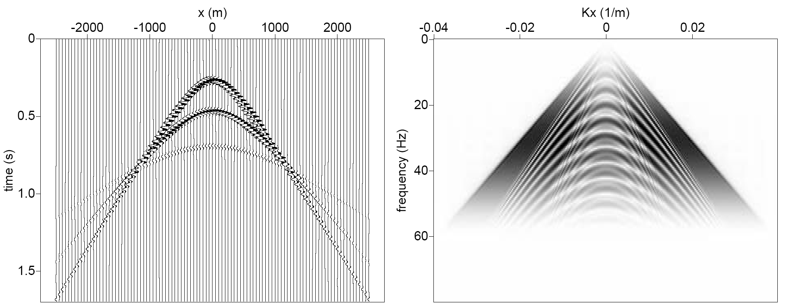{fig-align="center" width="95%"}
:::
::: {.column width="50%"}
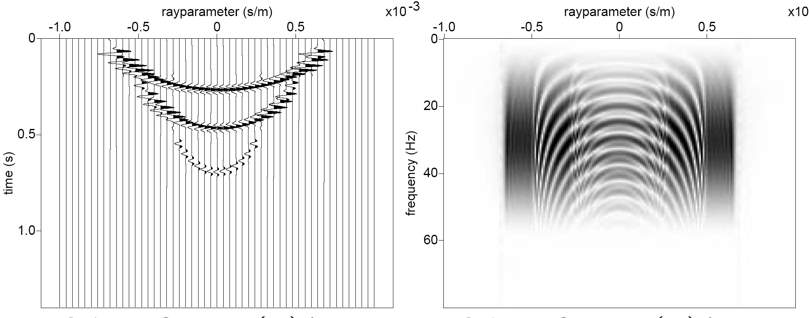{fig-align="center" width="95%"}
:::
::::

One point in the Radon domain $m(p,\tau)$ is obtained by **stacking** the input data along a straight line $t = \tau + px$.

## From Shot Records to Angle Gathers {.smaller}

The AVP inversion workflow involves three stages:

. . .

1. **Back-propagation** — surface data $\rightarrow$ virtual source/receiver records at depth: $\;d(x,t) \rightarrow d_{\text{virtual}}(x,t;z)$

2. **Radon transform + imaging** — form $\tau$-$p$ gathers at each image point: $\;d_{\text{virtual}} \rightarrow \hat{s}(p,\tau)$

3. **AVP inversion** — invert $\tau$-$p$ amplitudes for property contrasts: $\;\hat{s} \rightarrow \Delta\ln\rho,\;\Delta\ln\alpha,\;\Delta\ln\beta$

## Radon Amplitudes and Reflection Coefficients {.smaller}

After back-propagation and Radon transform, the focused amplitudes approximate the **plane-wave reflection coefficient**:

:::: {.columns}
::: {.column width="30%"}

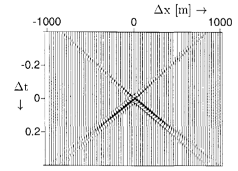{fig-align="center" width="90%"}

:::
::: {.column width="30%"}

{fig-align="center" width="95%"}

:::

::: {.column width="30%"}

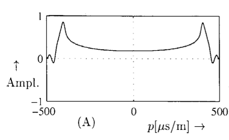{fig-align="center" width="95%"}

:::

::::

. . .

::: {.callout-note}
After back-propagation, the focused point in $x$-$t$ maps to a focused point in $\tau$-$p$, where the **amplitudes approximate the reflection coefficients** $R_i(p)$ convolved with a stretched wavelet [@vanwijngaarden1998].
:::

## Shot data and migrated data in $(\tau-p)$

{fig-align="center" width="60%"}


## Least-Squares Linear Inversion {.smaller}

Given the forward model $\hat{\mathbf{s}} = \mathbf{M}\,\mathbf{x}$, the **least-squares solution** is:

$$
\hat{\mathbf{m}} = \left(\mathbf{M}^\top\mathbf{M}\right)^{-1}\mathbf{M}^\top\hat{\mathbf{s}}
$$

. . .

where $\mathbf{m} = (\Delta\ln\rho,\;\Delta\ln\alpha,\;\Delta\ln\beta)^\top$ stacked over all $N_z$ depth points.

The system has $3N_z$ unknowns ($\Delta\ln\rho$, $\Delta\ln\alpha$, $\Delta\ln\beta$ at each of $N_z$ depth points) and $N_p \times N_z$ data samples.

- When $N_p \geq 3$, the system is **overdetermined** in the $p$-direction
- But $\mathbf{M}^\top\mathbf{M}$ may still be **ill-conditioned**, requiring regularization

## Inversion results

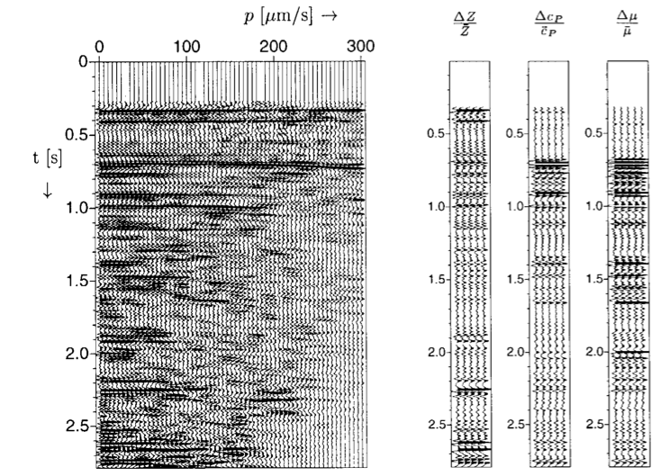


## Damped Least-Squares Inversion {.smaller}

For **damped least-squares inversion**, we add a regularization term:

$$
\boxed{\hat{\mathbf{x}} = \left(\mathbf{M}^\top\mathbf{M} + \boldsymbol{\varepsilon}\right)^{-1}\mathbf{M}^\top\hat{\mathbf{s}}}
$$

where $\boldsymbol{\varepsilon} = \text{diag}(\varepsilon_\rho\,\mathbf{I}_{N_z},\; \varepsilon_\alpha\,\mathbf{I}_{N_z},\; \varepsilon_\beta\,\mathbf{I}_{N_z})$.

. . .

::: {.callout-important}
## Why is damping needed?
For large systems, the inversion result depends **strongly** on the damping applied. Different damping for $\rho$, $\alpha$, $\beta$ reflects our different confidence in estimating each parameter. Density is typically the **hardest** to resolve.
:::

## Pre-Conditioned Least-Squares Inversion {.smaller}

With a **pre-conditioner** $\mathbf{P}$ that normalizes the columns of $\mathbf{M}$:

$$
\hat{\mathbf{x}} = \left(\mathbf{P}\,\mathbf{M}^\top\mathbf{M} + \boldsymbol{\varepsilon}\right)^{-1}\mathbf{P}\,\mathbf{M}^\top\hat{\mathbf{s}}
$$

Here $\mathbf{P}\,\mathbf{M}^\top\mathbf{M}$ is a correlation-like matrix with ones on the diagonal, ensuring balanced sensitivity across the three parameter classes.

. . .

::: {.callout-note}
Pre-conditioning prevents parameters with larger sensitivity (e.g., $\alpha$) from dominating the inversion at the expense of less-sensitive parameters (e.g., $\rho$).
:::

## Recovering Absolute Properties {.smaller}

The inversion yields **contrasts** $\Delta\ln\rho_i$, $\Delta\ln\alpha_i$, $\Delta\ln\beta_i$ at each interface. To obtain absolute property values, we accumulate contrasts on top of the **background model**:

$$
\ln\rho(z) = \ln\rho_0(z) + \sum_i \Delta\ln\rho_i
$$

$$
\ln\alpha(z) = \ln\alpha_0(z) + \sum_i \Delta\ln\alpha_i, \quad \ln\beta(z) = \ln\beta_0(z) + \sum_i \Delta\ln\beta_i
$$

. . .

::: {.callout-note}
The quality of the absolute property estimate depends critically on the accuracy of the **background model** $\rho_0(z)$, $\alpha_0(z)$, $\beta_0(z)$.
:::


## Synthetic Example: 1.5D Layered Model{.smaller}

:::: {.columns}
::: {.column width="50%"}

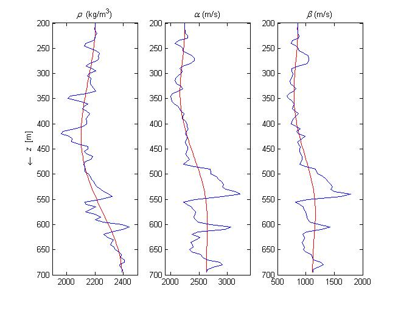{fig-align="center" width="95%"}

:::
::: {.column width="50%"}

Horizontally layered model with smooth curves representing the **background model**.

. . .

- Source: zero-phase wavelet with realistic bandwidth
- Inversion in the $\tau$-$p$ domain
- Compare predicted vs. actual properties

:::
::::

## Data + residual time & imaged domain {.smaller}

:::: {.columns}
::: {.column width="50%"}

**Time-domain**

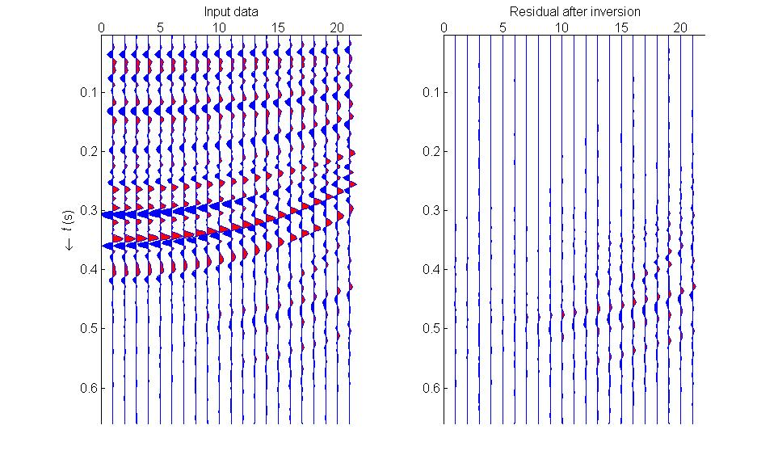{fig-align="center" width="95%"}

<!-- Predicted (green) vs. actual (blue) band-limited log properties. Spatial band-limitation is derived from the source wavelet. -->

:::
::: {.column width="50%"}

**Imaged domain**

{fig-align="center" width="95%"}

<!-- Adding band-limited predictions to background values. Note discrepancies due to the **spectral gap**. -->

:::
::::


## Band-Limited vs. Broadband Inversions {.smaller}

:::: {.columns}
::: {.column width="50%"}

**Band-limited result**

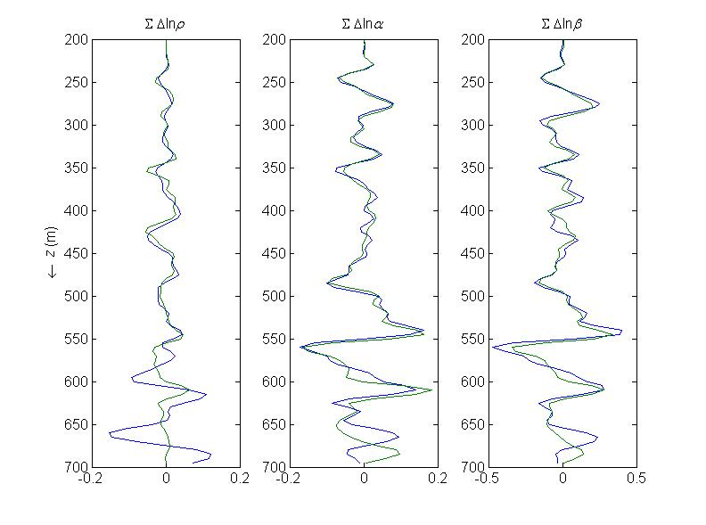{fig-align="center" width="95%"}

Predicted (green) vs. actual (blue) band-limited log properties. Spatial band-limitation is derived from the source wavelet.

:::
::: {.column width="50%"}

**Broadband result**

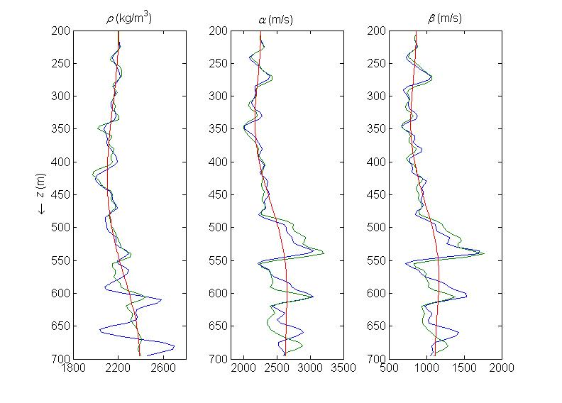{fig-align="center" width="95%"}

Adding band-limited predictions to background values. Note discrepancies due to the **spectral gap**.

:::
::::

## The Spectral Gap {.smaller}

:::: {.columns}
::: {.column width="50%"}

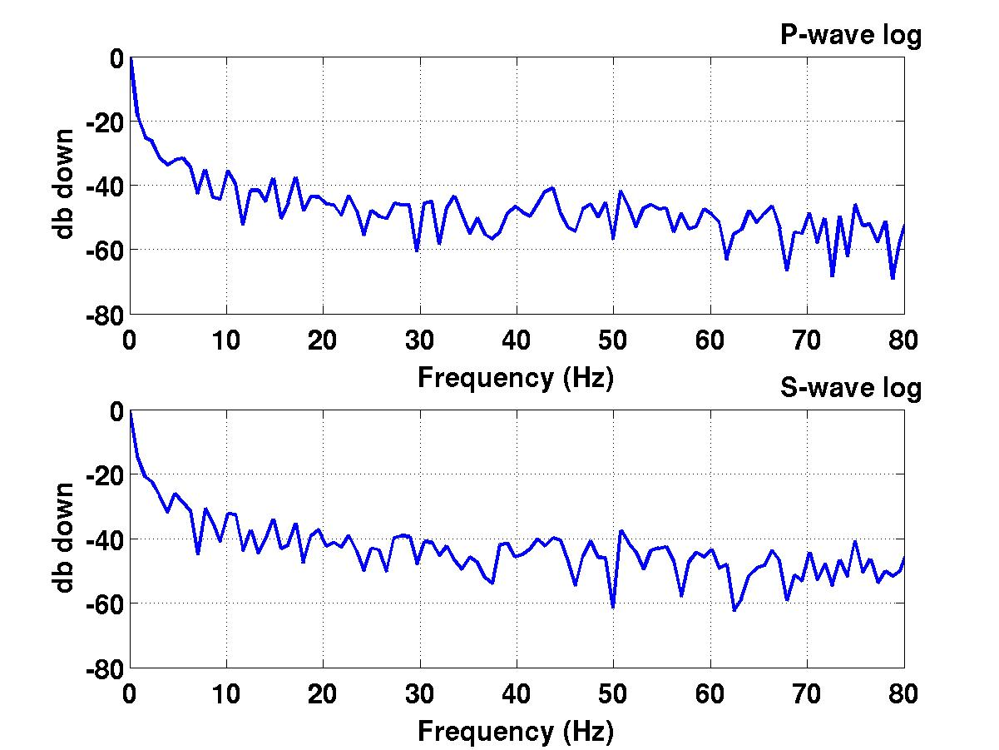{fig-align="center" width="95%"}

:::
::: {.column width="50%"}

With **linear imaging** we cannot bridge the spectral gap between:

- The **low-frequency** content of the background model
- The **band-limited** seismic amplitudes

. . .

The gap arises because the seismic wavelet has no energy at very low frequencies.

. . .

::: {.callout-important}
Only **nonlinear inversion** (e.g., with a sparseness constraint) or additional information (well logs) can bridge this gap.
:::

:::
::::

## Low-Contrast Validation — Model & Data {.smaller}

:::: {.columns}
::: {.column width="50%"}

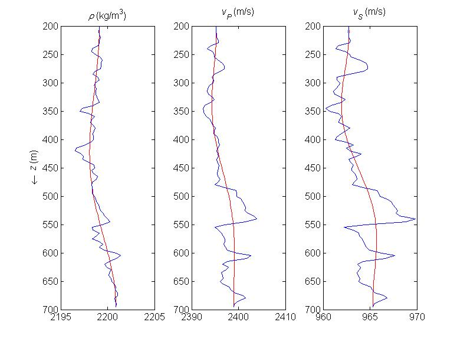{fig-align="center" width="95%"}

Low-contrast model (0.01$\times$ real contrasts) with $\rho$, $v_P$, $v_S$ vs. depth. Smooth red curves show the background model.

:::
::: {.column width="50%"}

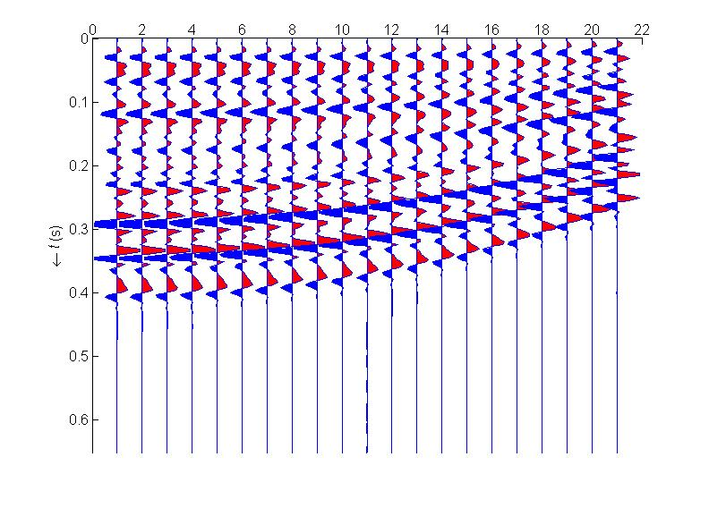{fig-align="center" width="95%"}

$\tau$-$p$ Radon-domain data for the low-contrast model, showing the amplitude-versus-ray-parameter variation.

:::
::::

## Low-Contrast Validation — Inversion Results {.smaller}

:::: {.columns}
::: {.column width="50%"}

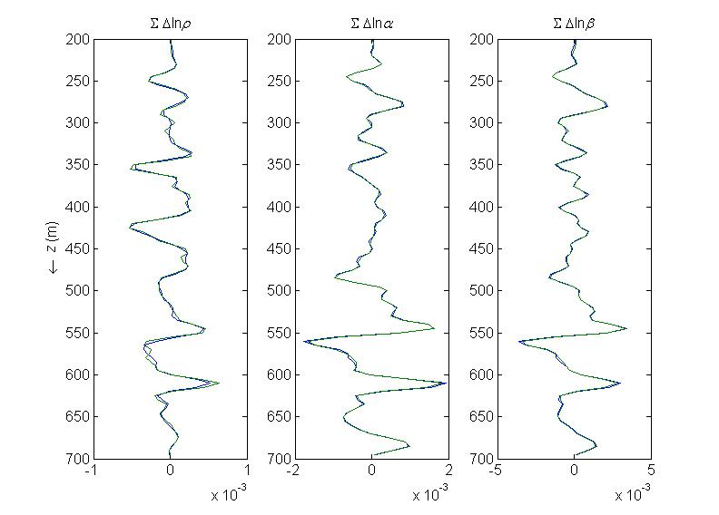{fig-align="center" width="95%"}

For very low contrasts (0.01$\times$ real), the linearized inversion performs **excellently** — validating the method.

:::
::: {.column width="50%"}

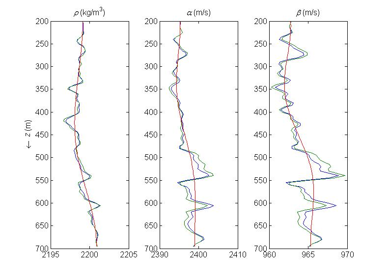{fig-align="center" width="95%"}

Even with near-perfect linear inversion, the **spectral gap** still causes discrepancies in the broadband result.

:::
::::

## Real Data Example {.smaller}

:::: {.columns}
::: {.column width="50%"}

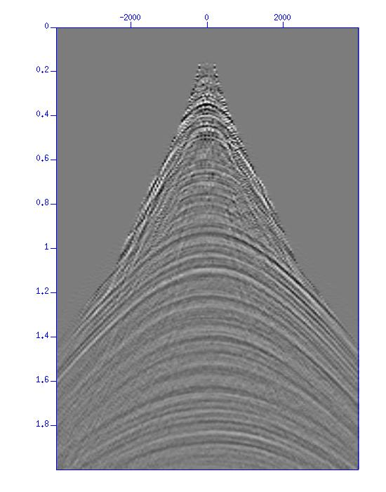{fig-align="center" width="95%"}

Input processed surface shot record and stacked section.

:::
::: {.column width="50%"}

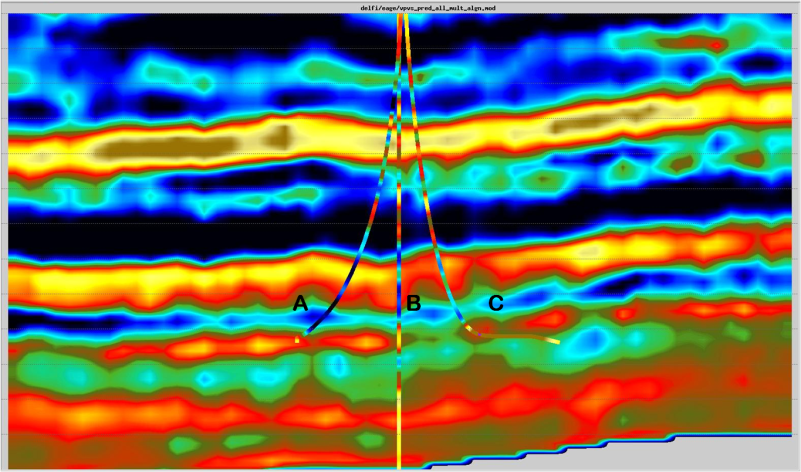{fig-align="center" width="95%"}

Linear elastic inversion results of redatumed data at top of target interval. (MSc thesis work by Xander Staal)

:::
::::

## Practical AVP Inversion Workflow — Data Preparation {.smaller}

The complete workflow for linearized AVO/AVP inversion:

::: {.incremental}

1. **Build background model** — smooth $\rho_0(z)$, $\alpha_0(z)$, $\beta_0(z)$ from well logs and velocity analysis
2. **Preprocess data** — remove multiples, correct for geometric spreading and attenuation
3. **Back-propagate** — redatum surface data to target level using background model
4. **Apply linear Radon transform** — decompose into plane waves ($\tau$-$p$ domain)

:::

## Practical AVP Inversion Workflow — Inversion & Interpretation {.smaller}

::: {.incremental}

5. **Form the forward operator** $\mathbf{M}$ — using linearized $R_{PP}(p)$ and the source wavelet
6. **Invert** — solve $\hat{\mathbf{x}} = (\mathbf{M}^\top\mathbf{M} + \boldsymbol{\varepsilon})^{-1}\mathbf{M}^\top\hat{\mathbf{s}}$ for contrasts $\Delta\ln\rho$, $\Delta\ln\alpha$, $\Delta\ln\beta$
7. **Reconstruct absolute properties** — add contrasts to background model
8. **Interpret** — use recovered $\rho$, $\alpha$, $\beta$ (or derived quantities like Poisson's ratio) for reservoir characterization

:::

## Summary {.smaller .scrollable}

:::: {.columns}
::: {.column width="50%"}

**Acoustic foundations:**

- Three factors affect amplitudes: geometric spreading, R/T coefficients, attenuation
- Linearized $R \approx \frac{1}{2}\Delta\ln Z$ is valid for small contrasts
- The convolutional model $\mathbf{d} = \mathbf{W}\mathbf{D}\mathbf{m}$ relates data to log-impedance

**Elastic theory:**

- Boundary conditions give Zoeppritz equations for $R_{PP}$, $R_{PS}$, $T_{PP}$, etc.
- Linearization for small $\delta$: reflections are $O(\delta)$, transmissions $O(1)$
- $R_{PP}(p)$ depends linearly on $\Delta\ln\rho$, $\Delta\ln\alpha$, $\Delta\ln\beta$

:::
::: {.column width="50%"}

**AVP inversion:**

- Linear Radon transform decomposes data into plane waves
- Radon-domain amplitudes $\approx$ linearized reflection coefficients
- Damped least-squares inversion recovers property contrasts
- Damping is needed due to ill-conditioning, especially for density
- The **spectral gap** limits recovery of absolute properties — only nonlinear methods can bridge it
- Background model quality is critical for the final result

:::
::::

## References {.smaller}

::: {#refs}
:::

---

:::{style="text-align: center; font-size: 0.6em; color: #888; margin-top: 2em;"}
This lecture was prepared with the assistance of Claude (Anthropic) and validated by Felix J. Herrmann.

This work is licensed under a [Creative Commons Attribution-NonCommercial-ShareAlike 4.0 International License](https://creativecommons.org/licenses/by-nc-sa/4.0/).


:::
