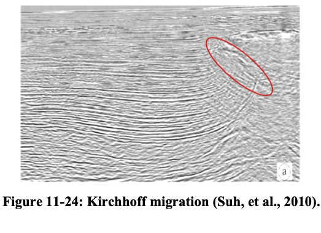
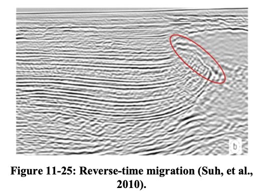
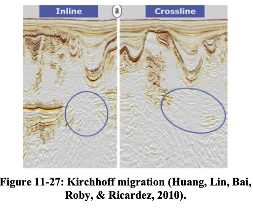
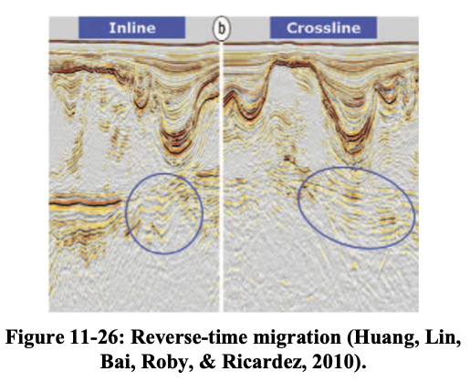
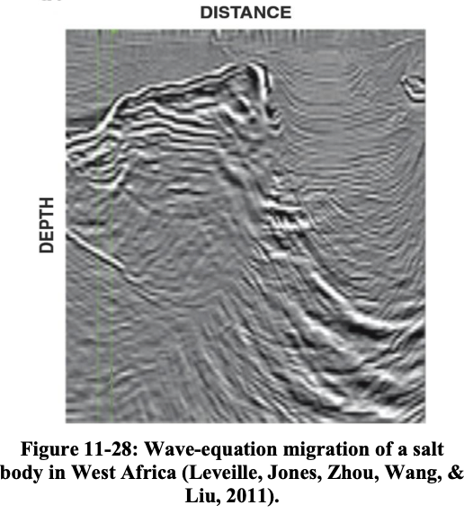
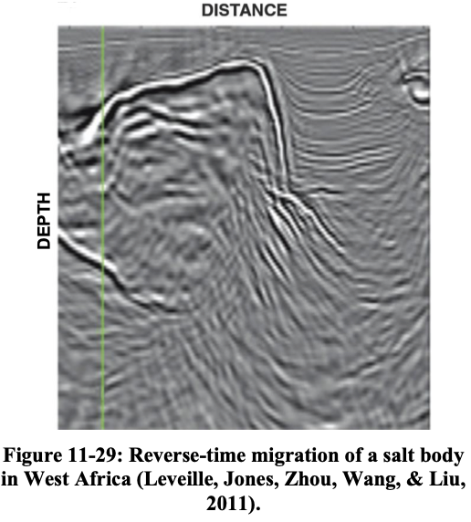

## {#title-custom .center background-color="white"}

:::{style="display: flex; justify-content: center; align-items: center; gap: 2.5em; margin-bottom: 1em;"}
{height=100}
{height=100}
:::

### Reverse-time Migration {style="margin-bottom: 0.1em;"}

**Felix J. Herrmann**

School of Earth and Ocean Sciences --- Georgia Institute of Technology

## Motivation{.smaller}

Seismic migration aims to move reflected energy to its true subsurface location. Not all migration methods handle complex geology equally well.

| Method | Pros | Cons |
|---|---|---|
| **Kirchhoff** | Fast, flexible geometry, parallelizable | Fails with multipathing, poor in complex media |
| **Gaussian Beam** | Handles multipathing, smooth amplitudes | Limited accuracy in sharp velocity contrasts |
| **One-way WEM** | Accurate for lateral velocity variations | Cannot image steep dips (>90&deg;), no turning waves |
| **RTM** | Full wave equation, all dips and turning waves | Computationally expensive, low-frequency artifacts |

## Overview different Migration Methods

![Overview of migration methods [@hill2020]](figures/Overview-migrations.png){width=250%}

## Impulse Responses{.smaller}

![(a) Kirchhoff migration. (b) Gaussian beam migration. (c) One-way wave-equation migration. (d) Reverse-time migration. As the migration method becomes more accurate, the impulse response becomes more complex. [@etgen2009]](figures/Wavefields.png){width=90%}

Impulse responses for four migration methods on the **Sigsbee escarpment model**, a common industry migration benchmark [@hill2020].

## Impulse Responses{.smaller}

- **Kirchhoff**: single-valued wavefront (one ray per angle); discontinuous in the presence of large velocity contrasts
- **Gaussian Beam**: smooth, continuous wavefronts that handle multipathing better than Kirchhoff but with limited resolution at sharp velocity boundaries
- **One-way Wave-equation Migration**: multi-valued wavefront captures complex wave paths; no internal reflections; smooth, gradational changes instead of discontinuities
- **Two-way (RTM)**: most complex and accurate; includes reflections from salt-sediment interfaces; practitioners suppress these by setting zero reflection coefficients in the density model

---

## Different Migration Methods {.smaller}

![Kirchhoff, Gaussian Beam, One-way WEM, and RTM comparison [@etgen2009]](figures/Comparison-4-Kirch-Gaussian-One-way-RTM.png){width=200%}

- **Kirchhoff** and **Gaussian Beam** struggle beneath complex salt bodies
- **Gaussian Beam** migration provides smoother results than Kirchhoff but still degrades beneath complex salt geometries
- **One-way** migration improves subsalt imaging but misses steep dips
- **RTM** produces the most complete and accurate image

---

## Kirchhoff vs. RTM{.smaller}

:::: {.columns}
::: {.column width="50%"}

:::
::: {.column width="50%"}

:::
::::

Kirchhoff migration vs. RTM on a complex salt model [@hill2020].

---

## Kirchhoff vs. RTM cont'd {.smaller}

:::: {.columns}
::: {.column width="50%"}

:::
::: {.column width="50%"}

:::
::::

Kirchhoff vs. RTM — another example [@hill2020].

## One-way vs. RTM{.smaller}

:::: {.columns}
::: {.column width="40%"}

:::
::: {.column width="40%"}

:::
::::

One-way WEM vs. RTM [@hill2020].

## RTM in words{.smaller}

RTM in four steps [@zhou2018]:

1. **Forward propagation** — propagate the source wavelet forward in time through the velocity model using the two-way wave equation
2. **Backward propagation** — inject the time-reversed recorded data at receiver locations and propagate backward through the same velocity model; stack contributions from all receivers
3. **Imaging condition** — cross-correlate the forward and backward wavefields at every subsurface point; the zero-lag correlation values form the image for each shot
4. **Post-processing** — apply a Laplacian filter to suppress low-frequency artifacts in the stacked RTM image

---

## Outline {.smaller}

1. **Motivation** — RTM as the gradient of an optimization problem
2. **Discretize first** — The wave equation as a matrix system
3. **The objective** — Least-squares misfit in vectors
4. **The Lagrangian** — Constrained optimization with multipliers
5. **Three partial derivatives** — Adjoint equation + gradient via calculus
6. **What is $\frac{\partial \mathbf{A}}{\partial m_i}$?** — Anatomy of the key matrix
7. **RTM algorithm** — Putting it together
8. **From RTM to FWI** — Iteration and the Hessian

::: {.callout-tip}
This lecture follows the discretize-then-optimize philosophy: we discretize the wave equation first, then apply standard multivariate calculus. No functional analysis, no Fréchet derivatives — just vectors, matrices, and the chain rule.
:::

--- 

## Philosophy: Two Routes to the Gradient{.smaller}

### Optimize-then-discretize

$$
\text{PDE} \;\xrightarrow{\text{variations}}\; \text{continuous gradient} \;\xrightarrow{\text{discretize}}\; \text{code}
$$

### Discretize-then-optimize 

$$
\text{PDE} \;\xrightarrow{\text{discretize}}\; \text{matrix system} \;\xrightarrow{\partial / \partial m_i}\; \text{gradient vector}
$$

. . .

::: {.callout-tip}
## Why this route?
Everything is finite-dimensional. The gradient is a **vector** $\nabla_{\mathbf{m}} J \in \mathbb{R}^n$, computed via **partial derivatives** $\frac{\partial}{\partial m_i}$ — standard multivariate calculus. No mathematical function spaces, no method of variations.
:::

---

## Step 1: Discretize the Wave Equation {.smaller}

<!-- ### From PDE to matrix system -->

Start from the acoustic wave equation $m(\mathbf{x})\,\partial_{tt} u - \nabla^2 u = q_s$ and discretize on a grid with $n$ spatial points and $n_t$ time steps.

. . .

Stack the wavefield at all space-time points into a single vector:

$$
\mathbf{u}_s \in \mathbb{R}^{N}, \qquad N = n \times n_t
$$

The discretized wave equation becomes:

$$
\boxed{\mathbf{A}(\mathbf{m})\,\mathbf{u}_s = \mathbf{q}_s}
$$

. . .

**Dimensions**:

- $\mathbf{m} \in \mathbb{R}^n$ — squared slowness at each grid point (what we want to find)
- $\mathbf{A}(\mathbf{m}) \in \mathbb{R}^{N \times N}$ — discrete wave-equation matrix
- $\mathbf{u}_s \in \mathbb{R}^{N}$ — wavefield vector
- $\mathbf{q}_s \in \mathbb{R}^{N}$ — source vector

---

## Structure of $\mathbf{A}(\mathbf{m})$ {.smaller}

<!-- ### How does $\mathbf{m}$ enter the matrix? -->

The wave equation has two terms: $m(\mathbf{x})\,\partial_{tt}u$ (mass/inertia) and $-\nabla^2 u$ (stiffness). After discretization:

$$
\mathbf{A}(\mathbf{m}) = \mathbf{M}(\mathbf{m})\,\mathbf{D}_{tt} - \mathbf{L}
$$

. . .

- $\mathbf{D}_{tt} \in \mathbb{R}^{N \times N}$: discrete second time-derivative (finite differences in $t$)
- $\mathbf{L} \in \mathbb{R}^{N \times N}$: discrete Laplacian (finite differences in $\mathbf{x}$) — **does not depend on** $\mathbf{m}$
- $\mathbf{M}(\mathbf{m}) \in \mathbb{R}^{N \times N}$: diagonal mass matrix that puts $m_i$ at every time step for grid point $i$

. . .

::: {.callout-note}
## Key observation
Only $\mathbf{M}(\mathbf{m})$ depends on $\mathbf{m}$, and it does so **linearly**. Changing $m_i$ at one spatial grid point affects a specific diagonal block of $\mathbf{A}$.
:::

---

## Step 2: The Discrete Objective {.smaller}

<!-- ### Receivers and data -->

A **sampling matrix** $\mathbf{P} \in \mathbb{R}^{M \times N}$ ($M = n_r \times n_t$) extracts the wavefield at receiver locations:

$$
\mathbf{d}_s^{\text{pred}} = \mathbf{P}\,\mathbf{u}_s = \mathbf{P}\,\mathbf{A}^{-1}(\mathbf{m})\,\mathbf{q}_s
$$

. . .

### Least-squares misfit

$$
\boxed{J(\mathbf{m}) = \frac{1}{2}\sum_{s=1}^{n_s} \left\|\mathbf{P}\,\mathbf{u}_s - \mathbf{d}_s^{\text{obs}}\right\|_2^2}
$$

subject to $\mathbf{A}(\mathbf{m})\,\mathbf{u}_s = \mathbf{q}_s$ for each shot $s$.

. . .

**Goal**: compute the **gradient vector** $\nabla_{\mathbf{m}} J \in \mathbb{R}^n$, i.e., all $n$ partial derivatives $\frac{\partial J}{\partial m_i}$.

---

## The Naïve Approach {.smaller}

<!-- ### Finite-difference gradient — correct but expensive -->

Perturb one parameter at a time:

$$
\frac{\partial J}{\partial m_i} \approx \frac{J(\mathbf{m} + \epsilon\,\mathbf{e}_i) - J(\mathbf{m})}{\epsilon}
$$

. . .

Each perturbation requires **re-solving** $\mathbf{A}(\mathbf{m} + \epsilon\,\mathbf{e}_i)\,\mathbf{u}_s = \mathbf{q}_s$ for all shots.

**Cost**: $n \times n_s$ PDE solves — one per parameter per shot.

. . .

For a model with $n = 10^6$ grid points and $n_s = 10^3$ shots, that's $10^9$ PDE solves.

::: {.callout-important}
## This is unaffordable!
We need a way to get **all** $n$ partial derivatives from a small, fixed number of PDE solves per shot.
:::

---

## Step 3: The Lagrangian {.smaller}

<!-- ### Constrained optimization with multipliers -->

Introduce a vector of Lagrange multipliers $\mathbf{v}_s \in \mathbb{R}^N$ for each shot:

$$
\boxed{\mathcal{L}(\mathbf{m}, \{\mathbf{u}_s\}, \{\mathbf{v}_s\}) = \frac{1}{2}\sum_s \|\mathbf{P}\mathbf{u}_s - \mathbf{d}_s^{\text{obs}}\|_2^2 + \sum_s \mathbf{v}_s^\top\!\left(\mathbf{A}(\mathbf{m})\,\mathbf{u}_s - \mathbf{q}_s\right)}
$$

. . .

This is a **scalar-valued function** of three groups of variables:

| Variable | Lives in | Meaning |
|---|---|---|
| $\mathbf{m}$ | $\mathbb{R}^n$ | model parameters |
| $\mathbf{u}_s$ | $\mathbb{R}^N$ | wavefield (one per shot) |
| $\mathbf{v}_s$ | $\mathbb{R}^N$ | Lagrange multipliers (one per shot) |

. . .

**Key property**: when the constraint is satisfied ($\mathbf{A}\mathbf{u}_s = \mathbf{q}_s$), the second term vanishes and $\mathcal{L} = J$.

---

## Step 4: Three Sets of Partial Derivatives {.smaller}

<!-- ### Stationarity conditions -->

At a stationary point of $\mathcal{L}$, we have $\nabla_{\mathbf{m}}\mathcal{L} = \nabla_{\mathbf{m}} J$. To find it, we set the partial derivatives of $\mathcal{L}$ w.r.t. each group of variables to zero.

. . .

We will take three derivatives:

| Derivative | What it gives us |
|---|---|
| $\frac{\partial \mathcal{L}}{\partial \mathbf{v}_s} = \mathbf{0}$ | recovers the **forward** (state) equation |
| $\frac{\partial \mathcal{L}}{\partial \mathbf{u}_s} = \mathbf{0}$ | gives the **adjoint** equation — determines $\mathbf{v}_s$ |
| $\frac{\partial \mathcal{L}}{\partial m_i}$ | gives the $i$-th component of the **gradient** |

. . .

::: {.callout-tip}
## No variations needed!
These are ordinary partial derivatives of a scalar function w.r.t. vector/scalar variables. Standard multivariate calculus.
:::

---

## Derivative 1: w.r.t. $\mathbf{v}_s$ {.smaller}

<!-- ### Recovering the state (forward) equation -->

The Lagrangian depends on $\mathbf{v}_s$ only through $\mathbf{v}_s^\top(\mathbf{A}\mathbf{u}_s - \mathbf{q}_s)$:

$$
\frac{\partial \mathcal{L}}{\partial \mathbf{v}_s} = \mathbf{A}(\mathbf{m})\,\mathbf{u}_s - \mathbf{q}_s = \mathbf{0}
$$

. . .

$$
\boxed{\mathbf{A}(\mathbf{m})\,\mathbf{u}_s = \mathbf{q}_s}
$$

. . .

No surprise — this just says "the wave equation must be satisfied." It confirms that $\mathbf{v}_s$ enforces the PDE constraint.

---

## Derivative 2: w.r.t. $\mathbf{u}_s$ --- The adjoint equation{.smaller}

<!-- ### The adjoint equation -->

$\mathcal{L}$ depends on $\mathbf{u}_s$ through **two** terms. Take the derivative of each:

. . .

**From the misfit term** $\frac{1}{2}\|\mathbf{P}\mathbf{u}_s - \mathbf{d}_s^{\text{obs}}\|_2^2$:

$$
\frac{\partial}{\partial \mathbf{u}_s}\left[\frac{1}{2}(\mathbf{P}\mathbf{u}_s - \mathbf{d}_s^{\text{obs}})^\top(\mathbf{P}\mathbf{u}_s - \mathbf{d}_s^{\text{obs}})\right] = \mathbf{P}^\top(\mathbf{P}\mathbf{u}_s - \mathbf{d}_s^{\text{obs}})
$$

. . .

**From the constraint term** $\mathbf{v}_s^\top \mathbf{A}\mathbf{u}_s$:

$$
\frac{\partial}{\partial \mathbf{u}_s}\left[\mathbf{v}_s^\top \mathbf{A}\mathbf{u}_s\right] = \mathbf{A}^\top \mathbf{v}_s
$$

. . .

Setting the sum to zero and defining the **residual** $\delta\mathbf{d}_s = \mathbf{P}\mathbf{u}_s - \mathbf{d}_s^{\text{obs}}$:

$$
\boxed{\mathbf{A}^\top\!\mathbf{v}_s = -\mathbf{P}^\top\,\delta\mathbf{d}_s}
$$

---

## What is $\mathbf{A}^\top$? {.smaller}

<!-- ### The matrix transpose = reverse-time propagation -->

Recall $\mathbf{A} = \mathbf{M}(\mathbf{m})\,\mathbf{D}_{tt} - \mathbf{L}$, so

$$
\mathbf{A}^\top = \mathbf{D}_{tt}^\top\,\mathbf{M}(\mathbf{m}) - \mathbf{L}^\top
$$

. . .

- $\mathbf{M}(\mathbf{m})$ is diagonal → $\mathbf{M}^\top = \mathbf{M}$ ✓
- $\mathbf{L}$ (Laplacian) is symmetric → $\mathbf{L}^\top = \mathbf{L}$ ✓
- $\mathbf{D}_{tt}$ (second time derivative): transposing **reverses the direction of time**---i.e., the matrix transpose = reverse-time propagation

. . .

So $\mathbf{A}^\top$ is the **same** wave equation, but solved **backward in time**.

::: {.callout-important}
## This is the "reverse-time" in RTM!
The matrix transpose is all it takes. No new physics — just linear algebra.
:::

---

## Interpretation of the Adjoint Equation {.smaller}

$\mathbf{A}^\top\mathbf{v}_s = -\mathbf{P}^\top\delta\mathbf{d}_s$

. . .

**Right-hand side** $-\mathbf{P}^\top\delta\mathbf{d}_s$:

- $\delta\mathbf{d}_s \in \mathbb{R}^M$: data residual (predicted minus observed)
- $\mathbf{P}^\top$: injects the residual back at receiver locations into the full grid
- The minus sign: we want to minimize the misfit

. . .

**Operator** $\mathbf{A}^\top$: propagates backward in time.

. . .

**Solution** $\mathbf{v}_s \in \mathbb{R}^N$: the **back-propagated residual wavefield** — the data residual sent backward through the Earth model.

---

## Derivative 3: w.r.t. model parameters{.smaller}

The gradient of $m_i$ — one component at a time

Now the payoff. Differentiate $\mathcal{L}$ w.r.t. the $i$-th model parameter $m_i$:

$$
\frac{\partial \mathcal{L}}{\partial m_i} = \frac{\partial}{\partial m_i}\left[\sum_s \mathbf{v}_s^\top \mathbf{A}(\mathbf{m})\,\mathbf{u}_s\right]
$$

. . .

The misfit term does not depend on $m_i$ directly (only through $\mathbf{u}_s$, which we've already dealt with). The constraint term gives:

$$
\frac{\partial \mathcal{L}}{\partial m_i} = \sum_s \mathbf{v}_s^\top\,\frac{\partial \mathbf{A}}{\partial m_i}\,\mathbf{u}_s
$$

. . .

::: {.callout-note}
## Observation
Each component $[\nabla_{\mathbf{m}} J]_i$ is a scalar: the dot product $\mathbf{v}_s^\top (\cdots) \mathbf{u}_s$. Stack all $n$ of them and you get the gradient **vector** $\nabla_{\mathbf{m}} J \in \mathbb{R}^n$.
:::

---

## Derivative of the Modeling w.r.t. its parameters? {.smaller}

What is $\frac{\partial \mathbf{A}}{\partial m_i}$?

<!-- ### Anatomy of a key matrix -->

. . .

Recall $\mathbf{A}(\mathbf{m}) = \mathbf{M}(\mathbf{m})\,\mathbf{D}_{tt} - \mathbf{L}$. The Laplacian $\mathbf{L}$ doesn't depend on $\mathbf{m}$, so:

$$
\frac{\partial \mathbf{A}}{\partial m_i} = \frac{\partial \mathbf{M}}{\partial m_i}\,\mathbf{D}_{tt}
$$

. . .

$\mathbf{M}(\mathbf{m})$ is diagonal with $m_i$ repeated along the entries corresponding to grid point $i$ at each time step. 

So $\frac{\partial \mathbf{M}}{\partial m_i}$ is a **very sparse** matrix — it has $n_t$ ones on the diagonal, at the positions corresponding to $(\mathbf{x}_i, t_1), (\mathbf{x}_i, t_2), \ldots, (\mathbf{x}_i, t_{n_t})$, and zeros everywhere else.

## Cont'd {.smaller}

**Effect**: $\frac{\partial \mathbf{A}}{\partial m_i}\,\mathbf{u}_s$ **selects** the second time derivative of $\mathbf{u}_s$ at spatial point $i$:

$$
\frac{\partial \mathbf{A}}{\partial m_i}\,\mathbf{u}_s = \begin{pmatrix} \vdots \\ 0 \\ \ddot{u}_s(\mathbf{x}_i, t_1) \\ \ddot{u}_s(\mathbf{x}_i, t_2) \\ \vdots \\ \ddot{u}_s(\mathbf{x}_i, t_{n_t}) \\ 0 \\ \vdots \end{pmatrix}
$$

---

## Assembling the Gradient {.smaller}

<!-- ### Putting the pieces together -->

The dot product $\mathbf{v}_s^\top\,\frac{\partial \mathbf{A}}{\partial m_i}\,\mathbf{u}_s$ selects the time traces at $\mathbf{x}_i$ and sums their products:

$$
\mathbf{v}_s^\top\,\frac{\partial \mathbf{A}}{\partial m_i}\,\mathbf{u}_s = \sum_{k=1}^{n_t} v_s(\mathbf{x}_i, t_k)\;\ddot{u}_s(\mathbf{x}_i, t_k)\,\Delta t
$$

. . .

Sum over shots to get the $i$-th gradient component:

$$
\boxed{[\nabla_{\mathbf{m}} J]_i = \sum_{s=1}^{n_s}\sum_{k=1}^{n_t} v_s(\mathbf{x}_i, t_k)\;\ddot{u}_s(\mathbf{x}_i, t_k)\,\Delta t}
$$

. . .

**This is the discrete zero-lag cross-correlation** of the forward wavefield $\mathbf{u}_s$ (its second time derivative) and the adjoint wavefield $\mathbf{v}_s$, evaluated at grid point $i$.

---

## The Full Gradient Vector {.smaller}

<!-- ### All $n$ components at once -->

Stack all $n$ components:

$$
\nabla_{\mathbf{m}} J = \begin{pmatrix} [\nabla_{\mathbf{m}} J]_1 \\ [\nabla_{\mathbf{m}} J]_2 \\ \vdots \\ [\nabla_{\mathbf{m}} J]_n \end{pmatrix} \in \mathbb{R}^n
$$

. . .

Each entry is the time cross-correlation at one grid point. Together, they form a **spatial image** — the RTM image.

. . .

::: {.callout-important}
## Key result
The gradient is a **vector** with $n$ entries — one per grid point. No ambiguity about scalars vs. functions. This is the RTM image, derived entirely from matrix calculus.
:::

---

## Cost Analysis {.smaller}

<!-- ### Why the adjoint-state method is efficient -->

For **each shot** $s$, the gradient computation requires:

| Step | Operation | Cost |
|---|---|---|
| 1 | Solve $\mathbf{A}\mathbf{u}_s = \mathbf{q}_s$ (forward) | 1 PDE solve |
| 2 | Compute $\delta\mathbf{d}_s = \mathbf{P}\mathbf{u}_s - \mathbf{d}_s^{\text{obs}}$ | cheap |
| 3 | Solve $\mathbf{A}^\top\mathbf{v}_s = -\mathbf{P}^\top\delta\mathbf{d}_s$ (adjoint) | 1 PDE solve |
| 4 | Cross-correlate to get $[\nabla J]_i$ for all $i$ | cheap |

. . .

**Total**: $2 \times n_s$ PDE solves for the **entire** gradient vector.

Compare with the naïve approach: $n \times n_s$ PDE solves.

For $n = 10^6$: **speedup of 500,000×**.

---

## The RTM Algorithm{.smaller}

Recipe for each shot $s$:

::: {.callout-note}
## RTM — Discretize-then-optimize version

1. **Forward solve**: $\mathbf{u}_s = \mathbf{A}^{-1}(\mathbf{m}_0)\,\mathbf{q}_s$ — store $\mathbf{u}_s$
2. **Residual**: $\delta\mathbf{d}_s = \mathbf{P}\,\mathbf{u}_s - \mathbf{d}_s^{\text{obs}}$
3. **Adjoint solve**: $\mathbf{v}_s = \mathbf{A}^{-\top}(\mathbf{m}_0)\,(-\mathbf{P}^\top\delta\mathbf{d}_s)$
4. **Image** (accumulate): $\text{image}_i \;\mathrel{+}= \sum_k v_s(\mathbf{x}_i,t_k)\,\ddot{u}_s(\mathbf{x}_i,t_k)\,\Delta t$
:::

. . .

After looping over all shots: $\text{image} = \nabla_{\mathbf{m}} J \in \mathbb{R}^n$.

---

## Physical Intuition {.smaller}

Why cross-correlation finds reflectors?

:::: {.columns}
::: {.column width="50%"}
**Forward wavefield** $\mathbf{u}_s$

- Source energy propagates **downward**
- "Illuminates" reflectors
- Runs forward in time
:::

::: {.column width="50%"}
**Adjoint wavefield** $\mathbf{v}_s$

- Data residual propagates from receivers
- Focuses energy back to reflectors
- Runs **backward** in time (via $\mathbf{A}^\top$)
:::
::::

. . .

At reflector locations, both wavefields are **simultaneously nonzero at the same times** → their time cross-correlation peaks.

At non-reflector locations, the wavefields are out of sync → cross-correlation is small.

---

## Jacobian and its adjoint {.smaller}

The **Jacobian** (sensitivity matrix) $\mathbf{J} \in \mathbb{R}^{M \times n}$ maps model perturbations $\delta\mathbf{m}$ to data perturbations $\delta\mathbf{d}$:

$$
\delta\mathbf{d}_s = \mathbf{J}_s\,\delta\mathbf{m}, \qquad [\mathbf{J}_s]_{j,i} = \frac{\partial [\mathbf{d}_s]_j}{\partial m_i}
$$

. . .

- **$\mathbf{J}_s\,\delta\mathbf{m}$** = **linearized Born modeling** — propagate a source, scatter off $\delta\mathbf{m}$, record at receivers
- **$\mathbf{J}_s^\top\,\delta\mathbf{d}_s$** = **RTM** — back-propagate the data residual, cross-correlate with the forward wavefield

. . .

The gradient is:

$$
\nabla_{\mathbf{m}} J = \sum_s \mathbf{J}_s^\top\,\delta\mathbf{d}_s
$$

RTM is the action of $\mathbf{J}^\top$ on the data residual — the **adjoint** of linearized Born scattering.

## Connection to FWI: RTM = One Gradient Step of FWI{.smaller}

<!-- ### The connection -->

RTM computes $\nabla_{\mathbf{m}} J$ once, at a **fixed** background model $\mathbf{m}_0$.

. . .

FWI **iterates**:

$$
\mathbf{m}^{(k+1)} = \mathbf{m}^{(k)} - \alpha_k\;\nabla_{\mathbf{m}} J(\mathbf{m}^{(k)})
$$

. . .

Each FWI iteration is essentially an RTM — recompute forward and adjoint wavefields in the updated model, cross-correlate, update.

. . .

::: {.callout-tip}
## With preconditioning
In practice, FWI uses approximate Hessian information:
$$\mathbf{m}^{(k+1)} = \mathbf{m}^{(k)} - \alpha_k\;\mathbf{H}_k^{-1}\;\nabla_{\mathbf{m}} J(\mathbf{m}^{(k)})$$
The Hessian corrects for illumination and geometric spreading — things that plain RTM gets wrong.
:::

---

## RTM vs. FWI {.smaller}

| | **RTM** | **FWI** |
|---|---|---|
| Iterations | **1** (single gradient) | Many |
| Updates velocity? | No (fixed $\mathbf{m}_0$) | Yes |
| Output | Reflectivity image ($\nabla_{\mathbf{m}} J$) | Velocity model ($\mathbf{m}$) |
| Needs starting model? | Yes (for kinematics) | Yes |
| Cost per iteration | 2 PDE solves/shot | 2 PDE solves/shot |

. . .

> RTM gives you **where** reflectors are (image). FWI also gives you **what** the velocity is (model).

---

## Comparison: Two Routes to the Same Gradient {.smaller}

Discretize-then-optimize vs. optimize-then-discretize:

| | **This lecture** | **Other approach** |
|---|---|---|
| Starting point | Matrix system $\mathbf{A}\mathbf{u} = \mathbf{q}$ | PDE $A(m)u = q$ |
| Calculus | $\frac{\partial}{\partial m_i}$ (partial derivatives) | $\delta_m$ (Fréchet derivative) |
| Gradient type | Vector $\nabla_{\mathbf{m}} J \in \mathbb{R}^n$ | Function $\nabla_m J(\mathbf{x})$ |
| Adjoint | Matrix transpose $\mathbf{A}^\top$ | Adjoint operator $A^\top$ |
| Advantage | Concrete, no ambiguity | Mesh-independent, elegant |

. . .

Both give the **same imaging condition**: cross-correlate forward and adjoint wavefields, sum over time and shots.

. . .

::: {.callout-note}
## Caveat
The two routes don't always commute perfectly — discretizing the adjoint PDE may differ slightly from transposing the discrete forward operator. In practice, the discretize-then-optimize route guarantees that your gradient is **exactly consistent** with your numerical forward solver.
:::

---

## Summary -- Key takeaways{.smaller}

1. **Discretize first**: write the wave equation as $\mathbf{A}(\mathbf{m})\mathbf{u}_s = \mathbf{q}_s$ with everything being finite vectors and matrices.

2. **Standard calculus**: the gradient $\nabla_{\mathbf{m}} J \in \mathbb{R}^n$ is computed via partial derivatives $\frac{\partial \mathcal{L}}{\partial m_i}$ — no variations needed.

3. **Three derivatives** of the Lagrangian give: the forward equation, the adjoint equation, and the gradient.

4. **$\mathbf{A}^\top$ = reverse time**: transposing the discrete wave-equation matrix reverses the direction of time propagation.

5. **RTM = one gradient step**: the cross-correlation imaging condition emerges from $\mathbf{v}_s^\top \frac{\partial \mathbf{A}}{\partial m_i}\mathbf{u}_s$.

6. **FWI = iterate**: keep computing gradients (RTM images) and updating the model.

---

## Further Reading{.smaller}

- Plessix, R.-É. (2006). *A review of the adjoint-state method for computing the gradient of a functional with geophysical applications.* Geophysical Journal International, 167(2), 495–503.
- Virieux, J. & Operto, S. (2009). *An overview of full-waveform inversion in exploration geophysics.* Geophysics, 74(6), WCC1–WCC26.
- Nocedal, J. & Wright, S.J. (2006). *Numerical Optimization.* Springer. — Ch. 18 on constrained optimization.

---

## References {.smaller}

::: {#refs}
:::

---

:::{style="text-align: center; font-size: 0.6em; color: #888; margin-top: 2em;"}
This lecture was prepared with the assistance of Claude (Anthropic) and validated by Felix J. Herrmann.

This work is licensed under a [Creative Commons Attribution-NonCommercial-ShareAlike 4.0 International License](https://creativecommons.org/licenses/by-nc-sa/4.0/).

:::

<!-- ## {background-color="#002855"}

### Questions?

::: {style="text-align: center; font-size: 1.2em;"}
Seismic Laboratory for Imaging and Modeling

[slim.gatech.edu](https://slim.gatech.edu)
::: -->
