## Outline

- The nonlinear forward problem and linearization
- The linearized forward problem and its adjoint
- The normal equations and the Hessian
- **Data-space** least-squares migration (DDLSM)
  - LSQR algorithm and preconditioning
  - Curvelet-based preconditioning
- **Image-space** least-squares migration (IDLSM)
  - Approximations of the Hessian
- Summary and practical considerations

---

## The Nonlinear Forward Problem {.smaller}

For each source $i$, the forward-modeled data are

$$
\mathbf{y}_i = \mathcal{F}[\mathbf{m}]\,\mathbf{q}_i + \boldsymbol{\epsilon}
$$

where $\mathcal{F}[\mathbf{m}] = \mathbf{P}_r\,\mathbf{A}^{-1}[\mathbf{m}]\,\mathbf{P}_s^{\top}$ maps sources to receivers through the wave equation:

$$
\mathbf{A}[\mathbf{m}] = \operatorname{diag}(\mathbf{m})\,\frac{\partial^2}{\partial t^2} - \nabla^2
$$

with squared-slowness model $\mathbf{m}$ [see @hill2020, Ch. 11].

. . .

The **full-waveform inversion** (FWI) objective is

$$
\min_{\mathbf{m}}\; f(\mathbf{m}) = \sum_{i=1}^{n_s} \|\mathcal{F}[\mathbf{m}]\,\mathbf{q}_i - \mathbf{y}_i\|_2^2
$$

---

## Gradient of FWI {.smaller}

The gradient of the FWI objective evaluated at a smooth background $\mathbf{m}_0$:

$$
\nabla_{\mathbf{m}} f\big|_{\mathbf{m}_0} = \sum_{i=1}^{n_s} \mathbf{J}_i^{\top}\,\underbrace{\big(\mathcal{F}[\mathbf{m}_0]\,\mathbf{q}_i - \mathbf{y}_i\big)}_{\text{data residual for source } i}
$$

. . .

Stacking the Jacobians $\mathbf{F} = [\mathbf{J}_1^{\top}, \ldots, \mathbf{J}_{n_s}^{\top}]^{\top}$ and the residuals $\mathbf{r}$:

$$
\nabla_{\mathbf{m}} f\big|_{\mathbf{m}_0} = \underbrace{\mathbf{F}^{\top}}_{\text{migration}}\,\mathbf{r}
$$

The gradient is computed by **migrating** the data residual — applying the adjoint Born scattering operator $\mathbf{F}^{\top}$ in the smooth background $\mathbf{m}_0$.

---

## Linearization: Born Scattering {.smaller}

Linearizing $\mathcal{F}[\mathbf{m}]$ around a smooth background $\mathbf{m}_0$ yields the **Jacobian** (Born scattering / demigration operator). By the chain rule:

$$
\begin{aligned}
\mathbf{J} &= \nabla_{\mathbf{m}}\mathcal{F}[\mathbf{m}_0] \\
&= -\mathbf{P}_r\,\mathbf{A}^{-1}[\mathbf{m}]\,\operatorname{diag}\!\left(\frac{\partial\mathbf{A}[\mathbf{m}]}{\partial\mathbf{m}}\,\mathbf{A}^{-1}[\mathbf{m}]\,\mathbf{P}_s^{\top}\mathbf{q}\right)\Bigg|_{\mathbf{m}_0}
\end{aligned}
$$

. . .

For source $i$ gives the **Born-scattered data**:

$$
\delta\mathbf{d}_i = \mathbf{J}_i\,\delta\mathbf{m} 
$$

## {.smaller}

Writing $\mathbf{m}$ for the reflectivity perturbation and stacking over sources, $\mathbf{F} = [\mathbf{J}_1^{\top}, \ldots, \mathbf{J}_{n_s}^{\top}]^{\top}$:

$$
\mathbf{d} = \mathbf{F}\,\mathbf{m} + \mathbf{n}
$$

where **$\mathbf{F}$ is the Born modeling (demigration) operator** and $\mathbf{F}^{\top}$ is **migration**.

---

## The Linearized Seismic Inverse Problem {.smaller}

Under the Born (single-scattering) approximation, observed data $\mathbf{d}$ relates to a reflectivity model $\mathbf{m}$ via

$$
\mathbf{d} = \mathbf{F}\,\mathbf{m} + \mathbf{n}
$$

where

- $\mathbf{F}$ — the **Born modeling** (demigration) operator
- $\mathbf{m}$ — subsurface reflectivity (the image we seek)
- $\mathbf{n}$ — noise and modeling errors

. . .

**Goal:** recover $\mathbf{m}$ from $\mathbf{d}$, given a smooth background velocity $v_0(\mathbf{x})$.

---

## Migration as the Adjoint

Conventional migration applies the **adjoint** $\mathbf{F}^{\top}$ to the data:

$$
\mathbf{m}_{\text{mig}} = \mathbf{F}^{\top}\,\mathbf{d}
$$

. . .

This is **not** the inverse. Substituting $\mathbf{d} = \mathbf{F}\,\mathbf{m}$:

$$
\mathbf{m}_{\text{mig}} = \underbrace{\mathbf{F}^{\top}\mathbf{F}}_{\mathbf{H}}\;\mathbf{m}
$$

The migrated image is a **blurred** version of the true reflectivity, filtered by the **Hessian** $\mathbf{H} = \mathbf{F}^{\top}\mathbf{F}$.

---

## Migration as the Adjoint — Workflow

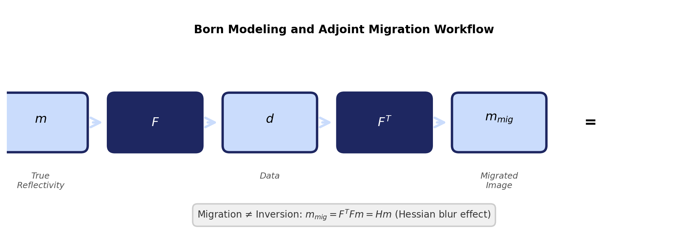{fig-align="center" width="90%"}

---

## What Does the Hessian Encode? {.smaller}

The Hessian $\mathbf{H} = \mathbf{F}^{\top}\mathbf{F}$ captures the combined effect of:

| Factor | Consequence in image |
|--------|---------------------|
| Finite acquisition aperture | Dip-dependent illumination |
| Source/receiver sampling | Acquisition footprint |
| Geometric spreading | Depth-dependent amplitude decay |
| Band-limited source | Finite spatial resolution |
| Velocity structure | Position-dependent blurring |

. . .

**Undoing** these effects $\Rightarrow$ true-amplitude, high-resolution imaging.

---

## Hessian Blurring — Image Domain{.smaller}

Figures adapted from @hill2020.

:::: {.columns}
::: {.column width="33%"}
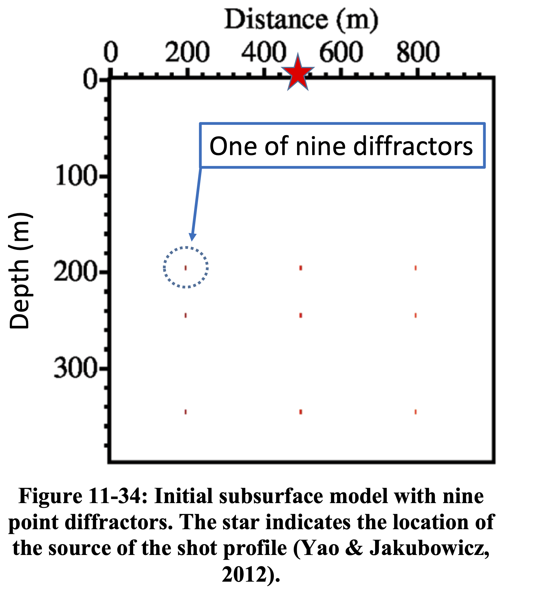{fig-align="center" width="100%"}
:::
::: {.column width="33%"}
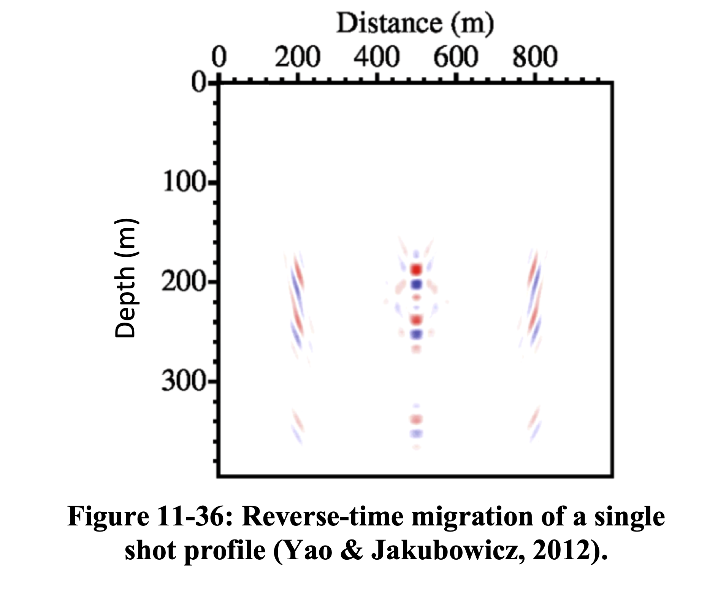{fig-align="center" width="100%"}
:::
::: {.column width="33%"}
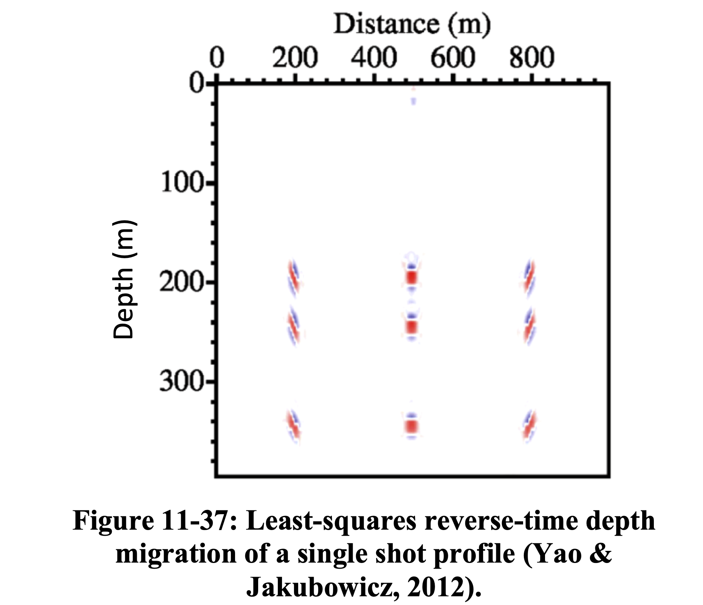{fig-align="center" width="100%"}
:::
::::

RTM applies the adjoint $\mathbf{F}^{\top}$ producing a **blurred** image. LS-RTM inverts $\mathbf{H}$ to recover the true reflectivity with correct amplitudes and resolution [@yao2012].

---

## Hessian Blurring — Data Domain{.smaller}

Figures adapted from @hill2020.

:::: {.columns}
::: {.column width="33%"}
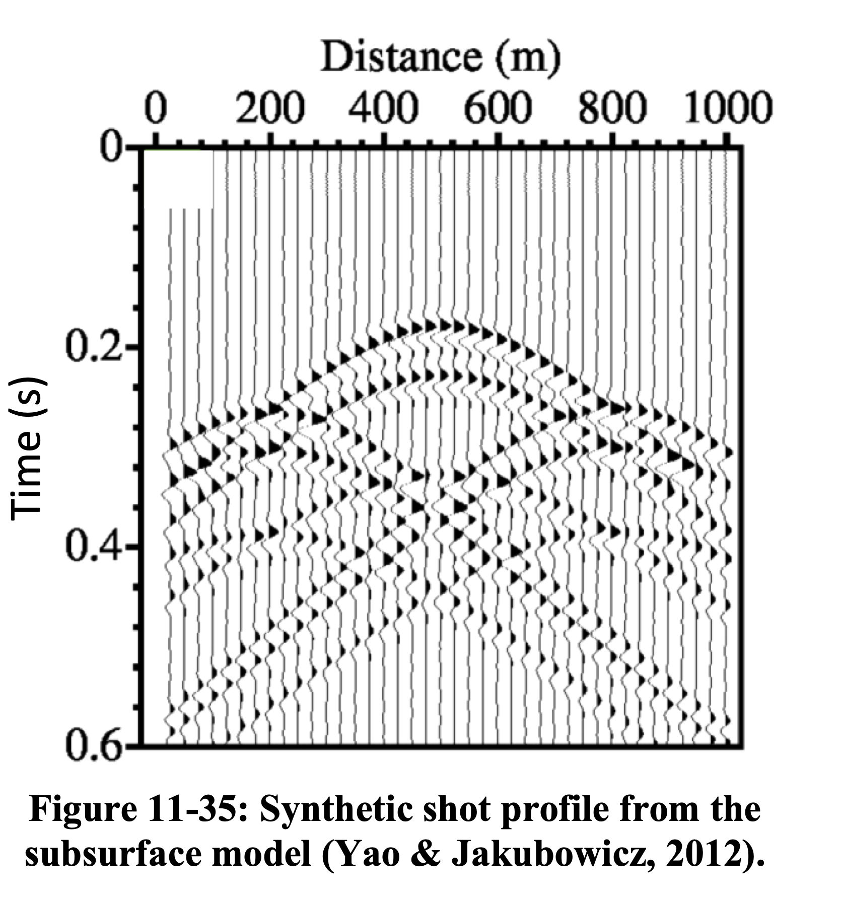{fig-align="center" width="100%"}
:::
::: {.column width="33%"}
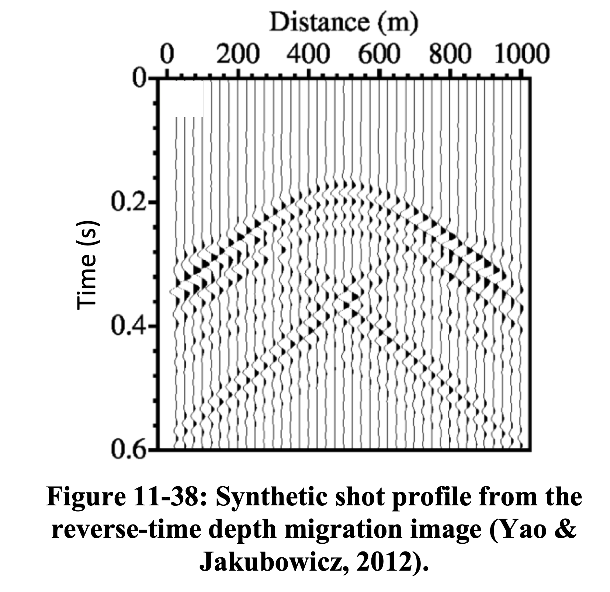{fig-align="center" width="100%"}
:::
::: {.column width="33%"}
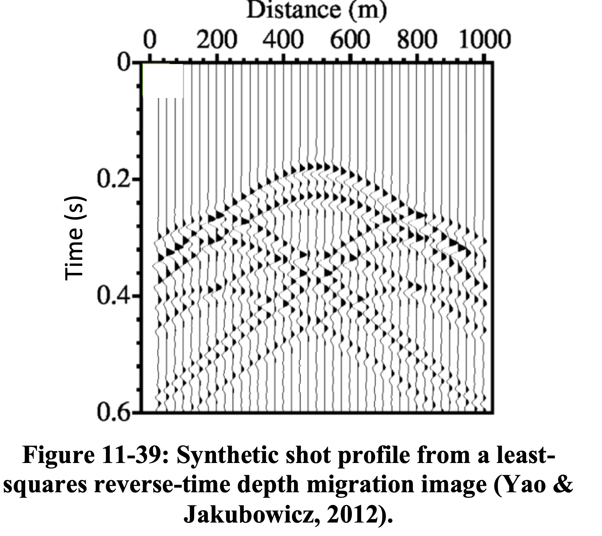{fig-align="center" width="100%"}
:::
::::

LS-RTM produces an image whose **predicted data** $\mathbf{F}\mathbf{m}$ closely matches the observed data $\mathbf{d}$, confirming that the Hessian has been effectively inverted [@yao2012].

---

## RTM vs. LS-RTM — Salt Model{.smaller}

:::: {.columns}
::: {.column width="50%"}
![Reverse-time migration [@zeng2014]](figures/RTM.png){fig-align="center" width="100%"}
:::
::: {.column width="50%"}
![Least-squares RTM [@zeng2014]](figures/LS-RTM.png){fig-align="center" width="100%"}
:::
::::

LS-RTM recovers reflector amplitudes beneath the salt body and suppresses migration artifacts [see also @hill2020, Ch. 11].

---

## RTM vs. LS-RTM — Field Data{.smaller}

:::: {.columns}
::: {.column width="50%"}
![Prestack migration [@zeng2014b]](figures/RTM_2.png){fig-align="center" width="100%"}
:::
::: {.column width="50%"}
![LS-RTM [@zeng2014b]](figures/LS-RTM_2.png){fig-align="center" width="100%"}
:::
::::

On field data, LS-RTM produces a higher-resolution image with more balanced amplitudes and reduced acquisition footprint [see also @hill2020].

---

## The Normal Equations

Setting $\nabla_{\mathbf{m}} \|\mathbf{d} - \mathbf{F}\mathbf{m}\|_2^2 = 0$ yields the **normal equations**:

$$
\mathbf{H}\,\mathbf{m} = \mathbf{F}^{\top}\mathbf{F}\,\mathbf{m} = \mathbf{F}^{\top}\,\mathbf{d}
$$

. . .

Two strategies to solve this:

1. **Data-domain LSM (DDLSM):** iteratively minimize $\|\mathbf{d} - \mathbf{F}\mathbf{m}\|_2^2$ — never form $\mathbf{H}$ explicitly

2. **Image-domain LSM (IDLSM):** approximate $\mathbf{H}$ (or $\mathbf{H}^{-1}$) and solve in the image domain

---

# Part I: Data-Space Least-Squares Migration {background-color="#2a4d69"}

---

## DDLSM — The Optimization Problem{.smaller}

$$
\min_{\mathbf{m}} \;\frac{1}{2}\|\mathbf{F}\,\mathbf{m} - \mathbf{d}\|_2^2
$$

. . .

Solved iteratively via **LSQR** [@paige1982] — a Krylov method based on Golub--Kahan bidiagonalization:

::::{.columns}
:::{.column width="50%"}

**Each iteration requires:**

- One **demigration** $\mathbf{F}\,\mathbf{v}^{(k)}$
- One **migration** $\mathbf{F}^{\top}\,\mathbf{u}^{(k)}$

:::
:::{.column width="50%"}

**Benefits:**

- Amplitude recovery
- Artifact suppression
- Handles incomplete data
- Improved resolution

:::
::::

. . .

::: {.callout-warning}
## The Bottleneck
Each LSQR iteration costs **application of Jacobian and Jacobian adjoint**. Convergence without preconditioning is typically slow ($\sim$20--50+ iterations).
:::

---

## LSQR Algorithm for LSM {.smaller .scrollable}

**Algorithm: LSQR** [@paige1982]

**Input:** Born operator $\mathbf{F}$, data $\mathbf{d}$, max iterations $K$, tolerance $\tau$

1. Initialize: $\beta_1\,\mathbf{u}_1 = \mathbf{d}$, $\;\alpha_1\,\mathbf{v}_1 = \mathbf{F}^{\top}\mathbf{u}_1$, $\;\mathbf{m}_0 = \mathbf{0}$
2. **for** $k = 1, 2, \ldots, K$:
   - **Bidiagonalization:**
     - $\beta_{k+1}\,\mathbf{u}_{k+1} = \mathbf{F}\,\mathbf{v}_k - \alpha_k\,\mathbf{u}_k$ $\quad$ *(one demigration)*
     - $\alpha_{k+1}\,\mathbf{v}_{k+1} = \mathbf{F}^{\top}\,\mathbf{u}_{k+1} - \beta_{k+1}\,\mathbf{v}_k$ $\quad$ *(one migration)*
   - **QR update:** apply Givens rotation to the bidiagonal system
   - **Solution update:** $\mathbf{m}_k = \mathbf{m}_{k-1} + \phi_k\,\mathbf{w}_k$
   - **Convergence check:** stop if $\|\mathbf{F}\mathbf{m}_k - \mathbf{d}\|_2/\|\mathbf{d}\|_2 < \tau$

. . .

::: {.callout-note}
## Key Property
LSQR minimizes $\|\mathbf{d} - \mathbf{F}\mathbf{m}\|_2$ monotonically over the Krylov subspace $\mathcal{K}_k(\mathbf{H}, \mathbf{F}^{\top}\mathbf{d})$. Early termination acts as **implicit regularization** [@vogel2002].
:::

---

## Why Is Convergence Slow?{.smaller}

The convergence rate of LSQR depends on the singular-value distribution of $\mathbf{F}$, or equivalently the eigenvalue distribution of $\mathbf{H}$:

$$
\|\mathbf{m}^{(k)} - \mathbf{m}^{*}\|_{\mathbf{H}} \;\leq\; 2\left(\frac{\sqrt{\kappa}-1}{\sqrt{\kappa}+1}\right)^k \|\mathbf{m}^{(0)} - \mathbf{m}^{*}\|_{\mathbf{H}}
$$

. . .

The Hessian has **enormous dynamic range** because of:

- Geometric spreading ($\sim z^2$ amplitude decay in 2D)
- Dip-dependent illumination gaps
- Acquisition footprint irregularities

$\Rightarrow$ $\kappa(\mathbf{H})$ is large $\Rightarrow$ LSQR converges slowly.

---

## Preconditioning — The Preconditioned System {.smaller}

Following @herrmann2009, we reformulate the system using left and right preconditioners.

**Right preconditioning** with $\mathbf{M}_R \approx \mathbf{H}^{1/2}$:

$$
\mathbf{F}\,\mathbf{M}_R^{-1}\,\mathbf{u} \approx \mathbf{d}, \qquad \mathbf{m} := \mathbf{M}_R^{-1}\,\mathbf{u}
$$

. . .

**Combined left + right preconditioning:**

$$
\underbrace{\mathbf{M}_L^{-1}\,\mathbf{F}\,\mathbf{M}_R^{-1}}_{\widehat{\mathbf{F}}}\;\mathbf{u} \approx \underbrace{\mathbf{M}_L^{-1}\,\mathbf{d}}_{\widehat{\mathbf{d}}}
$$

## {.smaller}

The **migrated** and **least-squares migrated** images are then given by:

$$
\widetilde{\mathbf{m}} = \mathbf{M}_R^{-1}\,\widetilde{\mathbf{u}}, \quad \widetilde{\mathbf{u}} = \widehat{\mathbf{F}}^{\top}\,\widehat{\mathbf{d}}
$$

$$
\widetilde{\mathbf{m}}_{LS} = \mathbf{M}_R^{-1}\,\widetilde{\mathbf{u}}_{LS}, \quad \widetilde{\mathbf{u}}_{LS} = \arg\min_{\mathbf{u}} \|\widehat{\mathbf{d}} - \widehat{\mathbf{F}}\,\mathbf{u}\|_2
$$

. . .

Our preconditioners are derived from **three observations** [@herrmann2009]:

1. Under certain conditions (high-frequency limit, smooth background velocity, no turning waves), the normal operator $\mathbf{H}$ is a $(d-1)$-order pseudodifferential operator ($\Psi$DO)
2. Migration amplitudes **decay with depth** due to spherical spreading of seismic body waves
3. Zero-order $\Psi$DOs can be approximated by a **diagonal scaling in the curvelet domain**

These observations define a series of increasingly accurate approximations to $\mathbf{H}^{1/2}$, yielding better preconditioners.

---

## Illumination-Based Preconditioning{.smaller}

The simplest diagonal approximation uses **illumination maps**.

Under high-frequency asymptotics and infinite-aperture assumptions, the Hessian is approximately diagonal:

$$
\mathbf{H} \approx \operatorname{diag}(\mathbf{h}), \quad h(\mathbf{x}) = \sum_s \int |\hat{G}_s(\mathbf{x}, \omega)|^2\, d\omega
$$

. . .

The preconditioner is then the **reciprocal illumination**:

$$
P_{\text{illum}}(\mathbf{x}) = \frac{1}{h(\mathbf{x}) + \epsilon}
$$

- Cheap to compute (byproduct of migration)
- Corrects gross amplitude imbalances (e.g., depth decay)
- **Does not** account for dip-dependent or off-diagonal effects

---

## Limitations of Diagonal Preconditioning{.smaller}

:::: {.columns}
::: {.column width="50%"}

**What it fixes:**

- Depth-dependent amplitude
- Gross illumination holes
- Source-receiver footprint (partially)

:::
::: {.column width="50%"}

**What remains:**

- Dip-dependent blurring
- Position- and angle-dependent resolution
- Off-diagonal Hessian structure

:::
::::

. . .

$\Rightarrow$ Need **phase-space** corrections that account for both position *and* dip/angle simultaneously.

---

## Curvelet-Based Preconditioning{.smaller}

Following @herrmann2009, the key insight is that the Hessian is **nearly diagonal in the curvelet domain**.

A pseudodifferential operator ($\Psi$DO) has the general form:

$$
(\Psi f)(x) \simeq \int e^{j\xi \cdot x}\, a(x, \xi)\, \hat{f}(\xi)\, d\xi
$$

where $a(x, \xi)$ is the **symbol** — a space- and spatial-frequency-dependent filter. This is simply a **non-stationary convolution**: the kernel varies with position.

. . .

Curvelets are localized in both **space** and **dip** (angle) — they live in phase space and are the natural domain to capture the anisotropic blurring of the Hessian.

**Theorem** [@candes2005]: *Under the action of the normal operator $\mathbf{H}$, curvelets remain approximately invariant — they are only rescaled, with corrections that decay at finer scales.*

---

## Why Curvelets? — Frequency Tiling and Spatial Atoms{.smaller}

![(a) Curvelet atoms in the physical domain at various scales, positions, and orientations. (b) Curvelet tiling of the 2D frequency plane showing dyadic scales with angular wedges obeying parabolic scaling [@herrmann2008].](figures/curvepart.png){fig-align="center" width="90%"}

---

## Three Levels of Preconditioning{.smaller}

@herrmann2009 propose a **cascade** of three corrections:

| Level | Correction | Domain |
|-------|-----------|--------|
| I | Order of migration operator ($|\omega|$ scaling) | Fourier domain |
| II | Geometric spreading (depth correction) | Physical domain |
| III | Position- and dip-dependent amplitude | **Curvelet** domain |

. . .

$$
\widehat{\mathbf{F}} = \mathbf{M}_L^{-1}\;\mathbf{F}\;\mathbf{M}_R^{-1}
$$

Each level addresses a different source of ill-conditioning.

---

## Level I — Left Preconditioning by Fractional Differentiation{.smaller}

The normal operator $\mathbf{H}$ is a $(d-1)$-order pseudodifferential operator ($\Psi$DO). In 2D image space, its leading-order behavior corresponds to the Laplacian $(-\Delta)$, or $|\xi|^2$ in the Fourier domain.

. . .

**Left preconditioner** [@herrmann2009, Eq. 6]:

$$
\mathbf{M}_L^{-1} := \partial_{|t|}^{-1/2} \;=\; \mathcal{F}^{*}\,|\omega|^{-1/2}\,\mathcal{F}
$$

This half-order fractional time integration compensates for the **order of the migration operator**, whitening the wavenumber spectrum [cf. @claerbout1994; @symes2008].

---

## Level II — Depth Correction{.smaller}

Correct for **geometric spreading** — reflected waves experience amplitude decay proportional to $\sqrt{z}$ (in 2D) from source down to reflector and back.

. . .

**Right preconditioner** [@herrmann2009, Eq. 7]:

$$
\mathbf{M}_R^{-1} = \mathbf{D}_z := \operatorname{diag}(\mathbf{z})^{1/2}
$$

where $z_i = i\,\Delta z$, with $\Delta z$ the depth sample interval.

. . .

Combined with Level I, this accounts for the smooth, position-dependent amplitude variations, but still treats all dips equally at each location.

---

## Level III — Curvelet-Domain Scaling {.smaller}

After left preconditioning, the Hessian becomes a **zero-order $\Psi$DO** — a non-stationary dip filter with smooth symbol $a(x, \xi)$.

. . .

Key approximation [@herrmann2008; @herrmann2009, Eq. 9]:

$$
\Psi\,\mathbf{r} \approx \mathbf{C}^{\top}\,\mathbf{D}_\Psi^2\,\mathbf{C}\,\mathbf{r}, \qquad \mathbf{D}_\Psi^2 := \operatorname{diag}(\mathbf{d}^2)
$$

where $\mathbf{C}$ is the curvelet transform and $\mathbf{d}$ are estimated from a **remigrated-image matched-filtering** procedure.

. . .

The **full right preconditioner** (Eq. 10):

$$
\mathbf{M}_R^{-1} = \mathbf{D}_z\;\mathbf{C}^{\top}\;\mathbf{D}_\Psi^{-1}
$$

The weights $d_{j,l,k}$ (scale $j$, angle $l$, position $k$) capture the **position- and dip-dependent** illumination deficiencies. Cost: approximately one modeling + one migration.

---

## Why Curvelets?{.smaller}

::::{.columns}
:::{.column width="50%"}

**Phase-space localization:**

- Scale (frequency band)
- Orientation (reflector dip)
- Position (spatial location)

Curvelets obey **parabolic scaling**: width $\sim$ length$^{1/2}$

:::
:::{.column width="50%"}

**Key properties for imaging:**

- Sparsify seismic images
- Near-diagonalize the Hessian
- Approximation error **decreases** at finer scales
- Anisotropic — match wavefront geometry

:::
::::

. . .

$\Rightarrow$ Curvelet-domain diagonal scaling is a far better approximation of $\mathbf{H}^{-1}$ than any isotropic (e.g., Fourier or spatial) diagonal scaling.

---

## Industry Adoption{.smaller}

The curvelet-domain preconditioning idea was later adopted by industry. @wang2018cgg proposed "curvelet-domain Hessian filters" (CHF) for preconditioned iterative LSRTM — essentially the same approach as @herrmann2009 — demonstrating faster convergence and fewer artifacts on both SEAM I synthetic and Gulf of Mexico field data.

. . .

::: {.callout-note}
## Note
The CGG paper does not cite the original curvelet-based preconditioning work by @herrmann2009, despite using the same curvelet-domain diagonal approximation of the Hessian.
:::

## CHF-Preconditioned LSRTM — SEAM I Synthetic{.smaller}

![SEAM I synthetic study: (a) true reflectivity; (b) raw RTM; (c) conventional LSRTM (iteration 1); (d) CHF-preconditioned LSRTM (iteration 1); (e) conventional LSRTM (iteration 10); (f) CHF-preconditioned LSRTM (iteration 3) [@wang2018cgg].](figures/cgg1.png){fig-align="center" width="90%"}

---

## CHF-Preconditioned LSRTM — GOM Field Data{.smaller}

![GOM field data: (a) raw RTM; (b) regular LSRTM (iteration 6); (c) CHF-preconditioned LSRTM (iteration 1, equivalent to single-iteration CHF); (d) CHF-preconditioned LSRTM (iteration 2) [@wang2018cgg].](figures/cgg2.png){fig-align="center" width="90%"}

---

## Effect on Convergence

On the SEG/EAGE AA' salt model [@herrmann2009]:

| Preconditioning level | Iterations to converge |
|-----------------------|----------------------|
| None | $\sim$ 50+ |
| Level I (Fourier) | $\sim$ 30 |
| Level I + II (+ depth) | $\sim$ 15 |
| Level I + II + III (+ curvelet) | $\sim$ 5--8 |

---

## Effect on Convergence {.smaller}

:::: {.columns}
::: {.column width="50%"}
![Data-space normalized residuals $\mu_k$ (dB) vs. LSQR iterations [@herrmann2009].](figures/res.png){fig-align="center" width="100%"}
:::
::: {.column width="50%"}
![Model-space normalized residuals $\nu_k$ (dB) vs. LSQR iterations [@herrmann2009].](figures/cond.png){fig-align="center" width="100%"}
:::
::::

Dotted blue: no preconditioning; dash-dotted green: Level I; dashed black: Level II; solid red: Level III. Level II/III curves are offset by one iteration to account for the preconditioning overhead.

---

## SEG/EAGE AA' Salt Model{.smaller}

:::: {.columns}
::: {.column width="33%"}
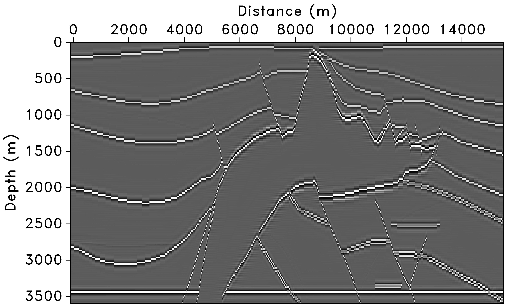{fig-align="center" width="100%"}
:::
::: {.column width="33%"}
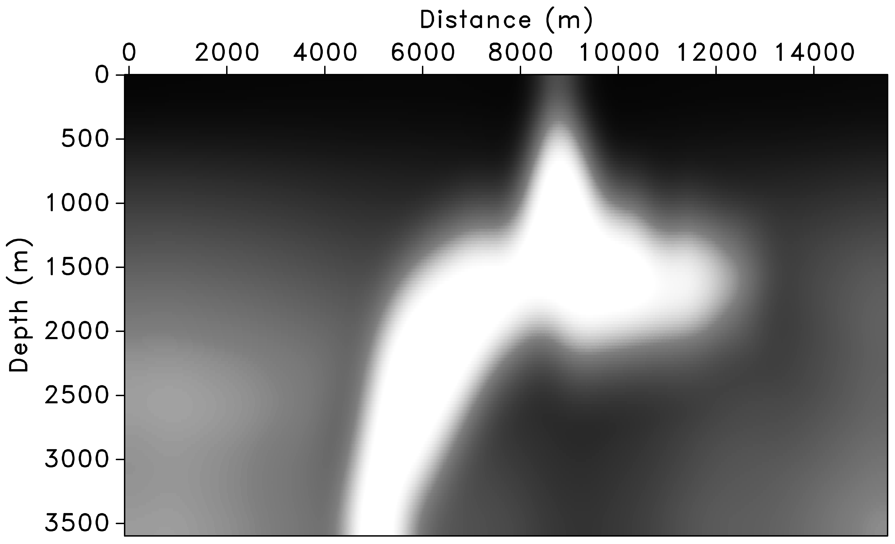{fig-align="center" width="100%"}
:::
::: {.column width="33%"}
{fig-align="center" width="100%"}
:::
::::

The migrated image suffers from deteriorated amplitudes, especially under the high-velocity salt and for steep reflectors and faults [@herrmann2009].

---

## Preconditioning Results — Migrated Images{.smaller}

:::: {.columns}
::: {.column width="33%"}
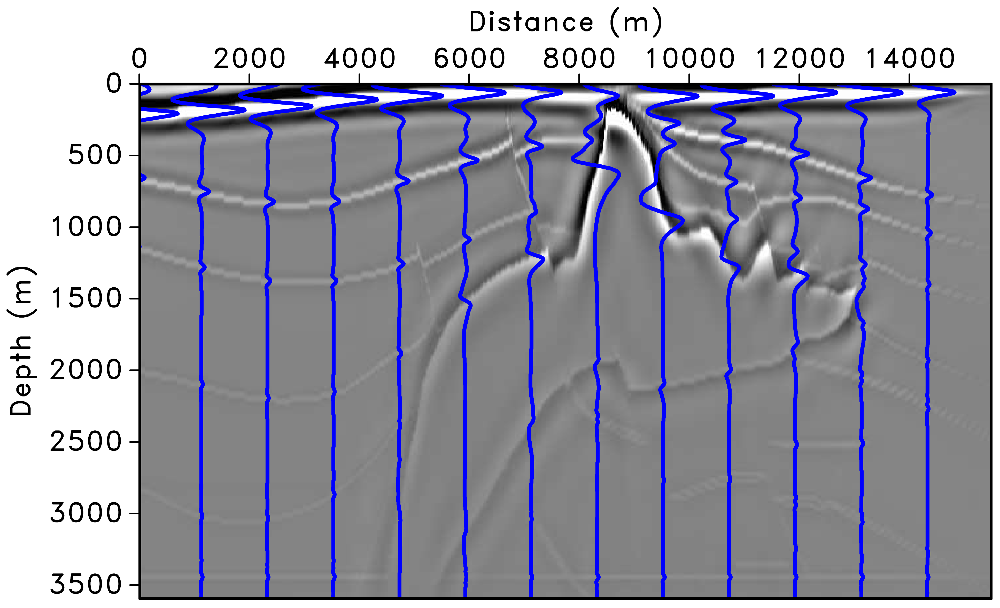{fig-align="center" width="100%"}
:::
::: {.column width="33%"}
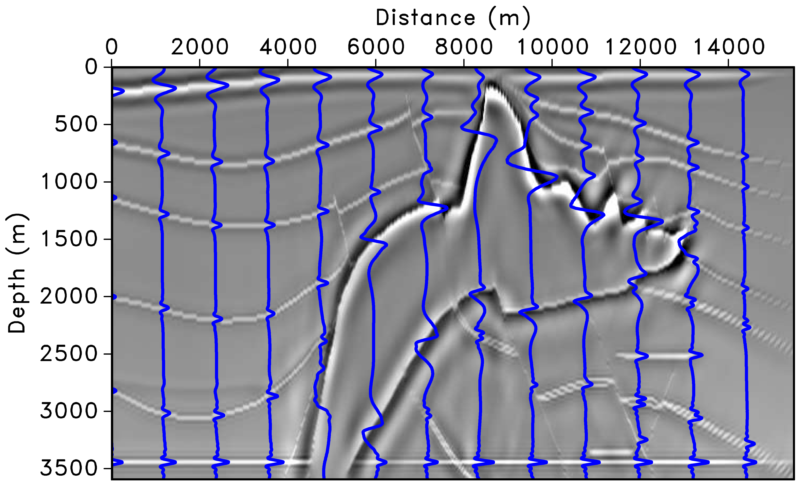{fig-align="center" width="100%"}
:::
::: {.column width="33%"}
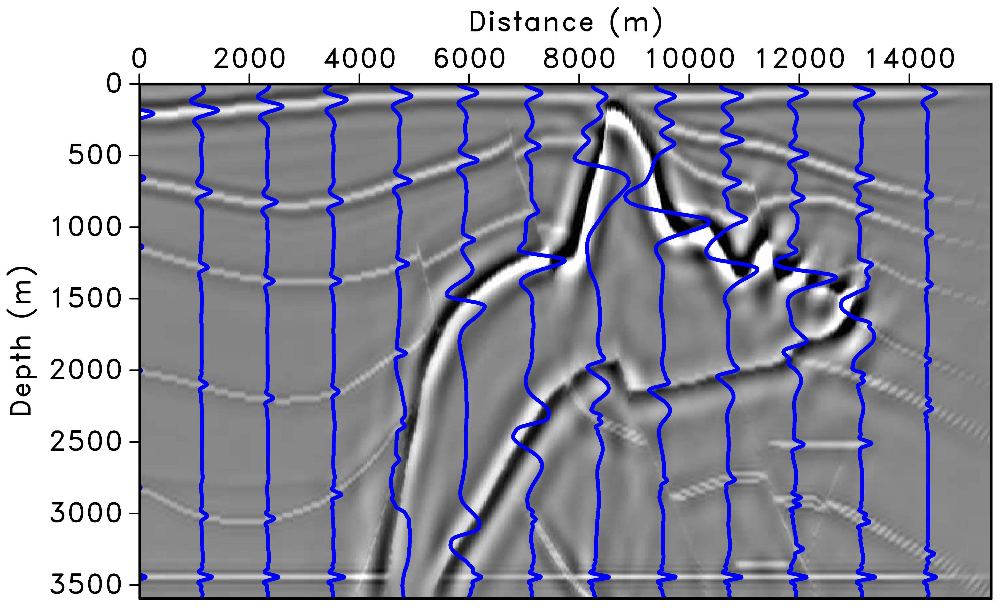{fig-align="center" width="100%"}
:::
::::

**(a)** Left preconditioning removes the imprint of the Laplacian, restoring low-frequency content. **(b)** Adding depth correction further improves amplitudes, but variations remain along the major horizontal reflector above 3500 m. **(c)** Curvelet-domain scaling provides additional position- and dip-dependent amplitude correction [@herrmann2009].

---

## Sparsity Promotion as Regularization{.smaller}

Beyond preconditioning, curvelet sparsity can serve as **regularization**:

$$
\min_{\mathbf{m}}\;\frac{1}{2}\|\mathbf{F}\mathbf{m} - \mathbf{d}\|_2^2 + \lambda\,\|\mathbf{C}\,\mathbf{m}\|_1
$$

. . .

The $\ell_1$ penalty in the curvelet domain:

- Suppresses incoherent migration artifacts
- Handles incomplete/noisy data gracefully
- Natural complement to curvelet preconditioning

See also: @herrmann2012, *Efficient least-squares imaging with sparsity promotion and compressive sensing*, Geophys. Prosp.

---

# Part II: Image-Space Least-Squares Migration {background-color="#2a4d69"}

---

## IDLSM — Key Idea {.smaller}

Instead of iterating in data space, work **directly in the image domain**.

Start from the normal equations:

$$
\mathbf{m} = \mathbf{H}^{-1}\,\mathbf{m}_{\text{mig}}
$$

. . .

If we can approximate $\mathbf{H}^{-1}$ (or $\mathbf{H}$), we solve an **image-domain deconvolution** problem:

$$
\min_{\mathbf{m}} \;\frac{1}{2}\|\mathbf{H}\,\mathbf{m} - \mathbf{m}_{\text{mig}}\|_2^2 + \mathcal{R}(\mathbf{m})
$$

. . .

**Advantage:** no additional modeling/migration — just matrix--vector products with $\mathbf{H}$ (or its approximation) in the image domain.

---

## The Challenge

The full Hessian $\mathbf{H} \in \mathbb{R}^{N \times N}$ where $N$ = number of image points.

For a typical 3D survey: $N \sim 10^8$--$10^{10}$

. . .

::: {.callout-important}
## Impractical to Form Explicitly
$\mathbf{H}$ has $N^2$ elements — storing it is impossible. We need **structured approximations**.
:::

---

## Approximation Strategy 1: Diagonal Hessian {.smaller}

The simplest approach — assume $\mathbf{H}$ is diagonal:

$$
H(\mathbf{x}, \mathbf{x}) \approx \sum_{s,r} A_s(\mathbf{x})\, A_r(\mathbf{x})
$$

where $A_s, A_r$ are source/receiver amplitude functions.

. . .

**Pros:**

- Very cheap (illumination map)
- Often adequate for amplitude balancing

**Cons:**

- Ignores off-diagonal terms (spatial blurring)
- Cannot improve resolution
- Fails near complex structures (salt flanks, faults)

---

## Approximation Strategy 2: Point Spread Functions {.scrollable .smaller}

Each column of $\mathbf{H}$ is the **point spread function** (PSF) at that image point:

$$
\text{PSF}(\mathbf{x}, \mathbf{x}') = [\mathbf{F}^{\top}\mathbf{F}](\mathbf{x}, \mathbf{x}')
$$

Compute PSFs on a **coarse grid** and interpolate:

. . .

1. Place point scatterers at selected locations $\{\mathbf{x}_i\}$
2. Model + migrate $\Rightarrow$ local PSFs
3. Solve local deconvolution problems

. . .

@fletcher2016: compute PSFs on coarse grid with on-the-fly interpolation.

@valenciano2006: target-oriented inversion using PSFs with one-way wave-equation migration.

---

## Point Spread Functions — Spatial Variation

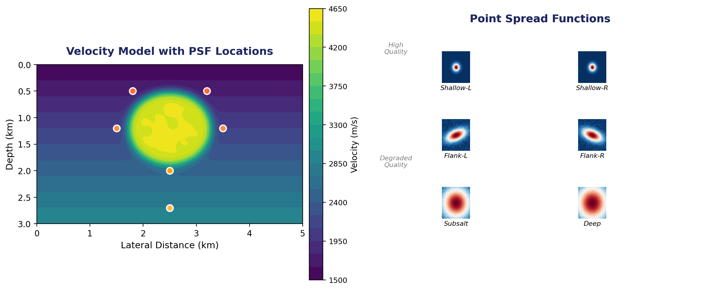{fig-align="center" width="95%"}

---

## Approximation Strategy 3: Non-Stationary Filters {.smaller}

Approximate the Hessian action as **space-varying convolution**:

$$
[\mathbf{H}\,\mathbf{m}](\mathbf{x}) \approx \int h(\mathbf{x}, \mathbf{x}')\, m(\mathbf{x}')\, d\mathbf{x}'
$$

where $h(\mathbf{x}, \mathbf{x}')$ is localized (banded).

. . .

**Matching-filter approach** [@aoki2009; @guo2020]:

- Compute $\mathbf{m}_{\text{mig}}$ and $\mathbf{H}\mathbf{m}_{\text{mig}} = \mathbf{F}^{\top}\mathbf{F}\mathbf{m}_{\text{mig}}$
- Estimate non-stationary filters that map $\mathbf{m}_{\text{mig}} \to \mathbf{F}^{\top}\mathbf{F}\mathbf{m}_{\text{mig}}$
- Invert these filters $\Rightarrow$ approximate $\mathbf{H}^{-1}$

Cost: one additional demigration/remigration cycle.

---

## Approximation Strategy 4: Kronecker Factorization {.smaller}

@gao2020 factorize the Hessian as a **superposition of Kronecker products**:

$$
\mathbf{H} \approx \sum_{i=1}^{r} \mathbf{A}_i \otimes \mathbf{B}_i
$$

where $\mathbf{A}_i, \mathbf{B}_i$ are small matrices.

. . .

- Only a **small percentage** of Hessian elements needed (matrix completion)
- Iterative solution replaces modeling/migration with **fast matrix multiplications**
- Achieves near-identical results to full DDLSM at 5--15$\times$ speedup

---

## Approximation Strategy 5: Curvelet-Domain Hessian {.smaller}

Building on the near-diagonality theorem, the Hessian in the curvelet domain can be approximated beyond a simple diagonal.

. . .

**Diagonal approximation** [@herrmann2009; @sanavi2021]:

$$
\mathbf{C}\,\mathbf{H}\,\mathbf{C}^{\top} \approx \operatorname{diag}(\boldsymbol{\sigma})
$$

Weights $\boldsymbol{\sigma}$ estimated from demigration/remigration of curvelet atoms.

. . .

**Banded/guided filter extension** [@li2021]:

- Estimate a **dense curvelet-domain filter** (not just diagonal)
- Uses guided-filter methodology for robustness
- Better handles low-wavenumber artifacts

---

## Approximation Strategy 6: Chains of Operators {.smaller}

Approximate $\mathbf{H}^{-1}$ as a **chain** of simple operators in complementary domains:

$$
\mathbf{H}^{-1} \approx \mathbf{W}_{\text{space}} \cdot \mathbf{W}_{\text{freq}} \cdot \mathbf{W}_{\text{space}}
$$

. . .

**@greer2018:** non-stationary amplitude + frequency matching

- Two operators capture amplitude and frequency variations
- Cost comparable to a single migration
- Handles the principal differences between RTM and LSRTM images

. . .

This is conceptually similar to the multi-level preconditioning of @herrmann2009, but formulated as a post-migration correction.

---

## Comparison of Approaches {.smaller}

| Method | Cost | Resolution gain | Amplitude | Off-diagonal |
|--------|------|----------------|-----------|-------------|
| Diagonal (illumination) | Negligible | No | Partial | No |
| PSF-based | Moderate | Yes (local) | Yes | Local |
| Non-stationary filters | 1 extra cycle | Yes | Yes | Banded |
| Kronecker | Sampling $\mathbf{H}$ | Yes | Yes | Approximate |
| Curvelet diagonal | $\sim$1 extra cycle | Partial | Yes | Phase-space |
| Full DDLSM | $K$ iterations | Yes | Yes | Exact |

---

## Regularization in IDLSM {.smaller}

The image-domain problem is often ill-posed. Common regularization:

$$
\min_{\mathbf{m}} \;\frac{1}{2}\|\mathbf{H}\,\mathbf{m} - \mathbf{m}_{\text{mig}}\|_2^2 + \lambda_1\|\mathbf{m}\|_1 + \lambda_2 \text{TV}(\mathbf{m})
$$

. . .

- **$\ell_1$ (sparsity):** promote sparse reflectivity (curvelets, seislets, wavelets)
- **Total variation:** preserve sharp edges, suppress oscillatory noise
- **Combined:** high-resolution *and* geologically plausible images

---

## DDLSM vs. IDLSM — When to Use Which? {.smaller}

:::: {.columns}

::: {.column width="50%"}

### Data-Domain (DDLSM)

- Exact Hessian action (implicit)
- Better for severely incomplete data
- Natural for simultaneous sources
- High computational cost
- Benefits greatly from preconditioning (curvelet, illumination)

:::

::: {.column width="50%"}

### Image-Domain (IDLSM)

- Requires Hessian approximation
- Very fast once $\mathbf{H}$ is estimated
- Natural for target-oriented imaging
- Lower computational cost
- Quality depends on approximation accuracy

:::

::::

---

## DDLSM vs. IDLSM — Workflows

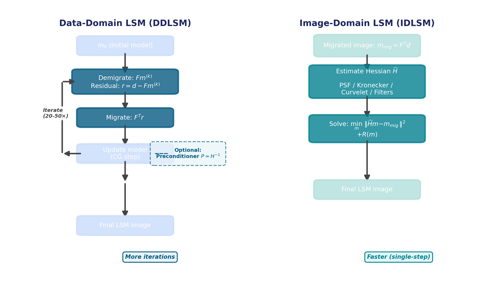{fig-align="center" width="85%"}

---

# Connections and Outlook {background-color="#2a4d69"}

---

## Unifying View {.smaller}

Both DDLSM and IDLSM solve the **same** normal equations — they differ in *how*:

$$
\underbrace{\mathbf{F}^{\top}\mathbf{F}}_{\text{Hessian}}\;\mathbf{m} = \underbrace{\mathbf{F}^{\top}\mathbf{d}}_{\text{migrated image}}
$$

. . .

| | DDLSM | IDLSM |
|---|-------|-------|
| Access to $\mathbf{H}$ | Implicit (via $\mathbf{F}, \mathbf{F}^{\top}$) | Explicit approximation |
| Preconditioning | $\mathbf{M}_L, \mathbf{M}_R$ speed up LSQR | $\hat{\mathbf{H}}^{-1}$ applied directly |
| Sweet spot | Full survey, complex geology | Target zones, fast turnaround |

. . .

The curvelet framework provides a **bridge** — useful both as a preconditioner in DDLSM and as a Hessian approximation in IDLSM.

---

## Emerging Directions {.smaller}

- **Learned Hessian approximations:** deep-learning-based inverse Hessian estimation [@kaur2020]
- **Extended image-domain LSM:** subsurface-offset gathers for velocity errors and AVA
- **Stochastic/randomized methods:** phase-encoded sources to reduce per-iteration cost
- **Elastic & viscoacoustic LSM:** multi-parameter Hessian challenges

---

## Key References {.smaller .scrollable}

::: {#refs}
:::

---

## Summary {.scrollable}

::: {.incremental}
1. Conventional migration = adjoint, not the inverse $\Rightarrow$ Hessian blurring
2. **DDLSM** iterates in data space via LSQR — exact but expensive; preconditioning is essential
3. **Illumination-based** preconditioners correct gross amplitude but miss dip-dependent effects
4. **Curvelet-based** preconditioners exploit phase-space near-diagonality of $\mathbf{H}$ for dramatic convergence acceleration
5. **IDLSM** approximates $\mathbf{H}$ directly — fast and practical for target-oriented imaging
6. Hessian approximations range from **diagonal** $\to$ **PSF** $\to$ **non-stationary filters** $\to$ **Kronecker** $\to$ **curvelet-domain** — each trading cost for accuracy
:::
