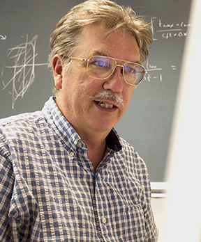

## {#title-custom .center background-color="white"}

:::{style="display: flex; justify-content: center; align-items: center; gap: 2.5em; margin-bottom: 1em;"}
{height=100}
{height=100}
:::

### Subsurface Image Volumes and Migration Velocity Analyses {style="margin-bottom: 0.1em;"}

**Felix J. Herrmann**

School of Earth and Ocean Sciences --- Georgia Institute of Technology

Based on @hou2015approximate, @hou2016accelerating, and @hou2018inversion.

## Outline {.smaller}

1. **Motivation** — Why extend the image?
2. **Born modeling recap** — Connection to RTM and LSM lectures
3. **The Born inverse problem** — Overdetermination and velocity dependence
4. **Extended Born modeling** — Subsurface-offset extension
5. **Extended imaging operators** — RTM vs. approximate inverse
6. **Preconditioning** — Left and right weight operators
7. **Extended least-squares migration** — Fitting data with any velocity
8. **Weighted conjugate gradient** — Accelerating convergence
9. **DSO velocity analysis** — Focusing as a velocity criterion
10. **Numerical examples** — Marmousi and field data
11. **Limitations of WEMVA** — Artifacts and the road to FWI

::: {.notes}
This lecture introduces subsurface-offset common-image gathers and their dual role: (1) migration-velocity analysis via focusing/flatness criteria, and (2) directional scattering information (AVA/AVP). We focus on the velocity-model-building aspect and motivate the transition to full-waveform inversion.
:::

## William W. Symes

:::: {.columns}

::: {.column width="30%"}
{fig-align="center" width="100%"}
:::

::: {.column width="70%"}
**Noah Harding Professor Emeritus**\
Computational & Applied Mathematics, Rice University

- Founded **The Rice Inversion Project (TRIP)** — 25+ years of industry-sponsored research
- Pioneered **differential semblance optimization** for migration velocity analysis
- SIAM Fellow; Desiderius Erasmus Prize (EAGE, 2015); Ralph E. Kleinman Prize (SIAM)
- Key insight: use the **approximate inverse** (not the adjoint) for velocity analysis
:::

::::
---

# Motivation {background-color="#2a4d69"}

---

## Dual Purpose of Subsurface-Offset Image Gathers

Subsurface-offset common-image gathers (CIGs) serve two purposes:

:::{.incremental}
- **Migration-velocity analysis**: Focusing of CIGs or flatness of common-angle gathers indicates the velocity model is correct
- **Directional scattering information**: When the velocity model is correct, CIGs contain amplitude-versus-angle (AVA/AVP) information
:::

. . .

::: {.callout-important}
## This lecture
We focus on **velocity model building** — using the extended image volume to update the background velocity $v_0$. The directional/AVA aspect will be covered later.
:::

---

## Recall: The Two-Parameter Inverse Problem

From our RTM and LSM lectures, we know:

- **RTM** computes the gradient of the FWI objective — it is the **adjoint** $\mathbf{F}^T$, not the inverse
- **LSM** solves $\mathbf{F}^T\mathbf{F}\,\delta\mathbf{m} = \mathbf{F}^T\mathbf{d}$ to deconvolve illumination effects
- Both require a **kinematically correct** background velocity $v_0$

. . .

::: {.callout-tip}
## Key question
What if $v_0$ is wrong? Can we still extract useful information from the image to update the velocity?
:::

# Born Modeling Recap {background-color="#2a4d69"}

## Connection to Previous Lectures

## Born Approximation — Continuous Form{.smaller}

The velocity is decomposed as $v(\mathbf{x}) = v_0(\mathbf{x}) + \delta v(\mathbf{x})$, where $v_0$ is smooth and $\delta v$ contains reflectors [@hou2015approximate].

The **Born modeling operator** $F[v_0]$ maps reflectivity $\delta v$ to scattered data:

$$
(F[v_0]\delta v)(\mathbf{x}_s, \mathbf{x}_r, t) = \frac{\partial^2}{\partial t^2} \int d\mathbf{x}\, d\tau\, G(\mathbf{x}_s, \mathbf{x}, \tau) \frac{2\delta v(\mathbf{x})}{v_0(\mathbf{x})^3} G(\mathbf{x}, \mathbf{x}_r, t - \tau)
$$ {#eq-born-continuous}

This is Equation 6 of @hou2018inversion. Compare with discrete expression

$$
\begin{align}\mathbf{J}&=\nabla\mathcal{F}[\mathbf{x}_0]\\
&=-\mathbf{P}_r\mathbf{A}^{-1}[\mathbf{x}]\mathrm{diag}\big(\frac{\partial\mathbf{A}[\mathbf{x}]}{\partial\mathbf{x}}\mathbf{A}^{-1}[\mathbf{x}]\mathbf{P}^\top_s\mathbf{q}\big)\Bigr|_{\mathbf{x}_0}
\end{align}
$$

---

## Connection to Lecture Notation (RTM)

In the discrete notation of our RTM lecture:

| Continuous (Papers) | Discrete (Lecture A) |
|:--------------------|:---------------------|
| $F[v_0]\,\delta v = \delta d$ | $\mathbf{F}\,\delta\mathbf{m} = \delta\mathbf{d}$ |
| $G(\mathbf{x}_s, \mathbf{x}, t)$ | $\mathbf{A}^{-1}(\mathbf{m})\,\mathbf{q}_s$ |
| $F^*[v_0]\,\delta d$ (RTM) | $\mathbf{F}^T\,\delta\mathbf{d}$ (adjoint) |
| Imaging condition | $[\nabla_\mathbf{m} J]_i = \sum_s \sum_k v_s(x_i,t_k)\,\ddot{u}_s(x_i,t_k)\,\Delta t$ |

. . .

::: {.callout-note}
The Born modeling operator $F[v_0]$ in the papers corresponds to the stacked Jacobians $\mathbf{F} = [\mathbf{J}_1^T, \ldots, \mathbf{J}_{n_s}^T]^T$ from our LSM lecture $.
:::

---

## The Born Inverse Problem {.smaller}

The **Born inverse problem** seeks $v_0$ and $\delta v$ such that $F[v_0]\,\delta v \approx d$ [@hou2018inversion].

:::{.incremental}
- This corresponds to the LS-RTM problem we discussed before in class
- **Data fit is impossible** unless $v_0$ is kinematically correct to within a **half-period** error in traveltime prediction [@symes2008migration]
- This is because we are solving an **overdetermined** problem: the data dimension exceeds the model dimension (e.g., 5D data vs. 3D model)
- Data fit is only possible in the **special case** of correct velocity
:::

. . .

::: {.callout-important}
## The way out
If $\delta v$ is **extended** to depend on an extra dimension (subsurface offset $h$), i.e., replaced by $\delta\bar{v}(\mathbf{x}, h)$, then any model-consistent data can be fit with **essentially any** $v_0$ by proper choice of $\delta\bar{v}$.
:::

# Extended Born Modeling {background-color="#2a4d69"}

## Subsurface-Offset Extension

## Subsurface Offset — The Idea

![Sketch of the subsurface offset extension. The subsurface offset $h$ is half the distance between subsurface scattering points. This extension allows stress to produce strain at a distance [@hou2016accelerating].](figures/paperC_fig2.png){fig-align="center" width="70%"}

---

## Extended Born Modeling Operator {.smaller}

The reflectivity $\delta v(\mathbf{x})$ is replaced by $\delta\bar{v}(\mathbf{x}, h)$, and the **extended Born modeling operator** $\bar{F}[v_0]$ is defined as [@hou2018inversion, Eq. 7]:

$$
(\bar{F}[v_0]\delta\bar{v})(\mathbf{x}_s, \mathbf{x}_r, t) = \frac{\partial^2}{\partial t^2} \int d\mathbf{x}\, dh\, d\tau\, G(\mathbf{x}_s, \mathbf{x} - h, \tau) \frac{2\delta\bar{v}(\mathbf{x}, h)}{v_0(\mathbf{x})^3} G(\mathbf{x} + h, \mathbf{x}_r, t - \tau)
$$ {#eq-extended-born}

Here $h$ is half the distance between sunken source and sunken receiver in Claerbout's survey-sinking imaging condition [@claerbout1985imaging].

. . .

**Physical meaning**: We now allow reflection at a distance — a nonphysical extension that matches the model dimension with the data dimension.

---

## Extended Imaging Operator (RTM) {.smaller .hscroll}

The **extended imaging operator** is the adjoint of $\bar{F}$ — i.e., extended RTM [@hou2018inversion, Eq. 8]:

:::{style="overflow-x: auto; overflow-y: hidden;"}

$$
I(\mathbf{x}, h) = (\bar{F}^*[v_0]\,d)(\mathbf{x}, h) = \frac{2}{v_0(\mathbf{x})^3} \int d\mathbf{x}_s\, d\mathbf{x}_r\, dt\, d\tau\, G(\mathbf{x}_s, \mathbf{x} - h, \tau)\, G(\mathbf{x} + h, \mathbf{x}_r, t - \tau) \frac{\partial^2}{\partial t^2} d(\mathbf{x}_s, \mathbf{x}_r, t)
$$ {#eq-extended-rtm}
:::

In our lecture notation, the extended RTM corresponds to:

$$\boldsymbol{\delta}\bar{\mathbf{v}}[\mathbf{x}, h_x]=\bar{\mathbf{F}}^T\,\delta\mathbf{d}=\sum_s\sum_t\mathbf{v}_s[\mathbf{x}+h_x]\ddot{\mathbf{u}}_s[\mathbf{x}-h_x,t]$$

where $\bar{\mathbf{F}}$ now depends on both spatial position $\mathbf{x}$ and subsurface offset $h$. Corresponds to the *cross-covariance* between the forward and adjoint wavefields.

---

## Reflection Data

We define the **reflection data** as the difference between nonlinear data and data simulated in the background-velocity model [@hou2018inversion, Eq. 3]:

$$
\delta d = \mathcal{F}[v] - \mathcal{F}[v_0] \approx F[v_0]\,\delta v
$$

where $\mathcal{F}[v]$ is the nonlinear forward modeling operator mapping velocity to data. 

---

## What Focusing Tells Us {.smaller .scrollable}

:::: {.columns}

::: {.column width="100%"}
![The RTM offset gather with (a) 10% slower velocity, (b) correct velocity, (c) 10% faster velocity; approximate inverse offset gather with (d) 10% slower velocity, (e) correct velocity, (f) 10% faster velocity. All inverted gathers plotted on the same scale [@hou2018inversion].](figures/paperB_fig1.png){fig-align="center" width="50%"}
:::

::::

---

## 

::: {.callout-tip}
Energy focuses at $h = 0$ with correct velocity and spreads to nonzero $h$ when velocity is incorrect.
:::

# Approximate Inverse Operator {background-color="#2a4d69"}

## From Adjoint to Inversion

## Paper A: Simple Model Setup

:::: {.columns}

::: {.column width="100%"}
![Reflectivity model ($\delta v$) with constant background ($v_0 = 2500$ m/s) and one-shot simulated Born data [@hou2015approximate].](figures/paperA_fig1.png){fig-align="center" width="30%"}
:::

::::

---

## Extended RTM vs. Extended Inversion

:::: {.columns}

::: {.column width="100%"}
![Extended RTM image (a) vs. extended inverted reflectivity model (b). The approximate inverse produces correct amplitudes [@hou2015approximate].](figures/paperA_fig2.png){fig-align="center" width="30%"}
:::

::::

---

## Data Fit Verification

:::: {.columns}

::: {.column width="100%"}
![Resimulated data from inverted reflectivity (a) and difference with original data (b). The approximate inverse accurately reproduces the data [@hou2015approximate].](figures/paperA_fig3.png){fig-align="center" width="30%"}
:::

::::

---

## Approximate Inverse — Main Result {.smaller}

The approximate inverse to the extended Born modeling operator takes the form [@hou2015approximate, Eq. 1]:

$$
\bar{F}^\dagger[v_0] = W_{\text{model}}[v_0]\; \bar{F}^*[v_0]\; W_{\text{data}}[v_0]
$$ {#eq-approx-inverse}

. . .

In our **LSM lecture notation**, this corresponds to **left and right preconditioning**:

$$
\tilde{\mathbf{m}} = \mathbf{M}_R^{-1}\,\tilde{\mathbf{u}}, \quad \hat{\mathbf{F}} = \mathbf{M}_L^{-1}\,\mathbf{F}\,\mathbf{M}_R^{-1}
$$

where:

- $W_{\text{data}}[v_0]$ acts as the **right preconditioner** $\mathbf{M}_L^{-1}$ (applied to data before migration)
- $W_{\text{model}}[v_0]$ acts as the **left preconditioner** $\mathbf{M}_R^{-1}$ (applied to image after migration)

---

## Weight Operators {.smaller}

The weight operators that make $\bar{F}$ approximately unitary [@hou2018inversion, Eq. 10]:

$$
W_{\text{model}}^{-1} = -8v^4 D_z Q, \qquad W_{\text{data}} = I_t^3\, D_{z_s}\, D_{z_r}
$$

where:

- $I_t$ = time integration operator
- $D_{z_s}, D_{z_r}$ = source and receiver depth derivatives
- $D_z$ = depth derivative in image domain
- $Q \approx 1$ near $h = 0$ (neglected in practice)

. . .

::: {.callout-note}
$W_{\text{data}}$ depends **only** on $v_0$ near sources and receivers — independent of the deep velocity structure. The computational cost of $\bar{F}^\dagger$ is roughly the same as extended RTM.
Approximately unitary means that the *adjoint* is close to the *inverse* and that most enegry/information is preserved.

:::

---

## Inversion with Incorrect Velocity

:::: {.columns}

::: {.column width="100%"}
![Extended RTM image (a) and extended inverted reflectivity (b) using an **incorrect** background velocity model. The inversion still produces a data-fitting model [@hou2015approximate].](figures/paperA_fig4.png){fig-align="center" width="30%"}
:::

::::

---

## Data Fit with Wrong Velocity

:::: {.columns}

::: {.column width="100%"}
![Resimulated data from inverted reflectivity using incorrect velocity (a) and difference with original data (b). Data fit holds even with wrong velocity [@hou2015approximate].](figures/paperA_fig5.png){fig-align="center" width="30%"}
:::

::::

---

## Nonextended Inversion Result

:::: {.columns}

::: {.column width="100%"}
![Nonextended inverted reflectivity (stacking over $h$) and difference with original reflectivity model [@hou2015approximate].](figures/paperA_fig6.png){fig-align="center" width="30%"}
:::

::::

---

## Gaussian Lens Example

:::: {.columns}

::: {.column width="100%"}
![Gaussian lens background velocity model with reflector at 2 km, and corresponding rays and wavefronts [@hou2015approximate].](figures/paperA_fig8.jpeg){fig-align="center" width="30%"}
:::

::::

---

## Gaussian Lens — Inversion Results

:::: {.columns}

::: {.column width="100%"}
![Extended inverted reflectivity (a) and nonextended inverted reflectivity (b) for the Gaussian lens model [@hou2015approximate].](figures/paperA_fig9.png){fig-align="center" width="30%"}
:::

::::

---

## Gaussian Lens — Data Fit

:::: {.columns}

::: {.column width="100%"}
![One-shot resimulated Born data (a) and difference with original data (b) for the Gaussian lens model [@hou2015approximate].](figures/paperA_fig10.png){fig-align="center" width="30%"}
:::

::::

# Extended Least-Squares Migration {background-color="#2a4d69"}

## Fitting Data with Any Velocity

## LSM vs. ELSM — The Key Difference {.smaller}

From our LSM lecture, the least-squares objective is:

$$
J_{\text{LS}} = \frac{1}{2}\|\mathbf{F}\,\delta\mathbf{m} - \delta\mathbf{d}\|^2
$$

**Extended LSM** replaces $F$ by $\bar{F}$ and $\delta v$ by $\delta\bar{v}(\mathbf{x}, h)$ [@hou2016accelerating]:

$$
J_{\text{ELSM}} = \frac{1}{2}\|\bar{F}[v_0]\,\delta\bar{v} - \delta d\|^2
$$

. . .

:::{.incremental}
- velocity model extension: $\delta\bar{v}(x,y,h)=\delta v(x,z)\delta(h)$
- With the extra offset dimension, the model dimension **matches** the data dimension
- ELSM can fit data with **correct or incorrect** velocity
- Correct velocity $\Rightarrow$ energy focuses at $h = 0$
- Incorrect velocity $\Rightarrow$ energy spreads to nonzero $h$, but data is still fit
:::

---

## LSM: Correct vs. Wrong Velocity

:::: {.columns}

::: {.column width="100%"}
![Least-squares migration after 30 CG iterations using (a) correct background velocity (2.5 km/s) and (b) incorrect background velocity (2 km/s) [@hou2016accelerating]. The wrong velocity image is wronly positioned and has incorrect amplitudes.](figures/paperC_fig1.png){fig-align="center" width="30%"}
:::

::::

---

## ELSM: Correct vs. Wrong Velocity

:::: {.columns}

::: {.column width="100%"}
![Extended least-squares migration after 30 CG iterations using (a) correct velocity (2.5 km/s) and (b) incorrect velocity (2 km/s). Offset range: $[-500, 500]$ m (correct) and $[-1000, 1000]$ m (wrong) [@hou2016accelerating].](figures/paperC_fig3.png){fig-align="center" width="30%"}
:::

::::

## 

::: {.callout-tip}
With incorrect velocity, the image is not focused at $h = 0$ but the data is still fit. The offset range must be larger to accommodate the velocity error.
:::

---

## Convergence: LSM vs. ELSM

:::: {.columns}

::: {.column width="100%"}
![Relative data misfit for (a) LSM and (b) ELSM with correct (blue) and wrong (red) velocity. ELSM residual converges to zero with both velocities [@hou2016accelerating].](figures/paperC_fig4.jpeg){fig-align="center" width="60%"}
:::

::::

# Weighted Conjugate Gradient {background-color="#2a4d69"}

## Accelerating ELSM Convergence

## The Unitarity Property {.smaller}

Because $\bar{F}^\dagger \bar{F} \approx I$ (the extended Born operator is approximately unitary w.r.t. weighted norms), CG with weighted norms converges dramatically faster [@hou2016accelerating].

The **weighted CG** uses inner products:

$$
\langle \delta\bar{v}_1, \delta\bar{v}_2 \rangle_{\text{model}} = \sum_{x,z,h} \delta\bar{v}_1(x,z,h)\,(W_{\text{model}}\,\delta\bar{v}_2)(x,z,h)
$$

$$
\langle d_1, d_2 \rangle_{\text{data}} = \sum_{s,r,t} d_1(\mathbf{x}_s, \mathbf{x}_r, t)\,(W_{\text{data}}\, d_2)(\mathbf{x}_s, \mathbf{x}_r, t)
$$

---

## Algorithm: Weighted Conjugate Gradient {.smaller}

**Algorithm 1** from @hou2016accelerating. Inputs: operators $\bar{F}$, $\bar{F}^\dagger$, data $\delta d$, initial estimate $\delta\bar{v}_0$.

:::{style="font-size: 0.85em;"}
1. $z_0 \leftarrow \bar{F}^\dagger(\delta d - \bar{F}\,\delta\bar{v}_0)$
2. $p_0 \leftarrow z_0$, $\quad k \leftarrow 0$
3. **repeat**
4. $\quad \alpha_k \leftarrow \dfrac{\langle z_k, z_k \rangle_{\text{model}}}{\langle \bar{F}\,p_k, \bar{F}\,p_k \rangle_{\text{data}}}$
5. $\quad \delta\bar{v}_{k+1} \leftarrow \delta\bar{v}_k + \alpha_k\, p_k$
6. $\quad z_{k+1} \leftarrow z_k - \alpha_k\, \bar{F}^\dagger \bar{F}\, p_k$
7. $\quad \beta_{k+1} \leftarrow \dfrac{\langle z_{k+1}, z_{k+1} \rangle_{\text{model}}}{\langle z_k, z_k \rangle_{\text{model}}}$
8. $\quad p_{k+1} \leftarrow z_{k+1} + \beta_{k+1}\, p_k$
9. $\quad k \leftarrow k + 1$
10. **until** convergence
:::

::: {.callout-note}
Each iteration costs roughly the same as standard CG — one demigration ($\bar{F}$) and one migration ($\bar{F}^\dagger$). The weights add negligible cost.
:::

---

## Simple Model — CG vs. WCG

:::: {.columns}

::: {.column width="100%"}
![Simple layered model. (a) Background velocity model and (b) reflectivity model [@hou2016accelerating].](figures/paperC_fig5.jpeg){fig-align="center" width="40%"}
:::

::::

---

## ELSM Results — CG vs. WCG

:::: {.columns}

::: {.column width="100%"}
![Twenty iterations of ELSM via (a) CG and (b) WCG iteration. WCG converges dramatically faster [@hou2016accelerating].](figures/paperC_fig7.png){fig-align="center" width="35%"}
:::

::::

---

## Physical Image from WCG

:::: {.columns}

::: {.column width="100%"}
![Physical image from stacking 20 WCG iterations along subsurface offset (a), and difference with original reflectivity (b). Same gray scale [@hou2016accelerating].](figures/paperC_fig6.png){fig-align="center" width="35%"}
:::

::::

# Marmousi Examples {background-color="#2a4d69"}

## Testing on a Realistic Model

## Marmousi Model Setup

:::: {.columns}

::: {.column width="100%"}
![Marmousi model. (a) Background velocity obtained by smoothing the original model, and (b) reflectivity model (difference between original and smoothed) [@hou2016accelerating].](figures/paperC_fig10.jpeg){fig-align="center" width="55%"}
:::

::::

::: {.notes}
Fixed spread acquisition: 231 sources (40 m spacing), 461 receivers (20 m spacing), all at 20 m depth. Spatial grid 20 m. Subsurface offset range [-500, 500] m. Band-pass wavelet 2.5-5-20-25 Hz.
:::

---

## Marmousi — ELSM Results

:::: {.columns}

::: {.column width="100%"}
![Twenty iterations of ELSM via (a) CG and (b) WCG iteration on the Marmousi model. WCG yields noticeably higher resolution [@hou2016accelerating].](figures/paperC_fig11.png){fig-align="center" width="55%"}
:::

::::

---

## Marmousi — Stacked Images

:::: {.columns}

::: {.column width="100%"}
![Physical images from stacking along offset: (a) 20 CG iterations and (b) 20 WCG iterations. WCG produces a higher-resolution result [@hou2016accelerating].](figures/paperC_fig12.png){fig-align="center" width="55%"}
:::

::::

---

## Marmousi — Data Fit {.smaller}

:::: {.columns}

::: {.column width="100%"}
![Single-shot Born data at 5 km (a) and data residual ($\times 10$) after 20 WCG iterations (b). The data is accurately reconstructed [@hou2016accelerating].](figures/paperC_fig14.png){fig-align="center" width="30%"}
:::

::::

::: {.callout-tip}
The residual is amplified by a factor of 10 — the actual misfit is very small, confirming accurate data fit.
:::

---

## Marmousi — Wrong Velocity {.smaller}

:::: {.columns}

::: {.column width="100%"}
![Twenty iterations of ELSM via (a) CG and (b) WCG with incorrect velocity (0.9 × true). Energy spreads to nonzero offset but data is still fit [@hou2016accelerating].](figures/paperC_fig15.png){fig-align="center" width="40%"}
:::

::::

::: {.callout-important}
The image is **not focused** for the poor background velocity, yet data **is fit** (as in Figure 14). The offset range must be doubled ($[-1000, 1000]$ m) to accommodate the velocity error. This is the key feature exploited for velocity analysis.
:::

---

## Marmousi — Convergence Comparison

:::: {.columns}

::: {.column width="100%"}
![Relative data misfit (a) and relative normal residual (b) for CG (red) and WCG (blue) with incorrect velocity. WCG converges faster even with velocity error [@hou2016accelerating].](figures/paperC_fig16.jpeg){fig-align="center" width="80%"}
:::

::::

::: {.callout-note}
The convergence behavior with wrong velocity is very similar to the correct velocity case — WCG acceleration is robust to velocity error.
:::

# DSO Velocity Analysis {background-color="#2a4d69"}

## Differential Semblance Optimization

## DSO Objective Function {.smaller}

In the subsurface-offset domain, the semblance condition requires a **focused** offset gather. The DSO objective penalizes energy at nonzero offset [@hou2018inversion, Eq. 11]:

$$
J[v] = \frac{1}{2}\|h\, I(\mathbf{x}, h)\|^2
$$ {#eq-dso}

where $I(\mathbf{x}, h)$ is the extended image from either RTM ($\bar{F}^*$) or the approximate inverse ($\bar{F}^\dagger$).

. . .

:::{.incremental}
- Minimization penalizes energy outside $h = 0$ $\Rightarrow$ focuses the gather
- Focused gather implies **correct velocity**
- This is the basic idea of DSO-based velocity analysis
:::

---

## RTM vs. Inversion — Objective Function {.smaller}

:::: {.columns}

::: {.column width="100%"}
![Normalized objective function: MVA with RTM (red), MVA + stack power (green), and IVA with approximate inverse (blue). Velocity ranges from 2 to 3 km/s. True velocity is 2.5 km/s [@hou2018inversion].](figures/paperB_fig2.png){fig-align="center" width="60%"}
:::

::::

::: {.callout-important}
## Critical observation
The MVA objective (red) has its minimum **shifted** to 2400 m/s — the wrong velocity! The IVA objective (blue) correctly minimizes at 2500 m/s. The so-called "gradient artifacts" are actually a problem of the **objective function**, not the gradient.
:::

---

## Velocity Update Results {.scrollable}

:::: {.columns}

::: {.column width="100%"}
![(a) True model, (b) initial model, 50-iteration L-BFGS result for (c) the adjoint operator (MVA), and (d) the approximate inverse operator (IVA) [@hou2018inversion].](figures/paperB_fig3.png){fig-align="center" width="25%"}
:::

::::

---

## Zero-Offset Images — Velocity Quality

:::: {.columns}

::: {.column width="100%"}
![Zero-offset approximate inverse image associated with different velocity models from the velocity update [@hou2018inversion].](figures/paperB_fig5.png){fig-align="center" width="25%"}
:::

::::

---

## Image Gathers — Focusing Quality{.smaller}

:::: {.columns}

::: {.column width="100%"}
![Approximate inverse image gathers in the subsurface-offset domain corresponding to the images above. Focused gathers confirm improved velocity [@hou2018inversion].](figures/paperB_fig6.png){fig-align="center" width="22%"}
:::

::::

# What Goes Wrong? {background-color="#2a4d69"}

## Artifacts and Limitations of WEMVA

## The Artifact Problem {.smaller}

When RTM (the adjoint) is used instead of inversion, **artifacts** corrupt the velocity update [@hou2018inversion]:

:::: {.columns}

::: {.column width="100%"}
![RTM offset gathers show noise at nonzero offset (red arrows). This noise is due to incorrect, dip-dependent amplitudes in migrated images that cannot interfere destructively [@hou2018inversion].](figures/paperB_fig1.png){fig-align="center" width="40%"}
:::

::::

# Fundamental Limitations of WEMVA {background-color="#2a4d69"}

## Problems with Wave-Equation MVA {.smaller}

Despite the improvements from using the approximate inverse, WEMVA has fundamental issues:

:::{.incremental}
1. **Strong reflectors dominate the objective** — The DSO objective $J = \frac{1}{2}\|h\,I(\mathbf{x},h)\|^2$ is weighted toward high-amplitude events, which may not carry the best velocity information

2. **Fails with strong multiples** — Surface-related or internal multiples violate the single-scattering (Born) assumption, corrupting the image gathers and biasing the velocity update

3. **Requires extensive hand-holding** — Dip filtering, offset range selection, regularization, and balancing of DSO vs. stack-power terms all require manual tuning

4. **Limited physics** — The constant-density acoustic approximation and idealized 2D acquisition geometry are restrictive
:::

. . .

::: {.callout-important}
## The road ahead
These limitations motivate the transition to **full-waveform inversion (FWI)**, which directly fits the data without requiring image-domain proxies. FWI will be the subject of our next lectures.
:::

---

## Summary {.smaller}

:::{.incremental}
- **Subsurface-offset extension** adds degrees of freedom to match data and model dimensions
- **Extended imaging** (RTM or approximate inverse) produces offset gathers $I(\mathbf{x}, h)$
- **Focusing at $h = 0$** indicates correct velocity; unfocused gathers indicate velocity error
- The **approximate inverse** $\bar{F}^\dagger = W_{\text{model}}\,\bar{F}^*\,W_{\text{data}}$ is critical — using RTM alone leads to artifacts in velocity analysis
- **Weighted CG** dramatically accelerates extended LSM convergence
- **DSO** provides a smooth, unimodal objective for velocity updates (when using inversion, not adjoint)
- WEMVA has fundamental limitations: strong reflectors, multiples, hand-holding
- **Next**: Full-waveform inversion — a more direct approach to velocity estimation
:::

---

## Key Takeaway

::: {.callout-tip}
## From image volumes to FWI
The main goal of subsurface-offset image volumes is to obtain estimates for the **background velocity model** $v_0$. While WEMVA with the approximate inverse improves upon classical MVA, its fundamental limitations (dominance of strong reflectors, sensitivity to multiples, need for hand-holding) motivate the move to **full-waveform inversion**, which we cover next.
:::

. . .

We leave the **directional scattering** aspect (AVA/AVP from image gathers) for a later lecture.

---

## References
