## {#title-custom .center background-color="white"}

:::{style="display: flex; justify-content: center; align-items: center; gap: 2.5em; margin-bottom: 1em;"}
{height=100}
{height=100}
:::

### Basics of Full-Waveform Inversion {style="margin-bottom: 0.1em;"}

**Felix J. Herrmann**

School of Earth and Ocean Sciences --- Georgia Institute of Technology

Based on @Virieux2009, @Virieux2017, @Jones2019

## Outline {.smaller}

1. **Motivation** — Why do we need FWI?
2. **Two types of wave interactions** — Forward vs. backward scattering
3. **Single scattering formulation** — The physics of FWI
4. **Fresnel zones and resolution** — What can FWI resolve?
5. **Optimization** — Gradient descent to quasi-Newton
6. **Cycle skipping** — The fundamental challenge
7. **Topology of gradients** — Banana-doughnut vs. rabbit ears
8. **FWI in practice with Devito** — Tutorials 01–03
9. **SLIM contributions & conclusions**

::: {.notes}
This is the first in a series of four lectures on Full-Waveform Inversion. We build from the motivation through the core theory and key challenges.
:::

---

## Why FWI?

**The velocity model problem:**

> Migration can only construct reliable images of the subsurface if we have an accurate representation of the parameter variation within the Earth. [@Jones2019]

. . .

Consequently, much effort has gone into developing model-building tools to estimate these parameters — the most important of which is **velocity**.

---

## Migration imaging artefacts {.smaller}

{width="85%"}

::: {.notes}
There is crosstalk between up and downgoing waves in the imaging condition. The grey regions along coincident portions of the ray-paths contribute unwanted cross-talk terms.
:::

---

## Cross-talk in RTM imaging

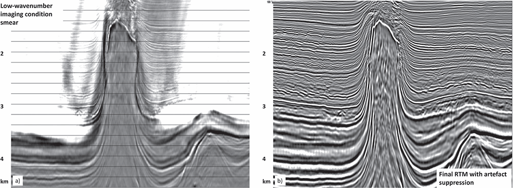{width="90%"}

The low-frequency background **"image condition" noise** is visible above the critical angle — these are the **rabbit-ear** components of the FWI gradient.

---

## What is FWI?

::: {.callout-important}
## Definition
Full waveform inversion (FWI) is a **high-resolution seismic imaging technique** that is based on using the **entire content** of seismic traces for extracting physical parameters of the medium sampled by seismic waves. [@Virieux2017]
:::

. . .

FWI provides the **highest resolution** of indirect osculating physical methods, compared with results from gravimetry, geomagnetism, or electromagnetism.

---

## Two types of wave interactions {.smaller}

::: {.columns}

::: {.column width="50%"}
### Smooth (transmission)

- Wave directions are **slightly deviated** by variations of medium properties
- Small variations in the wavefront
- Waves continue to propagate **forward** after interaction
- **Forward scattering** → transmission regime
:::

::: {.column width="50%"}
### Rough (reflection)

- Wave directions are **significantly modified** by medium properties
- **Backward scattering** → reflection regime
- Reflection waves have a **completely different direction** compared to incident wave
:::

:::

. . .

These two probing interactions have led to **two strategies** for imaging the medium: **tomographic** approaches and **migration** methods. [@Virieux2017]

---

## Wavenumber coverage {.smaller}

{width="65%"}

---

## Hierarchies of wave interactions {.smaller}

{width="70%"}

---

## Diving waves and subsurface illumination

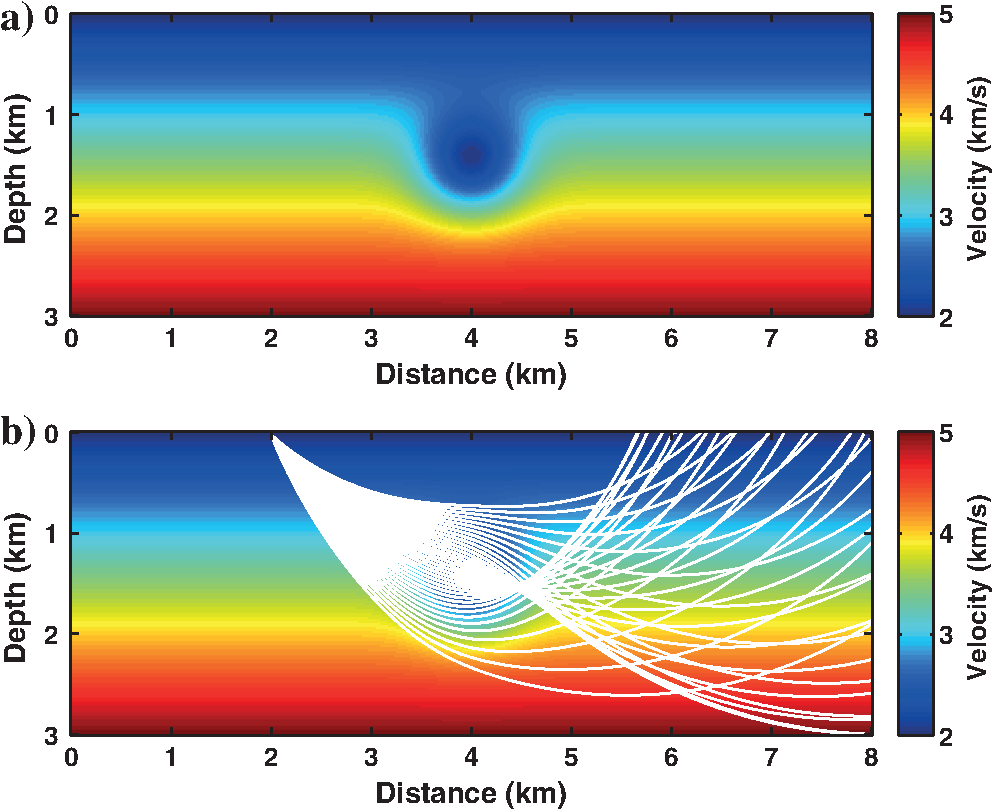{width="65%"}

---

## The FWI approach

In our approach we do **not** use any linearization of the forward modeling — such as the **linear Born approach** — which is considered in migration approaches. [@Virieux2017]

. . .

When we reconstruct our model by beginning with an initial model and revising it **iteratively**, nonlinearity is implicitly introduced by **repeated exact forward modeling** at each update stage.

<!-- . . .

::: {.callout-note}
The misfit between observed and synthetic data is a **continuous function** that will behave well locally, thereby allowing the introduction of **stochastic optimization** under the Bayesian approximation.
::: -->

---

## Diving waves and subsurface illumination

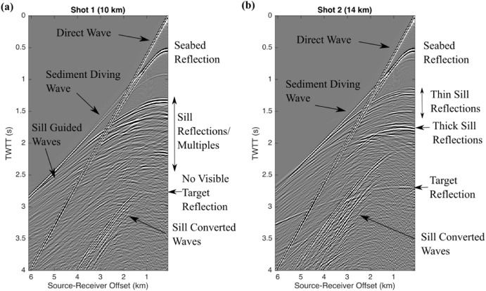{width="70%"}

---

## The misfit function{.smaller}

The FWI problem is defined as minimizing the least-squares misfit:

$$
\min_{\mathbf{m}} \mathcal{C}(\mathbf{m}) = \frac{1}{2} \int_0^{T_w} \int_{\partial\Omega_s} \int_{\partial\Omega_r} \left| \mathbf{d}_\text{syn}^\mathbf{m}(\mathbf{x}_r, \mathbf{x}_s, t) - \mathbf{d}_\text{obs}(\mathbf{x}_r, \mathbf{x}_s, t) \right|^2 \, \mathrm{d}x_r \, \mathrm{d}x_s \, \mathrm{d}t
$$ {#eq-misfit}

where $\mathbf{d}_\text{syn}^\mathbf{m}$ is the synthetic data computed in model $\mathbf{m}$, $\mathbf{d}_\text{obs}$ is the observed data, $T_w$ is the recording time, $\partial\Omega_s$ and $\partial\Omega_r$ are the source and receiver domains. [@Virieux2017, eq. 3]

---

## Iterative model update {.smaller}

This problem is solved through local nonlinear optimization. An iterative sequence $\mathbf{m}_k(\mathbf{x})$ is built from an initial guess $\mathbf{m}_\text{ini}(\mathbf{x})$:

$$
\mathbf{m}_{k+1} = \mathbf{m}_k + \alpha_k \Delta\mathbf{m}_k
$$ {#eq-update}

where $\alpha_k \in \mathbb{R}$ is computed through a **linesearch** or trust-region procedure. [@Virieux2017, eq. 4]

. . .

### Newton equation

For the Newton method, $\alpha_k = 1$ and $\Delta\mathbf{m}_k$ is the solution of:

$$
\mathcal{H}(\mathbf{m}_k) \Delta\mathbf{m}_k = -\nabla\mathcal{C}(\mathbf{m}_k)
$$ {#eq-newton}

where $\mathcal{H}(\mathbf{m}_k)$ is the **Hessian matrix** and $\nabla\mathcal{C}(\mathbf{m})$ is the **gradient vector**. [@Virieux2017, eq. 5]

---

## Gradient and Hessian {.smaller}

The FWI method can be expressed in terms of the **Jacobian operator** $\mathcal{J}(\mathbf{m}) = \partial\mathbf{d}_\text{syn}/\partial\mathbf{m}$:

$$
\nabla\mathcal{C}(\mathbf{m}) = \mathcal{J}^T(\mathbf{m})(\mathbf{d}_\text{syn}(\mathbf{m}) - \mathbf{d}_\text{obs})
$$

$$
\mathcal{H}(\mathbf{m}) = \mathcal{J}^T(\mathbf{m})\mathcal{J}(\mathbf{m}) + \frac{\partial\mathcal{J}}{\partial\mathbf{m}}(\mathbf{d}_\text{syn}(\mathbf{m}) - \mathbf{d}_\text{obs})
$$ {#eq-grad-hess}

[@Virieux2017, eq. 6]

. . .

### Gauss-Newton approximation

Dropping the second term of the Hessian gives:

$$
\mathcal{H}_\text{GN}(\mathbf{m}) = \mathcal{J}^T(\mathbf{m})\mathcal{J}(\mathbf{m})
$$ {#eq-gauss-newton-hess}

The model update at iteration $k$ becomes the **least-squares solution**:

$$
\mathcal{J}(\mathbf{m}_k) \Delta\mathbf{m}_k = -(\mathbf{d}_\text{syn}(\mathbf{m}_k) - \mathbf{d}_\text{obs})
$$ {#eq-gauss-newton}

[@Virieux2017, eqs. 7–9]

<!-- ---

## Step length estimation

$$
\alpha = \frac{\langle \nabla C(\mathbf{m}_0) | \nabla C(\mathbf{m}_0) \rangle}{\langle \mathbf{J}^t(\mathbf{m}_0) \nabla C(\mathbf{m}_0) | \mathbf{J}^t(\mathbf{m}_0) \nabla C(\mathbf{m}_0) \rangle}
$$ {#eq-steplength}

[@Virieux2009, eq. 13] -->

---

## Quasi-Newton: L-BFGS{.smaller}

- A **limited-memory** variant of the quasi-Newton BFGS method
- Allows computing $\mathcal{H}^{(n)} \nabla C^{(n)}$ **without explicitly forming** $\mathcal{H}^{(n)}$
- Only 3–20 gradients from previous iterations need to be stored
- **Negligible storage** compared to conjugate gradient [@Nocedal1980]

. . .

### Convergence comparison

| Method | Convergence | Cost per iteration |
|--------|------------|-------------------|
| Gradient descent | Slow (linear) | 1 forward + 1 adjoint |
| Conjugate gradient | Better | 1 forward + 1 adjoint |
| L-BFGS | Good | 1 forward + 1 adjoint |
| Gauss-Newton | Fast (quadratic) | Multiple solves |
| Newton | Fastest (quadratic) | Most expensive |


---

## The forward problem {.smaller}

**Wave equation in the time domain:**

$$
\mathbf{M}(\mathbf{x}) \frac{\mathrm{d}^2\mathbf{u}(\mathbf{x},t)}{\mathrm{d}t^2} = \mathbf{A}(\mathbf{x})\mathbf{u}(\mathbf{x},t) + \mathbf{s}(\mathbf{x},t)
$$

where $\mathbf{M}$ and $\mathbf{A}$ are the mass and stiffness matrices, $\mathbf{s}$ is the source term, and $\mathbf{u}$ is the seismic wavefield. [@Virieux2009, eq. 1]

. . .

**Wave equation in the frequency domain:**

$$
\mathbf{B}(\mathbf{x},\omega)\mathbf{u}(\mathbf{x},\omega) = \mathbf{s}(\mathbf{x},\omega)
$$ {#eq-wave-freq}

where $\mathbf{B}$ is the **impedance matrix** — a sparse complex-valued matrix. [@Virieux2009, eq. 2]


---

## The wavefield as a nonlinear operator{.smaller}

The relationship between the seismic wavefield and the parameters is **nonlinear** and can be written compactly as:

$$
\mathbf{u} = \mathbf{G}(\mathbf{m})
$$ {#eq-nonlinear}

[@Virieux2009, eq. 3]

. . .

The data-misfit vector $\Delta\mathbf{d} = \mathbf{d}_\text{obs} - \mathbf{d}_\text{cal}(\mathbf{m})$ with $\mathbf{d}_\text{cal}(\mathbf{m})=\mathcal{R}\mathbf{u}$ of dimension $N$ captures the differences at receiver positions for each source-receiver pair. The **misfit function** is:

$$
\mathcal{C}(\mathbf{m}) = \frac{1}{2} \Delta\mathbf{d}^\dagger \Delta\mathbf{d}
$$ {#eq-misfit-compact}

where $\dagger$ denotes the adjoint operator (transpose conjugate). [@Virieux2009, eq. 4]

---

## Gradient of the misfit function {.smaller}

**Adjoint-state gradient:**

The gradient can be computed without explicitly building the sensitivity matrix, using the **adjoint-state method**:

$$
\frac{\partial\mathcal{C}}{\partial\mathbf{m}}(\mathbf{x}) = \sum_s \int_0^{T_w} dt \, \boldsymbol{\lambda}^T(\mathbf{x},t) \frac{\partial\mathbf{M}}{\partial\mathbf{m}}(\mathbf{x}) \partial_t \mathbf{w}(\mathbf{x},t)
$$

[@Virieux2017, eq. 28]

. . .

The gradient is formed by the **zero-lag crosscorrelation** between the **adjoint wavefield** $\boldsymbol{\lambda}$ and the time derivative of the **incident wavefield** $\mathbf{w}$, multiplied by a local scattering operator.

---

## Sensitivity kernel and Fresnel zones {.smaller}

### The sensitivity kernel

{width="80%"}

---

## What are Fresnel zones? {.smaller}

The **first Fresnel zone** is the region where the phase time does not differ by more than **half a period** with respect to the direct arrival.

- Waves in the first Fresnel zone, primarily sampled by **direct waves**, provide a potential contribution for updating the medium with an expected **smooth resolution** [@Woodward1992]
- **Outer interference fringes**, mainly sampled by **reflected waves**, yield a zone with an expected **high resolution**
- Width of Fresnel zone is inversely proportional to the temporal frequency

. . .

### Resolution from diffraction tomography

The scattering wavenumber vector $\mathbf{k}$ linking the experimental setup to spatial resolution:

$$
\mathbf{k} = \frac{2f}{c_0} \cos\left(\frac{\theta}{2}\right) \mathbf{n} = \frac{4\pi}{\lambda} \cos\left(\frac{\theta}{2}\right) \mathbf{n}
$$ {#eq-resolution}

where $f$ is frequency, $c_0$ is velocity, $\theta$ is the diffraction/aperture angle, $\lambda$ is wavelength, and $\mathbf{n}$ is the unit vector. [@Virieux2017, eq. 29; @Virieux2009, eq. 30]

---

## Resolution from diffraction tomography {.smaller}

:::: {.columns}

::: {.column width="50%"}

<!-- 
$$
\mathbf{k} = \frac{2f}{c_0} \cos\left(\frac{\theta}{2}\right) \mathbf{n} = \frac{4\pi}{\lambda} \cos\left(\frac{\theta}{2}\right) \mathbf{n}
$$
 -->

{width="100%"}

<!-- - One frequency + one aperture $\rightarrow$ one wavenumber in model space -->
- Low frequencies and large appertures resolve intermediate and large wavelengths 
- Normal incidence ($\theta=0$) leads to max resolution of $\frac{1}{2}\lambda$
- Long offsets resolve small horizontal wavenumbers of dipping structures 
<!-- - Small $\theta$ (transmission) $\rightarrow$ low wavenumbers
- Large $\theta$ (reflection) $\rightarrow$ high wavenumbers -->

:::

::: {.column width="50%"}

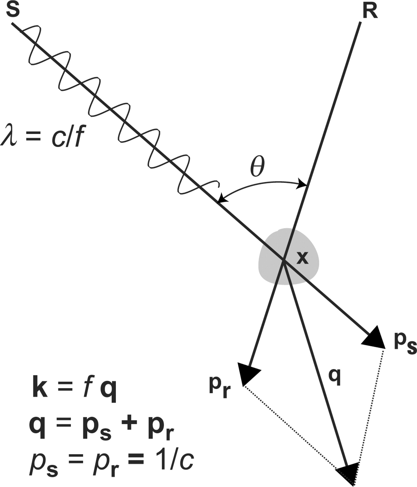{width="70%"}

:::

::::

---

## Attainable resolution {.smaller}

**Frequency-domain sensitivity kernel:**

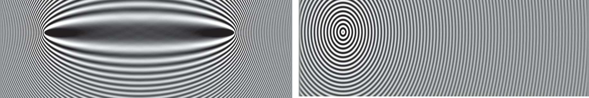{width="80%"}

. . .


::: {.callout-note}

**Key insights**: 

- One frequency and one aperture map **one wavenumber** in the model space. Frequency and aperture have **redundant control** of the wavenumber coverage. 
- The central zone of elliptical shape is the first Fresnel zone of width $\sqrt{\lambda O_{sr}}$⁠, where $O_{sr}$ is the source-receiver offset. 
- Residuals matching the first arrival with an error lower than half a period update large wavelengths. 
- Outer fringes are isochrones associated with later-arriving reflections, providing updates of the shorter wavelengths.
:::

---

## Valhall OBC field example: resolution improvement {.smaller}

{width="65%"}

---

## Valhall: seismogram comparison {.smaller}

{width="90%"}


## OBC data set from the North Sea {.smaller}

![Initial model in the left panels and final model in the right panels. Horizontal sections are shown at depths of 175 m, 500 m, and 1000 m. Note the significant increase of resolution from left to right. The paleoriver features are nicely visible in (d) but cannot be seen in (a), at a depth of 175 m. In (d), one can identify also the strong imprint of the acquisition. At a depth of 500 m, imprints on bedrock of former glaciers are focused in (e) but are not visible in (b). Finally, at a depth of 1000 m, very precise contours of the gas cloud are clear in (f) but are completely blurred in (c). Acquisition imprints decrease with depth but are still present. From @Virieux2017](figures/virieux2014_fig6){width="55%"}

<!-- ---

## Optimization methods {.smaller}

### Gradient (steepest) descent with linesearch

The gradient of $\mathcal{C}(\mathbf{m})$ with respect to model parameter $m_l$:

$$
\nabla C_\mathbf{m} = \frac{\partial C(\mathbf{m})}{\partial\mathbf{m}} = -\Re\left[\mathbf{J}^\dagger \Delta\mathbf{d}\right]
$$ {#eq-gradient}

The perturbation model is searched in the direction of the **steepest ascent** (negative gradient). Step length $\alpha$ is estimated by a **linesearch**. [@Virieux2009, eq. 9]

. . .

### Step length estimation

$$
\alpha = \frac{\langle \nabla C(\mathbf{m}_0) | \nabla C(\mathbf{m}_0) \rangle}{\langle \mathbf{J}^t(\mathbf{m}_0) \nabla C(\mathbf{m}_0) | \mathbf{J}^t(\mathbf{m}_0) \nabla C(\mathbf{m}_0) \rangle}
$$ {#eq-steplength}

[@Virieux2009, eq. 13]

---

## Newton and Gauss-Newton methods {.smaller}

### Full Newton

The **Hessian** contains two terms:

$$
\frac{\partial^2 C(\mathbf{m}_0)}{\partial\mathbf{m}^2} = \Re\left[\mathbf{J}_0^* \mathbf{J}_0\right] + \Re\left[\frac{\partial\mathbf{J}_0^t}{\partial\mathbf{m}^t}(\Delta\mathbf{d}_0^* \ldots \Delta\mathbf{d}_0^*)\right]
$$ {#eq-hessian}

[@Virieux2009, eq. 10]

. . .

### Newton perturbation model 

$$
\Delta\mathbf{m} = -\left\{ \Re\left[\mathbf{J}_0^* \mathbf{J}_0 + \frac{\partial\mathbf{J}_0^t}{\partial\mathbf{m}^t}(\Delta\mathbf{d}_0^* \ldots \Delta\mathbf{d}_0^*)\right] \right\}^{-1} \Re\left[\mathbf{J}_0^\dagger \Delta\mathbf{d}_0\right]
$$ {#eq-newton-update}

[@Virieux2009, eq. 11]

---

## Gauss-Newton and L-BFGS {.smaller}

### Gauss-Newton

- Drop the second term of the Hessian: $\mathbf{H}_a = \mathbf{J}_0^* \mathbf{J}_0$
- **Locally quadratically convergent**
- Requires solving a linear system at each iteration

. . .

 -->


## Regularization {.smaller}

FWI is an **ill-posed problem** — an infinite number of models can match the data. The misfit function can be **augmented**:

$$
\mathcal{C}(\mathbf{m}) = \frac{1}{2} \Delta\mathbf{d}^\dagger \mathbf{W}_d \Delta\mathbf{d} + \frac{1}{2} \varepsilon (\mathbf{m} - \mathbf{m}_\text{prior})^\dagger \mathbf{W}_m (\mathbf{m} - \mathbf{m}_\text{prior})
$$ {#eq-regularization}

where:

- $\mathbf{W}_d = \mathbf{S}_d^* \mathbf{S}_d$ — data weighting (inverse of data covariance)
- $\mathbf{W}_m = \mathbf{S}_m^* \mathbf{S}_m$ — model weighting (inverse of model covariance)
- $\mathbf{S}_m$ is a **roughness operator** (e.g., first- or second-difference matrices)
- $\varepsilon$ controls the **trade-off** between data fit and model smoothness

[@Virieux2009, eq. 17]

---

## Cycle skipping: the fundamental challenge {.smaller}

**The problem:**

:::: {.columns}

::: {.column width="50%"}
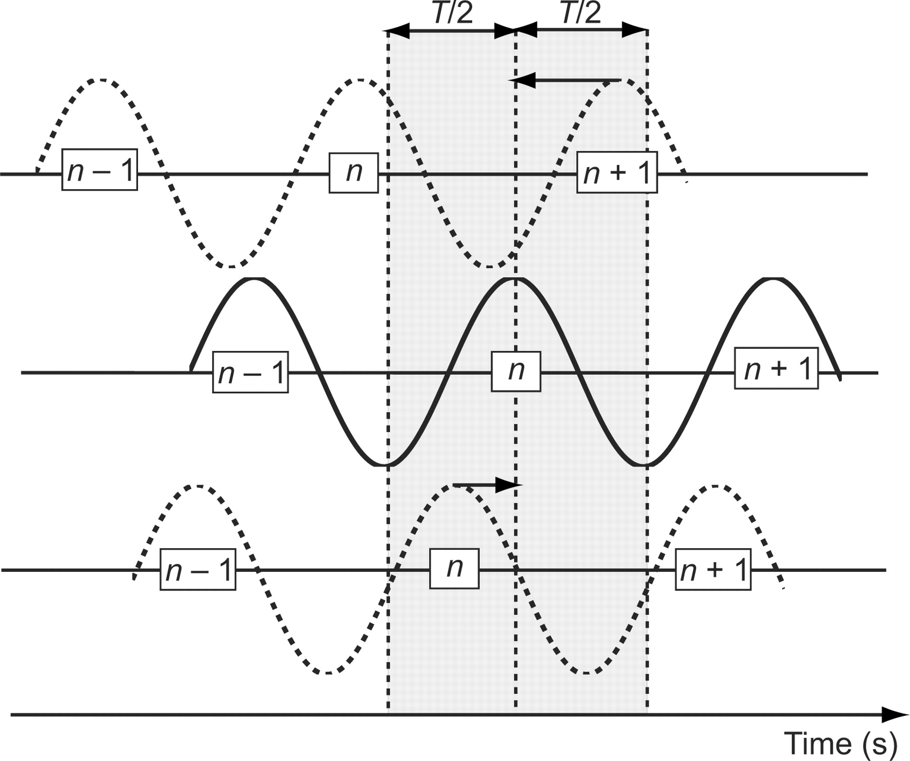{width="100%"}
:::


::: {.column width="50%"}
The **Born approximation** requires that the starting model allows matching observed traveltimes with an error less than **half the period** [@BeydounTarantola1988]:

$$
\frac{\Delta t}{T_L} < \frac{1}{N_A}
$$

where $T_L$ is the simulation duration and $N_A$ is the number of propagated wavelengths.

For 50 wavelengths, the traveltime error must be less than **1%**!
:::

::::

---

## Cycle skipping examples (cont.) {.smaller}

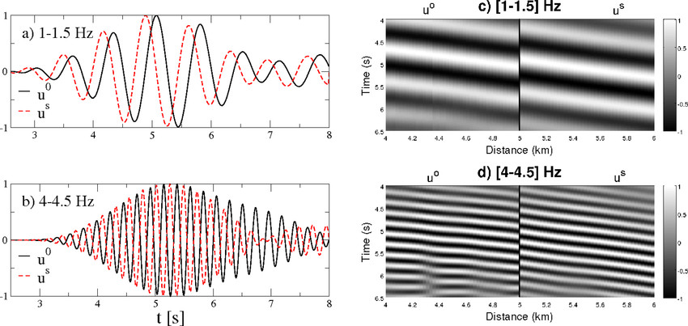{width="75%"}

---

## Cycle skipping examples {.smaller}

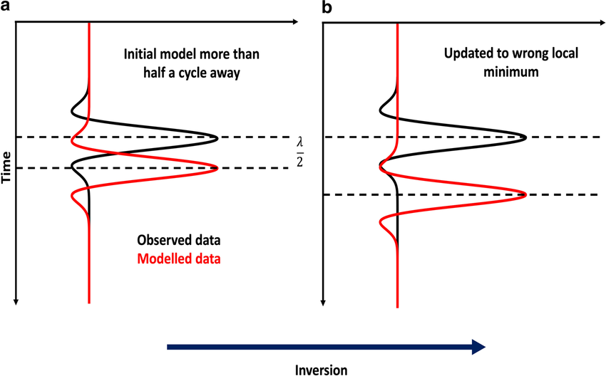{width="70%"}

---

## Cycle skipping examples (cont.) {.smaller}

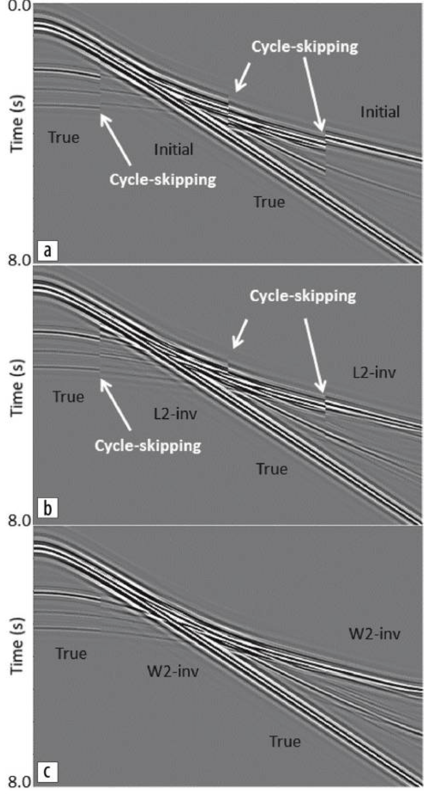{width="50%"}

---

## Cycle skipping examples (cont.) {.smaller}

{width="85%"}


<!-- ## Cycle skipping in model space {.smaller}

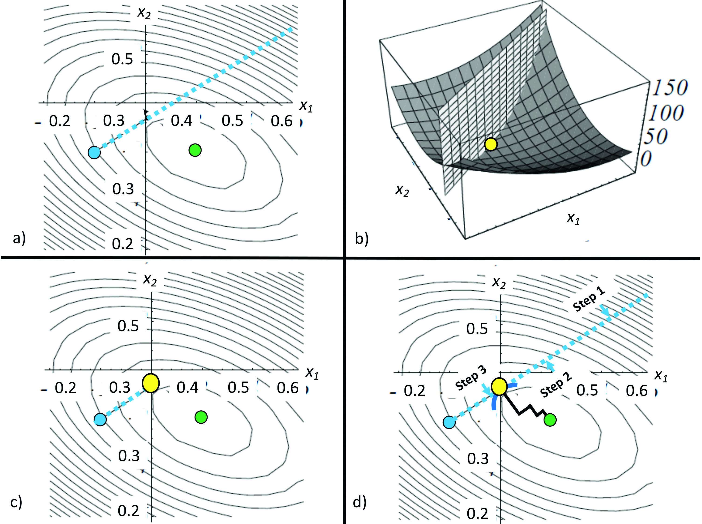{width="85%"}

--- 
-->

## Effects of Cycle-skipping - true model

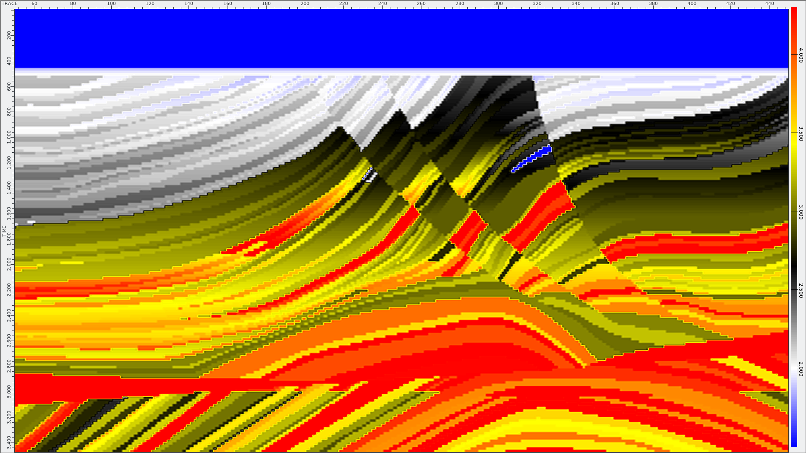{.nostretch width="70%"}

---

## Effects of Cycle-skipping – > 3Hz

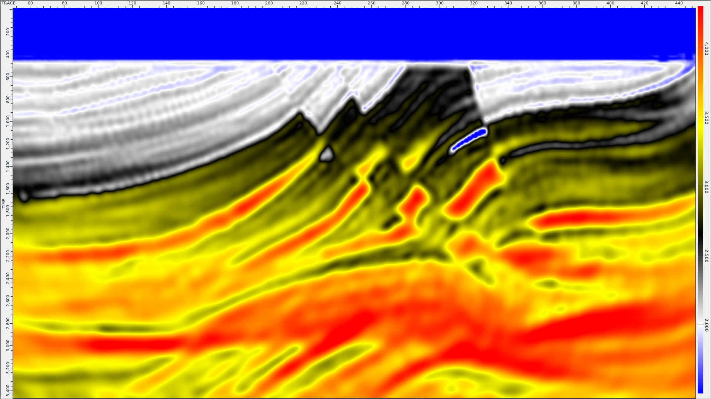{.nostretch width="70%"}

---

## Effects of Cycle-skipping – > 6Hz

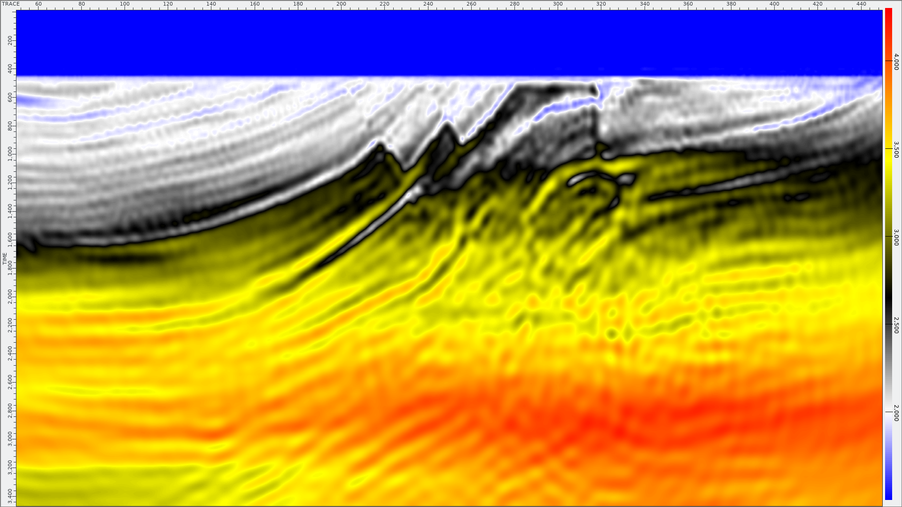{.nostretch width="70%"}

---

## Sensitivity to starting models {.smaller}

{width="55%"}

---

## Multiscale strategies{.smaller}

**Frequency continuation:** The **hierarchical multiscale** strategy successively processes data subsets of increasing resolution power to incorporate **progressively smaller wavenumbers** in the tomographic models. [@Virieux2009]

- **Time domain**: @BunksEtAl1995 propose successive inversion of subdata sets of increasing high-frequency content
- **Frequency domain**: Invert single or multiple frequencies (frequency groups) of increasing frequency

. . .

**Laplace-Fourier approach:** Using complex-valued frequencies equivalent to **exponential damping** of seismograms:

$$
P\left(\omega + \frac{i}{\tau}\right) e^{i\omega t} = \int_{-\infty}^{+\infty} p(t) e^{-(t-t_0)/\tau} e^{i\omega t} \, dt
$$ {#eq-laplace-fourier}

The Laplace-domain inversion provides a **smooth velocity model** as a starting model for subsequent Fourier-domain FWI. [@ShinCha2009; @Virieux2009]

---


## Multiscale FWI example {.smaller}

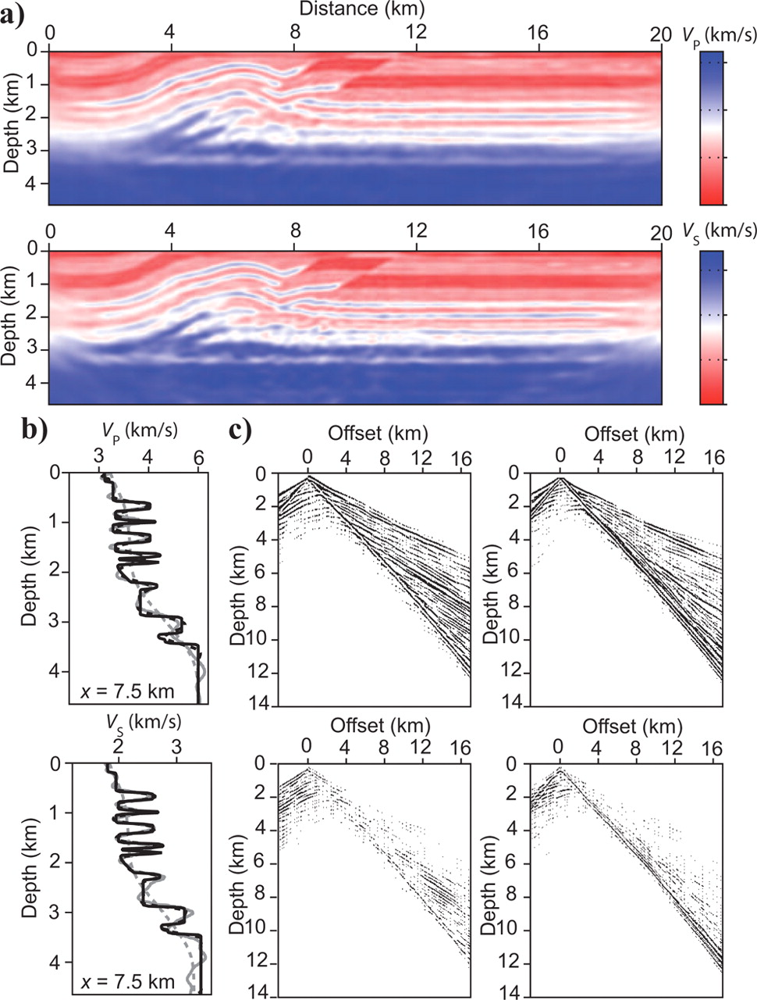{width="55%"}

---

## Laplace-Fourier-domain FWI {.smaller}

{width="65%"}

---

## Next steps{.smaller}

:::: {.columns}

::: {.column width="50%"}

While multiscale techniques mitigate some of the effects of cycle skipping they to not overcome the problem.

So, far we mainly looked at transmitted diving waves whose depth of penetration depends on 

- maximum offset
- lowest temporal frequency (determines width of the Fresnel zone)

In the next lectures, we will exploit 

- topology of gradient to fascilitate reflection and multi-parameter FWI
- model space extensions
- constraints

:::

::: {.column width="50%"}

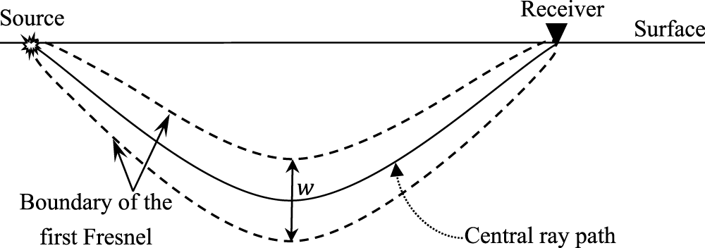{.nostretch width="70%"}


:::
:::

## Topology of the FWI gradient {.smaller}

**Banana-doughnut kernels vs. rabbit ears:**

{width="85%"}

---

## Three components of the gradient {.smaller}

{width="85%"}

---

## Building the gradient: single wavelet {.smaller}

::: {.columns}
::: {.column width="50%"}
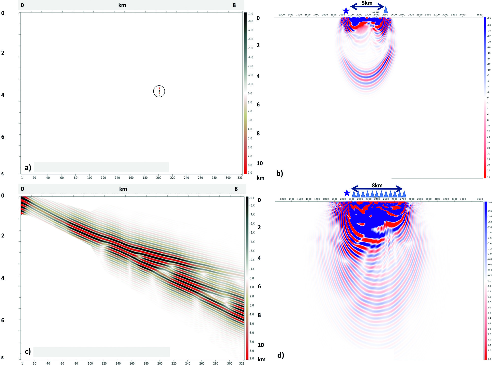{width="100%"}
:::

::: {.column width="50%"}
- Subjecting a single residual wavelet to the FWI procedure produces **banana-shaped** and **rabbit-ear-shaped** gradient contributions
- These closely resemble **migration impulse responses**
- Working independently with these separated gradient components can facilitate faster and more reliable model update
:::

:::

---

## Summing gradient contributions {.smaller}

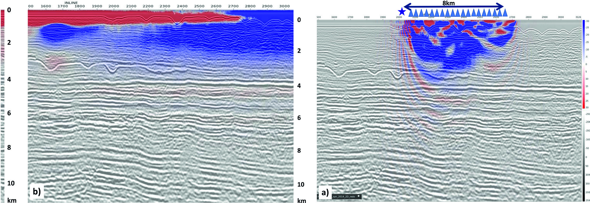{width="85%"}

---

## Discussion: practical aspects {.smaller}

**Key takeaways from industrial implementation [@Jones2019]:**

- For **early iterations**, concentrate on the lowest available frequencies — the cost function is **less oscillatory** and cycle skipping is less likely
- For deep sub-salt model update, frequencies below about **2 Hz** are needed
- Using the **acoustic approximation**, we ignore density changes and modelled reflection amplitudes will be in error
- For early stages, rely on **diving-wave energy** (transmitted/refracted wavefield) — penetrates to ~$\frac{1}{3}$ of maximum source-receiver offset

. . .

**Two-stage approach:**

1. **Refracted wavefield**: update shallow sediment model using long offsets, low frequencies, and turning wave data
2. **Reflected wavefield**: use the **rabbit-ear** cross-talk terms to penetrate deeper into the model

<!-- ---

## Valhall field example: resolution improvement {.smaller}

{width="65%"}

---

## Valhall: seismogram comparison {.smaller}

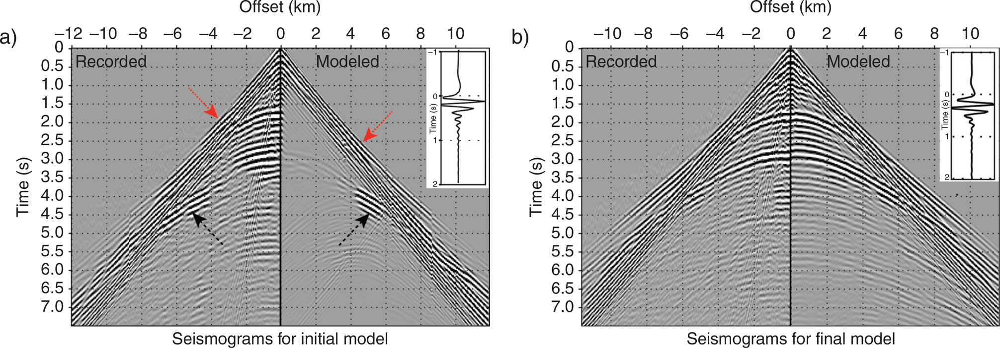{width="90%"}

--- 

-->


## FWI in practice with Devito {.smaller}

### Tutorials 01–03: From forward modelling to FWI

The following slides illustrate a hands-on implementation of FWI using [Devito](https://www.devitoproject.org/), a domain-specific language for finite-difference computations. Based on tutorials from the [SLIM Group](https://slimgroup.github.io/Devito-Examples/tutorials).

{width="30%"}

Three key steps:

1. **Tutorial 01** — Forward modelling: solve the acoustic wave equation
2. **Tutorial 02** — Reverse-Time Migration: adjoint wavefield and imaging condition
3. **Tutorial 03** — Full-Waveform Inversion: gradient computation and iterative update

---

## Tutorial 01: Forward modelling {.smaller}

### The acoustic wave equation

$$
\begin{cases}
m \dfrac{d^2 u(\mathbf{x},t)}{dt^2} - \nabla^2 u(\mathbf{x},t) + \eta \dfrac{d u(\mathbf{x},t)}{dt} = q & \text{in } \Omega \\[6pt]
u(\cdot,0) = 0, \quad \dfrac{du}{dt}\big|_{t=0} = 0
\end{cases}
$$

where:

- $m = 1/c^2$ is the **square slowness**
- $\eta$ is the **damping mask** (absorbing boundary layer)
- $q$ is the source term (Ricker wavelet): $q(t) = \left(1 - 2\pi^2 f_0^2 \left(t - \frac{1}{f_0}\right)^2\right) e^{-\pi^2 f_0^2 \left(t - 1/f_0\right)^2}$

---

## Tutorial 01: Model and geometry {.smaller}

:::: {.columns}

::: {.column width="50%"}
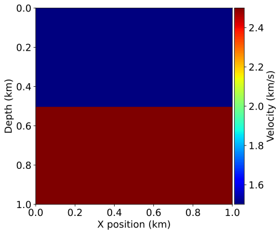{width="100%"}
:::

::: {.column width="50%"}
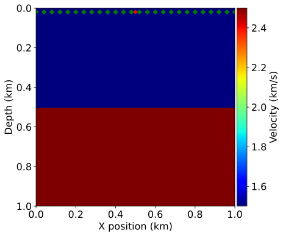{width="100%"}
:::

::::

---

## Tutorial 01: Devito implementation {.smaller}

### Setting up the wave equation in Devito

```python
from devito import TimeFunction, Eq, solve, Operator

# Define wavefield and PDE
u = TimeFunction(name="u", grid=model.grid,
                 time_order=2, space_order=2)
pde = model.m * u.dt2 - u.laplace + model.damp * u.dt

# Create time-marching stencil: solve for u(t+dt)
stencil = Eq(u.forward, solve(pde, u.forward))

# Source injection and receiver interpolation
src_term = src.inject(field=u.forward,
                      expr=src * dt**2 / model.m)
rec_term = rec.interpolate(expr=u.forward)

# Create and run operator
op = Operator([stencil] + src_term + rec_term,
              subs=model.spacing_map)
op(time=time_range.num-1, dt=model.critical_dt)
```

---

## Tutorial 01: Shot record {.smaller}

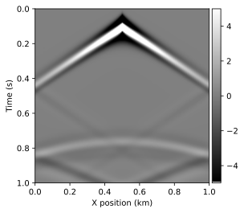{width="55%"}

---

## Tutorial 02: Reverse-Time Migration {.smaller}

### From forward model to linear system

The forward simulation can be written as:

$$
\mathbf{A}(\mathbf{m}) \, \mathbf{u} = \mathbf{q}
$$

The **adjoint** (back-propagation) solves:

$$
\mathbf{A}(\mathbf{m})^T \, \mathbf{v} = \delta\mathbf{d}
$$

where $\delta\mathbf{d} = \mathbf{P}_r \mathbf{u} - \mathbf{d}_\text{obs}$ is the data residual.

. . .

### Imaging condition

$$
\text{Image} = \sum_{t=1}^{n_t} \mathbf{u}[t] \, \mathbf{v}[t]
$$

The forward and adjoint wavefields meet at **reflector positions** at zero time offset.

---

## Tutorial 02: True vs. smooth model {.smaller}

:::: {.columns}

::: {.column width="33%"}
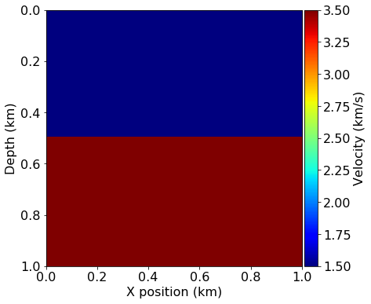{width="100%"}
:::

::: {.column width="33%"}
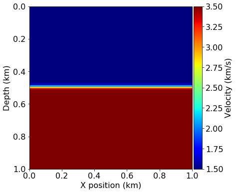{width="100%"}
:::

::: {.column width="33%"}
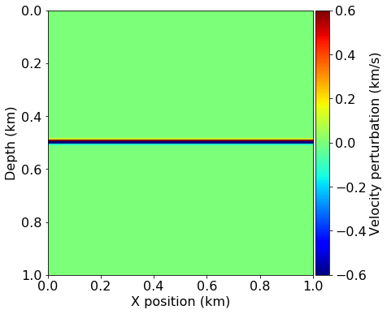{width="100%"}
:::

::::

---

## Tutorial 02: RTM imaging operator {.smaller}

```python
def ImagingOperator(model, image):
    v = TimeFunction(name='v', grid=model.grid,
                     time_order=2, space_order=4)
    u = TimeFunction(name='u', grid=model.grid,
                     time_order=2, space_order=4,
                     save=geometry.nt)

    # Adjoint wave equation (note negated damping)
    eqn = model.m * v.dt2 - v.laplace + model.damp * v.dt.T
    stencil = Eq(v.backward, solve(eqn, v.backward))

    # Inject data residual at receiver locations
    res_term = residual.inject(field=v.backward,
                    expr=residual * dt**2 / model.m)

    # Imaging condition: correlate u and v
    image_update = Eq(image, image - u * v)

    return Operator([stencil] + res_term + [image_update],
                    subs=model.spacing_map)
```

---

## Tutorial 02: RTM result {.smaller}

:::: {.columns}

::: {.column width="50%"}

### Imaging loop

```python
for i in range(nshots):
    # Forward model with true velocity
    true_d, _, _ = solver.forward(vp=model.vp)
    # Forward model with smooth velocity
    smooth_d, u0, _ = solver.forward(
        vp=model0.vp, save=True)
    # Back-propagate residual
    residual = smooth_d.data - true_d.data
    op_imaging(u=u0, v=v, vp=model0.vp,
               residual=residual)
```

:::

::: {.column width="50%"}

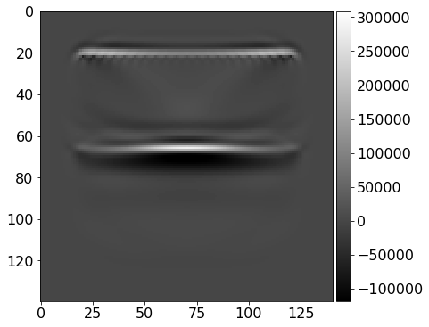{width="100%"}

:::

::::

---

## Tutorial 03: Full-Waveform Inversion {.smaller}

### FWI objective function

$$
\min_{\mathbf{m}} \; \Phi_s(\mathbf{m}) = \frac{1}{2} \left\lVert \mathbf{P}_r \mathbf{u} - \mathbf{d} \right\rVert_2^2, \quad \text{s.t.} \quad \mathbf{u} = \mathbf{A}(\mathbf{m})^{-1} \mathbf{P}_s^T \mathbf{q}_s
$$

### Gradient via adjoint-state method

$$
\nabla \Phi_s(\mathbf{m}) = \sum_{t=1}^{n_t} \mathbf{u}[t] \, \mathbf{v}_{tt}[t] = \mathbf{J}^T \delta\mathbf{d}_s
$$

where $\mathbf{v}_{tt}$ is the **second-order time derivative** of the adjoint wavefield:

$$
\mathbf{A}^T(\mathbf{m}) \, \mathbf{v} = \mathbf{P}_r^T \, \delta\mathbf{d}
$$

::: {.callout-note}
The FWI gradient is the RTM imaging condition with an extra $\partial_{tt}$ applied to the adjoint field.
:::

---

## Tutorial 03: FWI setup {.smaller}

:::: {.columns}

::: {.column width="33%"}
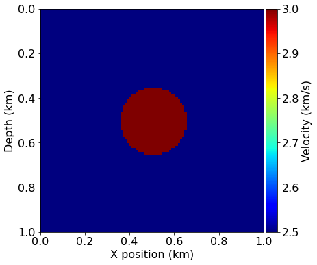{width="100%"}
:::

::: {.column width="33%"}
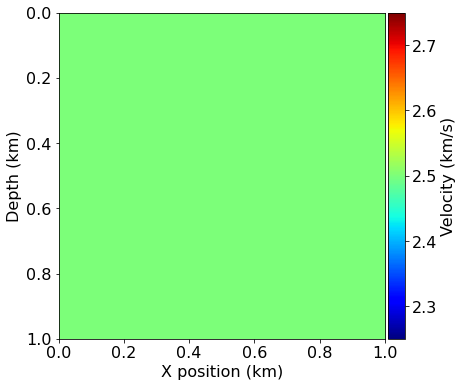{width="100%"}
:::

::: {.column width="33%"}
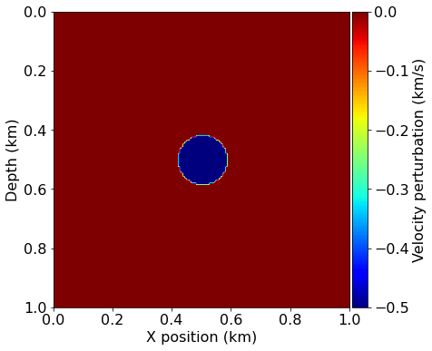{width="100%"}
:::

::::

**Transmission geometry**: sources on one side, receivers on the other — records mostly diving waves, which are essential for FWI convergence.

---

## Tutorial 03: Gradient computation {.smaller}

```python
def fwi_gradient(vp_in):
    grad = Function(name="grad", grid=model.grid)
    objective = 0.
    for i in range(nshots):
        geometry.src_positions[0, :] = source_locations[i, :]

        # Forward model with true velocity → observed data
        _, _, _ = solver.forward(vp=model.vp, rec=d_obs)

        # Forward model with current estimate → save wavefield
        _, u0, _ = solver.forward(vp=vp_in, save=True, rec=d_syn)

        # Compute residual and accumulate objective
        compute_residual(residual, d_obs, d_syn)
        objective += .5 * norm(residual)**2

        # Back-propagate residual → gradient
        solver.gradient(rec=residual, u=u0, vp=vp_in, grad=grad)

    return objective, grad
```

---

## Tutorial 03: FWI iteration loop {.smaller}

```python
for i in range(fwi_iterations):
    # Compute functional value and gradient
    phi, direction = fwi_gradient(model0.vp)

    # Step length (in practice: linesearch)
    alpha = .05 / mmax(direction)

    # Update model with box constraints
    update_with_box(model0.vp, alpha, direction)
```

. . .

:::: {.columns}

::: {.column width="50%"}
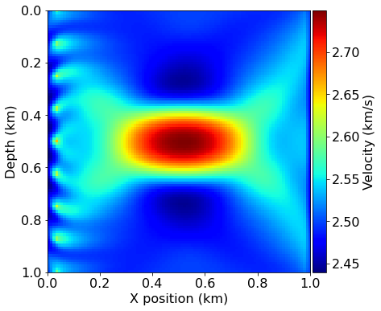{width="100%"}
:::

::: {.column width="50%"}
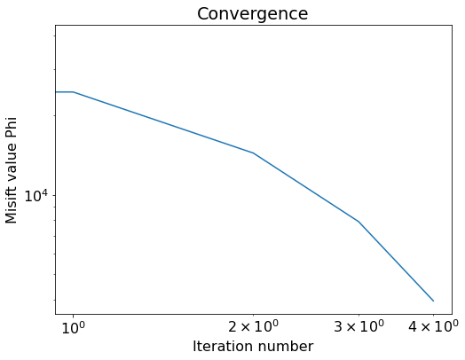{width="100%"}
:::

::::

---

## Tutorial 03: Gradient vs. perturbation {.smaller}

:::: {.columns}

::: {.column width="33%"}
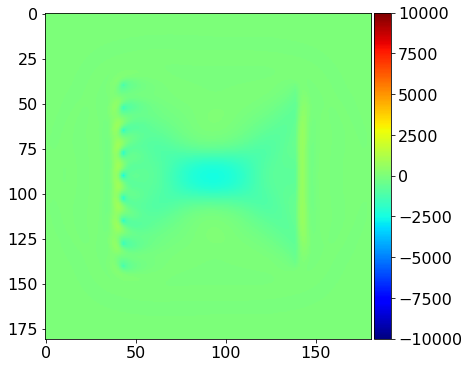{width="100%"}
:::

::: {.column width="33%"}
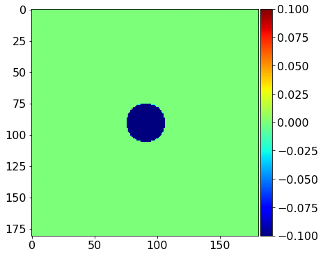{width="100%"}
:::

::: {.column width="33%"}
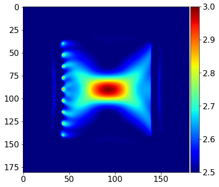{width="100%"}
:::

::::

::: {.callout-important}
The gradient has the **same sign** as the true perturbation — confirming that gradient descent moves the model in the correct direction.
:::

---

## SLIM contributions to FWI {.smaller}

**Stochastic optimization and computational efficiency:**

:::: {.columns}

::: {.column width="50%"}

**Effective method for parameter estimation with PDE constraints** [@haber2012effective]

- Reformulate multi-source problems as **stochastic programming**
- Combine multiple right-hand sides into **fewer simultaneous sources**
- Reduces **linear cost scaling** to a tractable framework

:::

::: {.column width="50%"}

**Seismic waveform inversion by stochastic optimization** [@vanLeeuwen2010]

- Stochastic optimization for seismic waveform inversion
- **Sub-sampling** of sources reduces per-iteration cost
- Convergence guarantees under stochastic gradient framework

:::

::::

---

## SLIM contributions (cont.) {.smaller}

**Robustness and scalability:**

:::: {.columns}

::: {.column width="50%"}

**Robust inversion, dimensionality reduction, and randomized sampling** [@Herrmann2012robust]

- Uses **Student's t-distribution** instead of least-squares
- Handles **50% corrupted data** successfully
- Dimensionality reduction via data averaging and sampling

:::

::: {.column width="50%"}

**3D frequency-domain seismic inversion with controlled sloppiness** [@vanLeeuwen2014]

- Adaptive scheme using **small subsets** of sources and **inexact PDE solves**
- Significant computational gains while maintaining accuracy
- Makes **3D FWI computationally tractable**

:::

::::

. . .

::: {.callout-important}
## Common theme
All four works address the **computational bottleneck** of FWI by leveraging ideas from **stochastic optimization**, **randomized linear algebra**, and **dimensionality reduction**.
:::

---

## Summary {.smaller}

**Key takeaways:**

1. **FWI** uses the entire wavefield to reconstruct subsurface parameters at **sub-wavelength resolution**
2. The **single scattering formulation** treats all phases equally — no prior scale separation
3. The gradient is formed by **crosscorrelation** of forward and adjoint wavefields
4. **Cycle skipping** is the fundamental challenge — mitigated by **multiscale strategies**
5. The gradient has three components: **banana** (transmission), **migration arc** (reflection), and **rabbit ears** (cross-talk)
6. **Optimization methods** range from gradient descent to quasi-Newton (L-BFGS)
7. **Regularization** and starting model design are critical for convergence
8. **Stochastic methods** from SLIM make large-scale 3D FWI tractable

---

## References {.smaller}

::: {#refs}
:::
