## {#title-custom .center background-color="white"}

:::{style="display: flex; justify-content: center; align-items: center; gap: 2.5em; margin-bottom: 1em;"}
{height=100}
{height=100}
:::

### Constraints for Edge-Preserving Full-Waveform Inversion {style="margin-bottom: 0.1em;"}

**Felix J. Herrmann**

School of Earth and Atmospheric Sciences — Georgia Institute of Technology

Based on [@peters2017constraints], [@esser2016salt], [@esser2018tvwri], [@peters2019projection]

---

## Outline {.smaller}

1. **Motivation** — Avoiding local minima with extended formulations [@esser2018tvwri]
2. **Tikhonov regularization** — Limitations of penalty-based approaches
3. **Regularization with constraints** — Projection-based alternative
4. **Part I: Penalties vs. Constraints** — Practical aspects [@peters2017constraints; @esser2016salt]
5. **Part II: Constraints — Theory** — Convex sets, projections, and algorithms [@peters2019projection]
6. **Part III: Application to Salt** — Automatic salt flooding [@esser2018tvwri; @esser2016salt]

::: {.notes}
This is the second lecture in a series on FWI extensions. We build on the WRI foundations from the previous lecture and introduce constrained optimization for FWI/WRI, focusing on edge-preserving regularization for salt imaging.
:::

---

# Motivation {background-color="#002855"}

---

## Avoiding local minima {.smaller}

Full-waveform inversion solves a **non-linear least-squares** problem [@esser2018tvwri]:

$$
\min_{m} \frac{1}{2}\sum_{j=1}^{N_s}\|F(m)q_j - d_j\|_2^2
$$

where $F(m) = PA(m)^{-1}$ is the forward operator combining the PDE solve $A(m)^{-1}$ with measurement $P$.

. . .

**Problem**: The objective has *parasitic* local minima due to cycle-skipping.

. . .

Consider,

$$
F(c)q = 
\left(
\begin{matrix}
	\mathcal{F}^{-1}e^{\imath\omega\|x_1 - x_s\|_2/c}\mathcal{F}q\\
	\mathcal{F}^{-1}e^{\imath\omega\|x_2 - x_s\|_2/c}\mathcal{F}q\\
	\mathcal{F}^{-1}e^{\imath\omega\|x_3 - x_s\|_2/c}\mathcal{F}q\\
\end{matrix}
\right),
$$
where $\mathcal{F}$ denotes the temporal Fourier transform, $\omega$ the angular frequency, $\imath=\sqrt{-1}$, $x_i$ is the receiver location, $x_s$ is the source location, and $c$ is the soundspeed of the medium.

---

## Avoiding local minima {.smaller}

**Extended formulation** (WRI) mitigates this by relaxing the PDE constraint [@vanLeeuwen2013Penalty1]. 

This takes folllowing form for above problem:

$$
\min_{m,\Delta q} \frac{1}{2}\sum_{j=1}^{N_s}\|F(m)(q_j + \Delta q_j) - d_j\|_2^2 + \lambda^2 \|\Delta q_j\|_2^2
$$

As $\lambda \uparrow \infty$, $\|\Delta q\|_2\downarrow 0$ and we recover the original problem.

---

## Example 1 — Local minima in FWI {.smaller}

:::: {.columns}
::: {.column width="33%"}
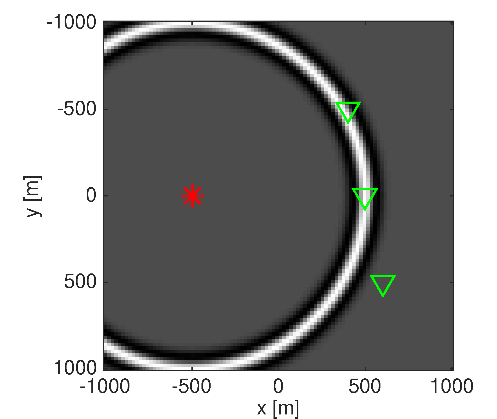
:::
::: {.column width="33%"}
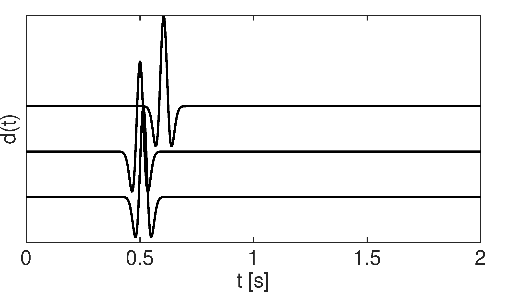
:::
::: {.column width="33%"}
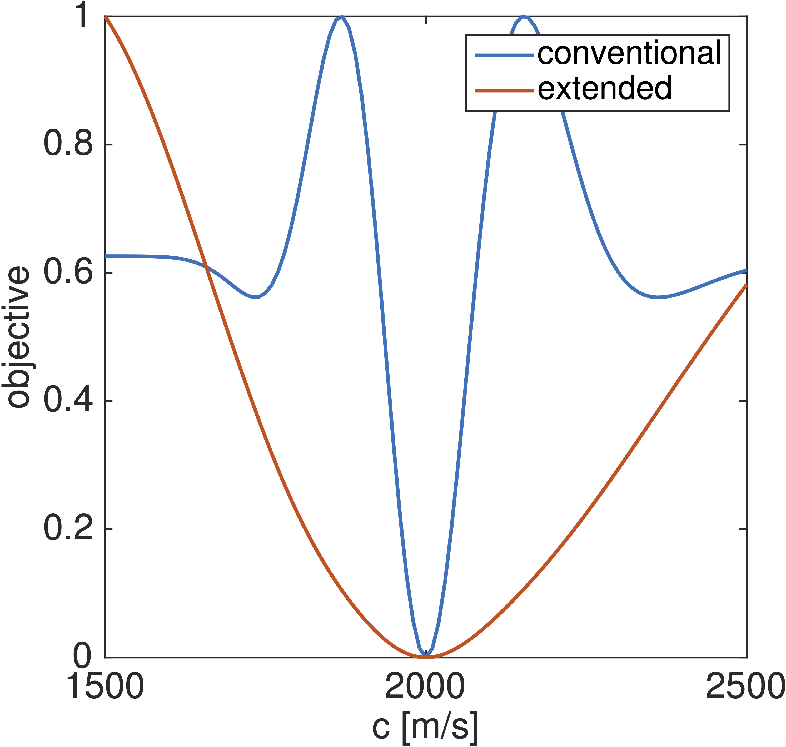
:::
::::

- **Conventional** ($\lambda\rightarrow\infty$): multiple local minima clearly visible
- **Extended** ($\lambda=0.1$): local minima are effectively mitigated
- Band-limited data makes both large- and small-scale recovery difficult

::: aside
Adapted from @esser2018tvwri, Fig. 1.
:::

---

## Example 2 — Why constraints matter {.smaller}

:::: {.columns}
::: {.column width="33%"}
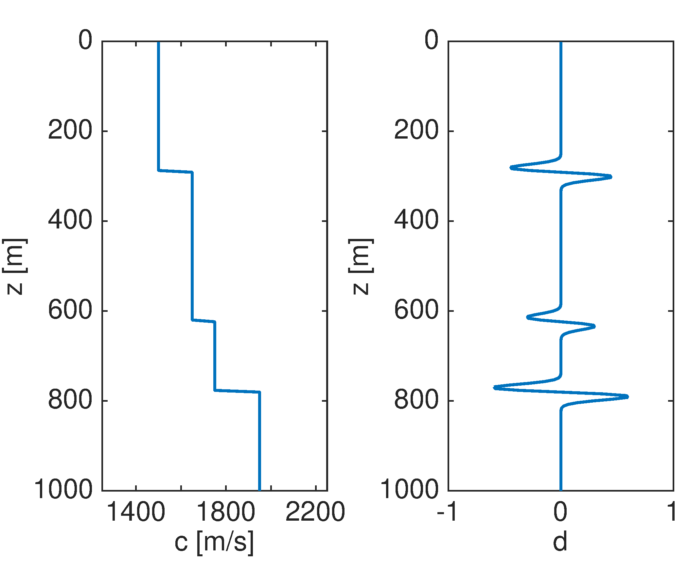
:::
::: {.column width="33%"}
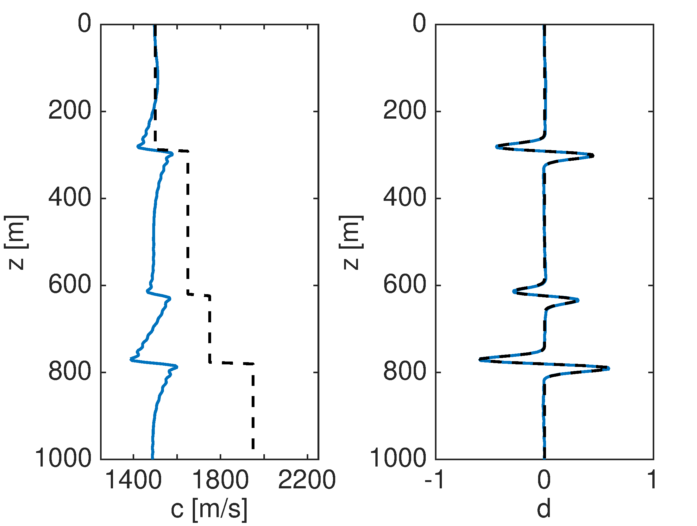
:::
::: {.column width="33%"}
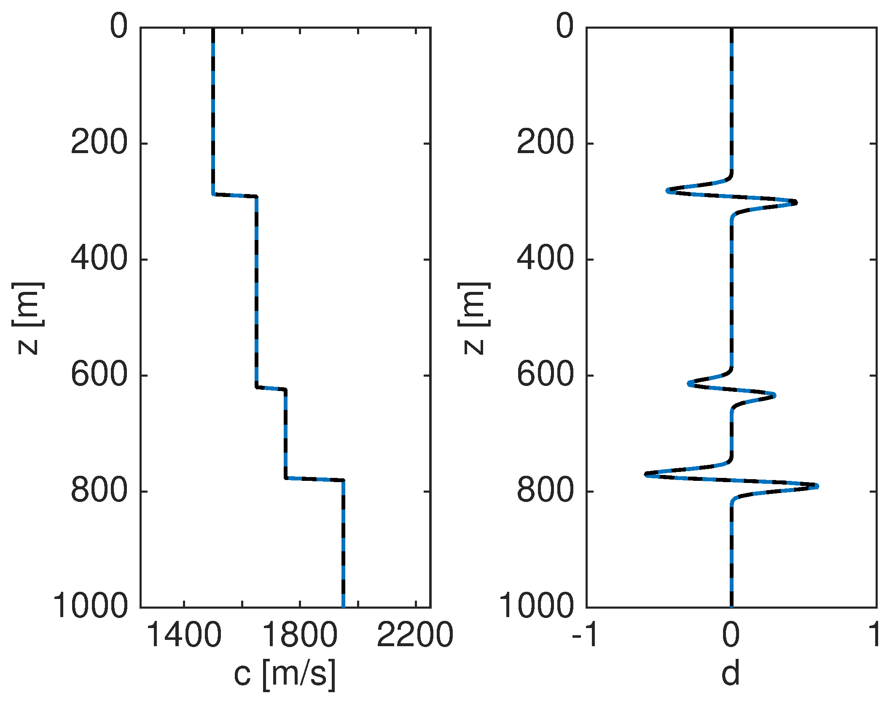
:::
::::

Recover 1D velocity $c(z)$ from band-pass filtered data $d = F(c)q$:

$$
\min_{c\geq c_0} \|F(c)q - d\|_2^2 \quad \text{subject to}\quad Dc\geq 0
$$

- **Bounds** ($c \geq c_0 = 1500\,\mathrm{m/s}$) + **monotonicity** ($Dc \geq 0$) recover broadband velocity from bandlimited data

::: aside
Adapted from @esser2018tvwri, Fig. 2.
:::

---

## Tikhonov regularization{.smaller}

:::: {.columns}
::: {.column width="40%"}
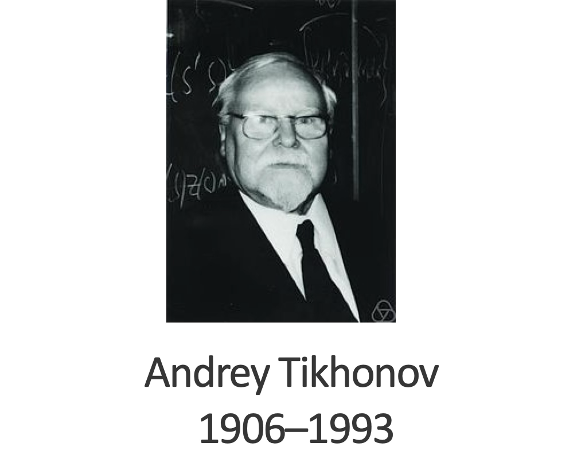{width=90%}
:::
::: {.column width="60%"}

$$
\min_{\mathbf{m}} f(\mathbf{m}) + \frac{\alpha}{2}\|R_1\mathbf{m}\|^2+ \frac{\beta}{2}\|R_2\mathbf{m}\|^2
$$

- [well-known & successful technique]{style="color: green;"}
- [is differentiable]{style="color: green;"}
- [not an exact penalty]{style="color: red;"}
- [regularization may adversely affect gradient & Hessian]{style="color: red;"}
- [requires non-trivial choices for hyper parameters]{style="color: red;"}
- [not easily extended to edge-preserving norms]{style="color: red;"}
- [no guarantees that all model iterates are regularized]{style="color: red;"}

:::
::::

---

## Regularization w/ constraints{.smaller}

:::: {.columns}
::: {.column width="40%"}
{width=90%}
:::
::: {.column width="60%"}

$$
\min_{\mathbf{m}} f(\mathbf{m})\quad\text{subject to}\quad \mathbf{m}\in \mathcal{C}_1\cap\mathcal{C}_2
$$

- [not well-known in our community]{style="color: red;"}
- [requires understanding of latest optimization techniques]{style="color: red;"}
- [does not affect gradient & Hessian]{style="color: green;"}
- [easier parameterization]{style="color: green;"}
- [able to uniquely project onto intersection of multiple constraint sets]{style="color: green;"}
- [constraints do not need to be differentiable]{style="color: green;"}
- [constraints are satisfied at every model iterate]{style="color: green;"}

:::
::::

---

## Proxy projection

Find model $\mathbf{m}$, closest to $\mathbf{x}$, such that it satisfies the constraints:

$$
\mathcal{P}_\mathcal{C}(\mathbf{x})=\arg\min_\mathbf{m}\|\mathbf{m}-\mathbf{x}\|_2^2\quad\text{subject to}\quad \mathbf{m}\in \mathcal{C}_1\cap\mathcal{C}_2
$$

yielding

- nonlinear "minimal complexity" best approximation of $\mathbf{m}$
- $\mathbf{m}\rightarrow \mathbf{x}$ when $\tau\rightarrow\tau_0=\mathrm{TV}(\mathbf{x})$ and $\mathbf{m}\in \mathrm{Box}$
- edge preserving

---

## Best approximations

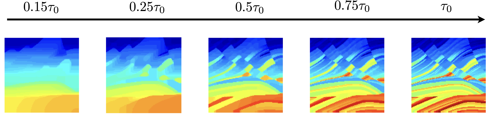{width=85%}

---

# Part I: Penalties vs. Constraints — Practical Aspects {background-color="#002855"}

Based on [@peters2017constraints] and [@esser2016salt]

---

## Total-variation norm — velocity blocking {.smaller}

The **total-variation** (TV) norm of a velocity model $\mathbf{m}$ [@Rudin1992]:

$$
\text{TV}(\mathbf{m}) = \frac{1}{h}\sum_{ij}\sqrt{({m}_{i+1,j}-{m}_{i,j})^2 + ({m}_{i,j+1}-m_{i,j})^2}
$$

. . .

Combined with **box constraints** ($l \leq m_{i,j} \leq u$), the projection:

$$
\min_{\mathbf{m}}\|\mathbf{m} - \mathbf{m}_\ast\|^2 \quad\text{subject to}\quad \mathbf{m}\in \text{Box} \text{ and } \text{TV}(\mathbf{m}) \leq \tau
$$

finds a unique **blocked velocity model** whose blockiness depends on $\tau$.

::: aside
@peters2017constraints
:::

---

## Projecting onto TV + Box constraints {.smaller}

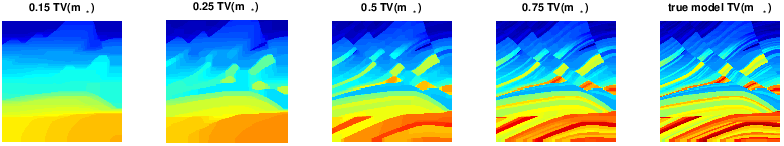{width=95%}

- As $\tau$ increases, the projected model is **less blocky** and **closer** to the original
- The parameter $\tau$ **predictably** controls model complexity

::: aside
@peters2017constraints, Fig. 1.
:::

---

## FWI with TV-like penalties {.smaller}

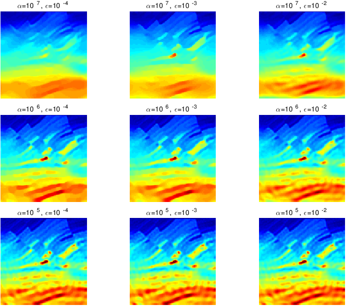{width=33%}

$$\min_{\mathbf{m}} f(\mathbf{m})+\alpha \text{TV}_{\epsilon}(\mathbf{m})$$

- Smooth approximation: $\text{TV}_{\epsilon}(\mathbf{m}) = \frac{1}{h}\sum_{ij}\sqrt{(m_{i+1,j}-m_{i,j})^2 + (m_{i,j+1}-m_{i,j})^2 + \epsilon^2}$
- No distinctive progression from "blocked" to less blocky
- **Unpredictable** behavior as a function of $\alpha$ and $\epsilon$

::: aside
@peters2017constraints, Fig. 2.
:::

---

## FWI with TV constraints — predictable {.smaller}

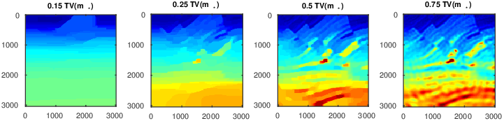{width=95%}

- **Predictable** progression from blocky to detailed as $\tau$ increases
- Only **one parameter** ($\tau$) to set — directly measurable from initial model
- Model iterates always satisfy constraints

::: aside
@peters2017constraints, Fig. 3.
:::

---

## Why constraints? {.smaller}

1. **Constraints translate prior information more directly than penalties**
   - $\tau$ is directly measurable from a starting model; trade-off parameter $\alpha$ is not

. . .

2. **Absence of user-specified weights**
   - Unique projections via Dykstra's algorithm [@Dykstra1983] — no weight selection needed
   - Constraints do not alter the objective (data misfit)

. . .

3. **Constraints are only activated when necessary**
   - If a proposed model satisfies all constraints, the projection does nothing
   - Data-fitting and constraint handling are **uncoupled**

. . .

4. **Constraints are satisfied at each iteration**
   - Penalty methods do not guarantee this — making them prone to local minima

::: aside
@peters2017constraints
:::

---

## Results on BP 2004 — bounds only vs. TV {.smaller data-transition="none"}

:::: {.columns}
::: {.column width="50%"}
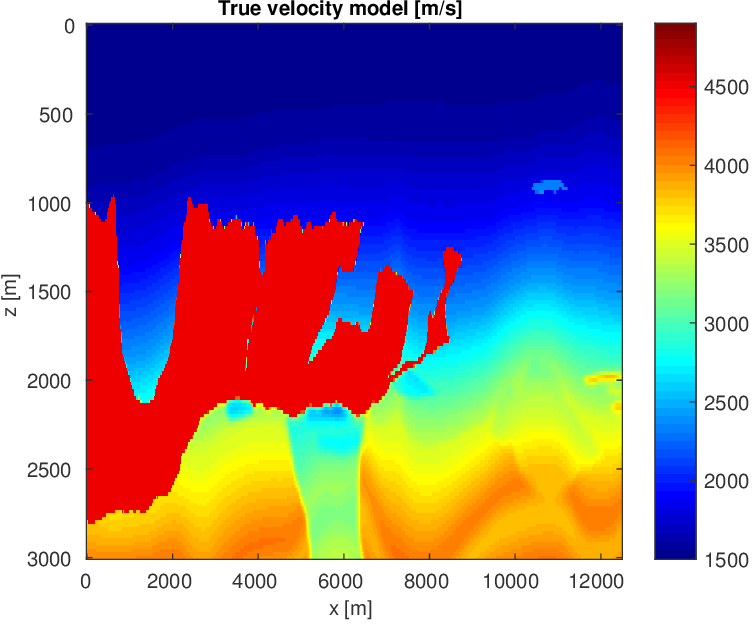

<!-- 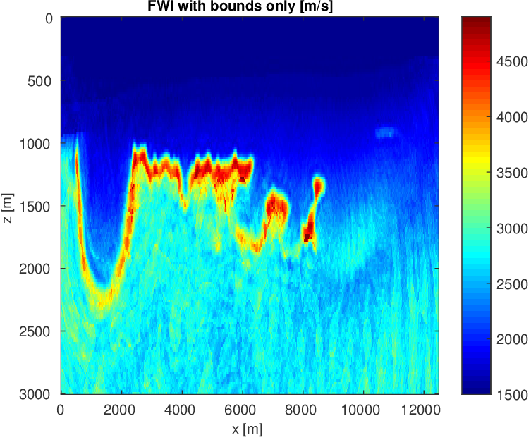 -->
:::
::: {.column width="50%"}
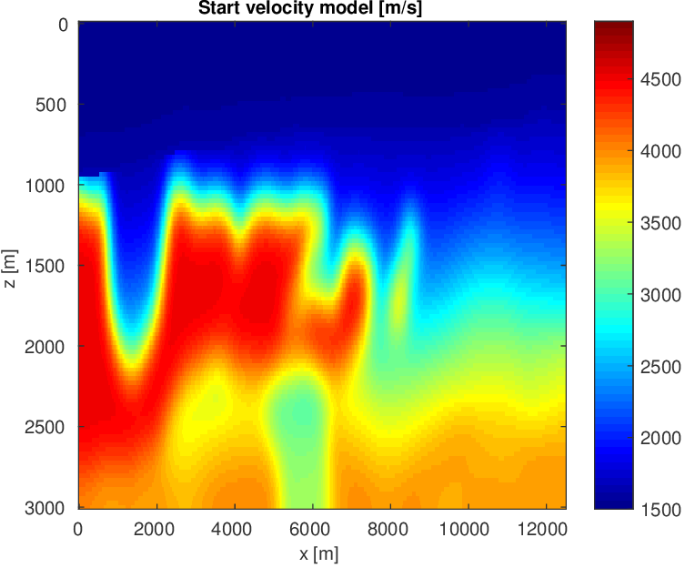

<!-- 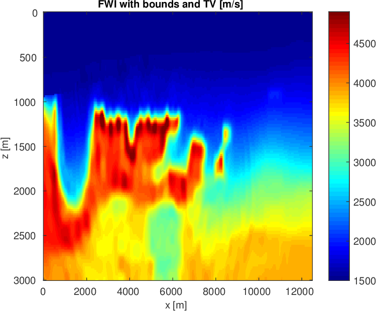 -->
:::
::::

::: aside
@peters2017constraints, Fig. 4. West part of BP 2004 model; 8 simultaneous sources.
:::

---

## Results on BP 2004 — bounds only vs. TV {.smaller data-transition="none"}

:::: {.columns}
::: {.column width="50%"}
<!--  -->

:::
::: {.column width="50%"}
<!--  -->

:::
::::

::: aside
@peters2017constraints, Fig. 4. West part of BP 2004 model; 8 simultaneous sources.
:::

---

## Algorithm — proj. gradient w/ Dykstra {.smaller}

:::{style="font-size: 0.85em;"}

| **Initialize**: define constraint sets (bounds, TV, others) |
|:---|
| **For** $k = 1, 2, \ldots$ |
| $\quad$ 1. Compute gradient $\nabla_\mathbf{m} f(\mathbf{m}_k)$ |
| $\quad$ 2. Gradient step: $\tilde{\mathbf{m}} = \mathbf{m}_k - \gamma\nabla_\mathbf{m} f(\mathbf{m}_k)$ |
| $\quad$ 3. Project: $\mathbf{m}_{k+1} = \text{DYKSTRA}(\tilde{\mathbf{m}})$ |
| **End** |

: Pseudo-code combining projected gradients with Dykstra's algorithm [@Dykstra1983] for intersection of constraints. {.striped}

:::

. . .

- Each model update depends only on the **current model and gradient**
- Updated models **satisfy all constraints** after each iteration
- Dykstra's algorithm is **parameter free** in practice

::: aside
@peters2017constraints, Algorithm 1.
:::

---

## Projection onto TV+Box — Marmousi {.smaller}

:::: {.columns}
::: {.column width="33%"}

:::
::: {.column width="33%"}

:::
::: {.column width="33%"}
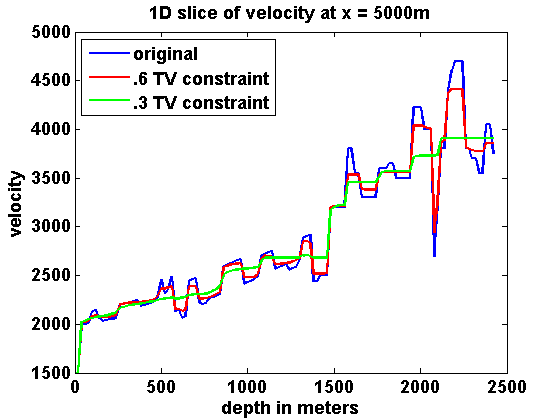
:::
::::

- Box: $v_{\min}=1500\,\mathrm{m/s}$, $v_{\max}=5500\,\mathrm{m/s}$
- Smaller $\tau$ $\Rightarrow$ fewer unconformities, more "cartoon-like"
- Relaxing constraint ($\tau\rightarrow\infty$) recovers original model

::: aside
Adapted from [@esser2016salt]
:::

---

## FWI stuck in a local minimum {.smaller}

:::: {.columns}
::: {.column width="33%"}
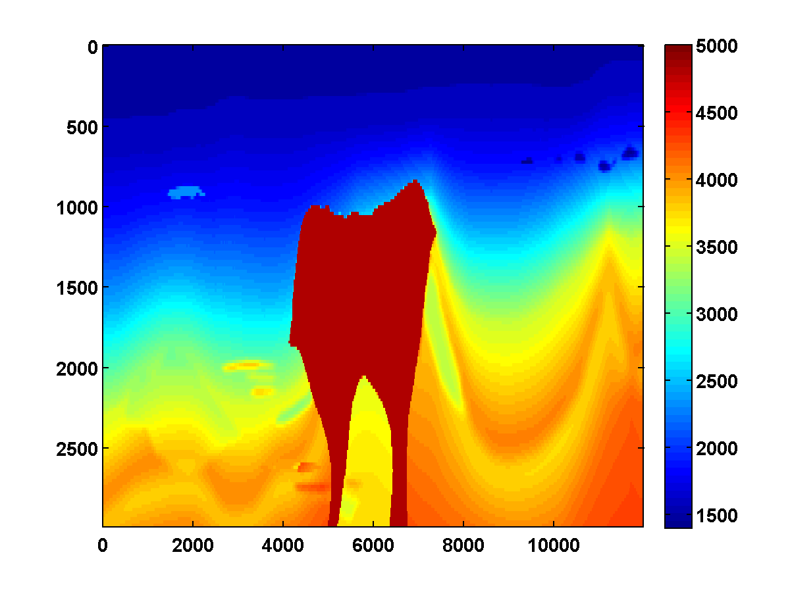
:::
::: {.column width="33%"}
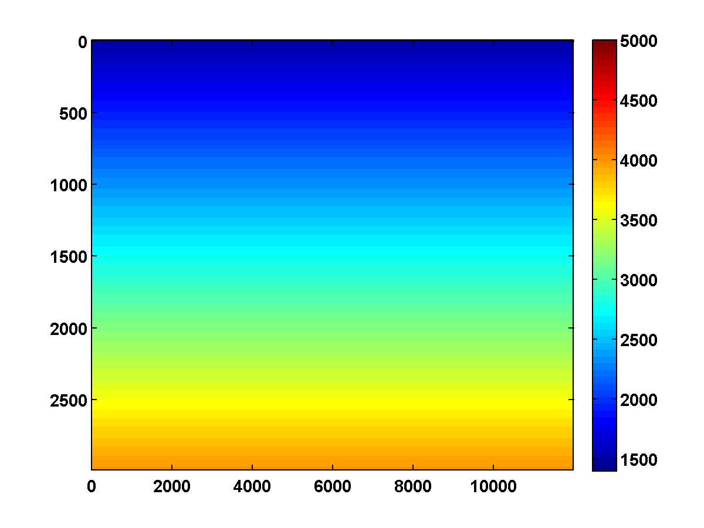
:::
::: {.column width="33%"}
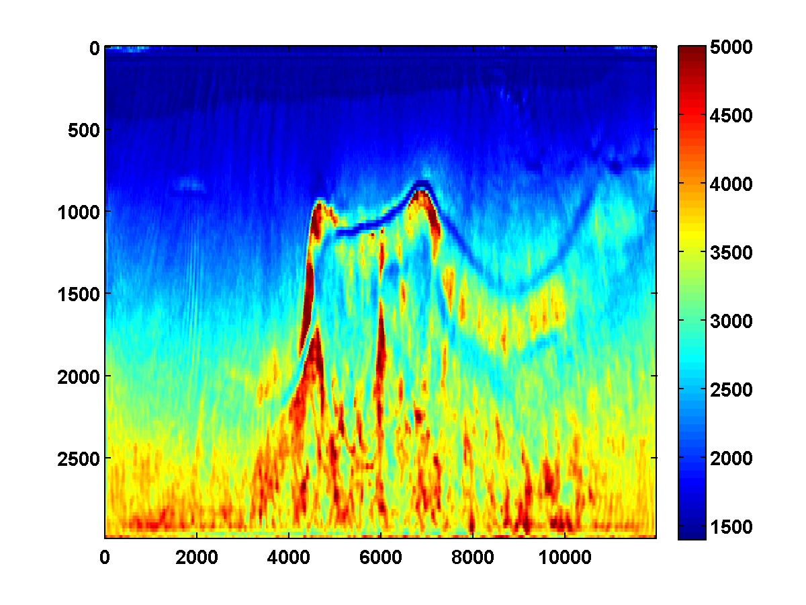
:::
::::

- Middle portion of BP 2004 model — FWI places a **velocity low** below top-of-salt
- Poor starting model + missing low frequencies + limited offsets
- FWI is **stuck** in an erroneous local minimum

::: aside
Adapted from [@esser2016salt]
:::

---

## Including constraints with projections {.smaller}

After including constraints, FWI solves [@esser2016salt]:

$$
\min_{\mathbf{m}}\Phi(\mathbf{m})\quad \text{subject to} \quad\mathbf{m}+\Delta\mathbf{m}\,\in\, \mathcal{C}
$$

At iteration $k$, constraints are imposed by projecting:

$$
\Pi_{\mathcal{C}}(\mathbf{m}^k)  = \arg\min_\mathbf{m} \frac{1}{2} \|\mathbf{m} - \mathbf{m}^k\|^2 \quad\text{subject to}\quad \mathbf{m}\,\in\,\mathcal{C}
$$

. . .

**Properties:**

- When $\mathcal{C}$ is **convex**, the projection is **unique**
- Intersections of convex sets are also convex
- Examples: **box constraints** (velocity bounds) and **TV-norm ball** ($\text{TV}(\mathbf{m}) \leq \tau$)

---

## The hinge loss — a constraint for salt {.smaller}

**Key insight**: In sedimentary basins, velocity generally **increases with depth**. Salt bodies are high-velocity inclusions — we can step *into* salt but should not easily step *out*.

. . .

The **asymmetric (one-sided) TV constraint** [@esser2016salt]:

$$
\|\min(0, D_z \mathbf{m})\|_1 \leq \xi
$$

- $D_z$ = vertical finite differences
- Small $\xi$: allow velocity to **step into** salt, discourage stepping **out**
- Relaxing $\xi$: gradually allows velocity lows to build up below salt

. . .

This is the **hinge loss** applied to vertical velocity differences — commonly used in machine learning for SVMs.

---

## Multiple relaxed FWI cycles {.smaller}

:::: {.columns}
::: {.column width="25%"}
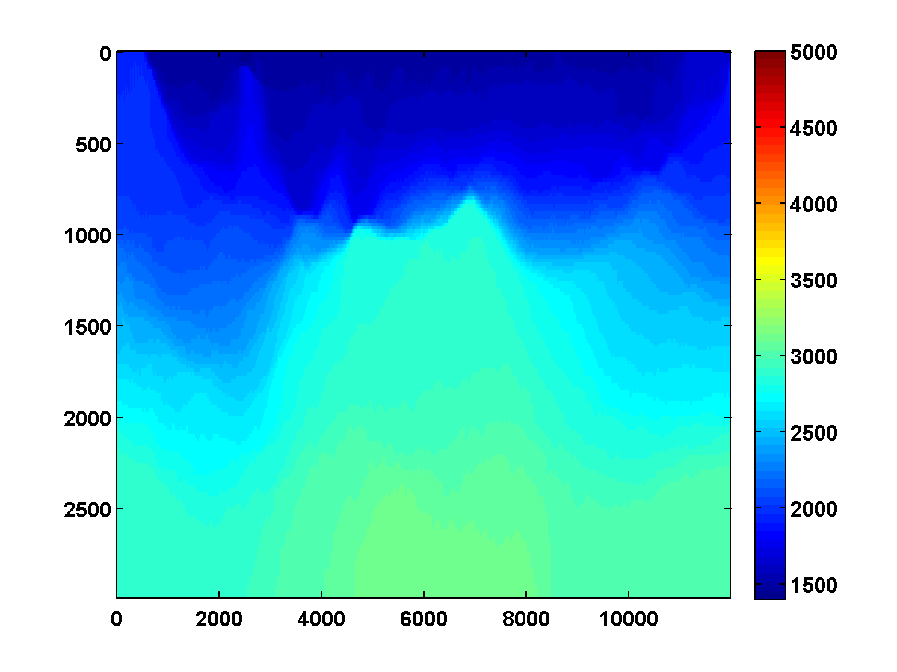
:::
::: {.column width="25%"}
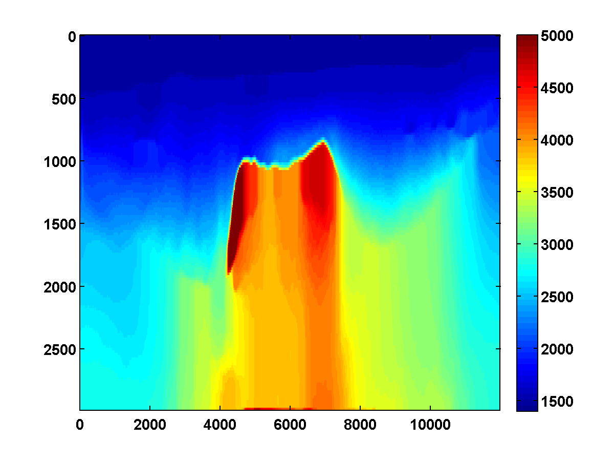
:::
::: {.column width="25%"}
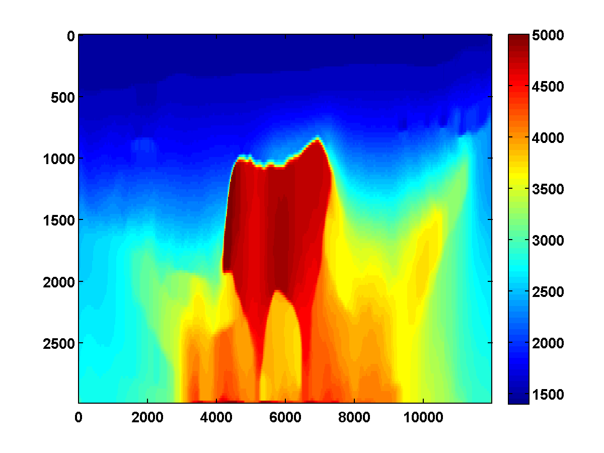
:::
::: {.column width="25%"}
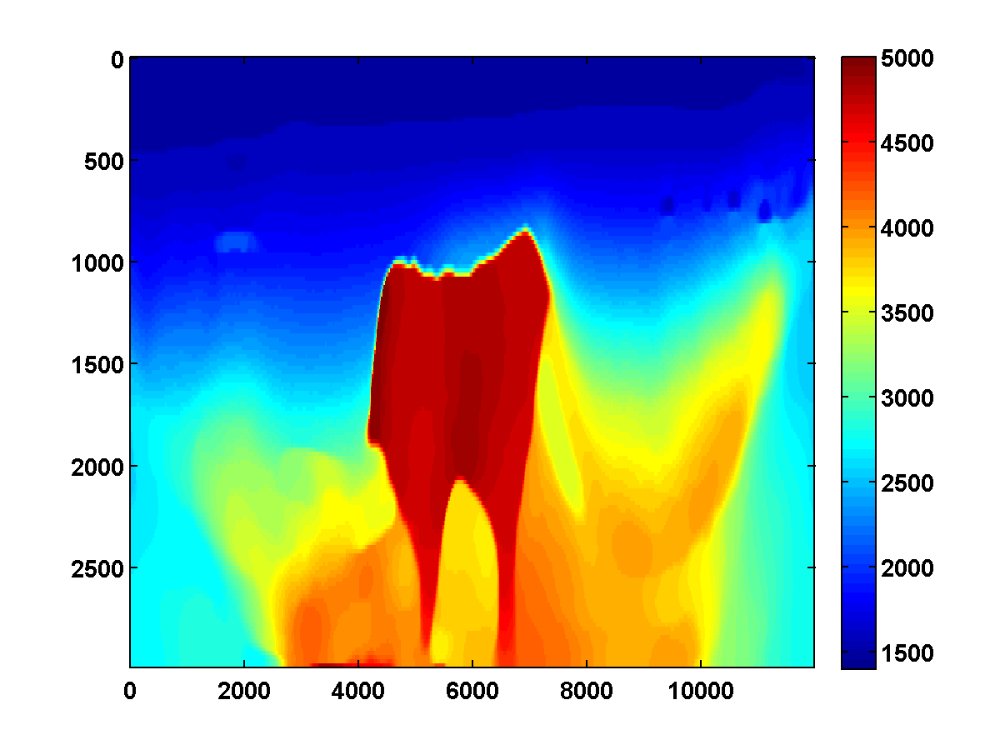
:::
::::

- Fixed box ($v_{\min}=1500$, $v_{\max}=5000\,\mathrm{m/s}$) and TV ($\tau=0.9\times \tau_{\text{true}}$)
- Gradually relax hinge-loss $\xi$ over warm-started FWI cycles
- Salt body is **remarkably well recovered**

::: aside
Adapted from [@esser2016salt]. Snapshots show half of the continuation steps.
:::

---

## Why this automatic approach works {.smaller}

The constrained approach succeeds when:

1. Relaxed constraints **mitigate** adverse effects of local minima from prior cycles
2. Sharp reflectors of **correct sign** are introduced
3. **Progress** is made during each FWI cycle
4. "Fine-scales" of previous cycle contribute to "coarse-scales" of next cycle

. . .

**Conceptual similarity to manual workflows:**

| Stage | Manual Workflow | Constrained FWI |
|-------|----------------|-----------------|
| 1 | Pick top salt | TV + hinge-loss delineates top salt |
| 2 | Salt flood downward | Hinge-loss allows buildup into salt |
| 3 | Pick bottom salt + tomography | Relaxed hinge-loss allows velocity lows |
| 4 | Iterate | Warm-started cycles |

::: aside
@esser2016salt
:::

---

# Part II: Constraints — Theory {background-color="#002855"}

Based on [@peters2019projection]

---

## Limitations of unconstrained regularization {.smaller}

**Quadratic (Tikhonov) penalties** [@peters2019projection]:

$$
\phi(\mathbf{m}) = f(\mathbf{m}) + \frac{\alpha_1}{2}\|R_1\mathbf{m}\|_2^2 + \frac{\alpha_2}{2}\|R_2\mathbf{m}\|_2^2
$$

. . .

**Problems:**

- Penalties **alter gradient and Hessian**: $\nabla^2_\mathbf{m} \phi = \nabla^2_\mathbf{m} f + \alpha_1 R_1^\top R_1 + \alpha_2 R_2^\top R_2$
- Trade-off parameters $\alpha_i$ have **no physical meaning** and are **interdependent** with data misfit
- Cannot directly encode **non-smooth** priors (TV norm, monotonicity)
- **Gradient filtering** $\mathbf{m}^{k+1} = \mathbf{m}^k - \gamma\, s(\nabla_\mathbf{m} f)$ — no theoretical guarantees

---

## Convex sets — definition and properties {.smaller}

A set $\mathcal{C}$ is **convex** if for all $\mathbf{x}, \mathbf{y} \in \mathcal{C}$ and $0 \leq c \leq 1$:

$$
c\mathbf{x} + (1-c)\mathbf{y} \in \mathcal{C}
$$

. . .

**Key properties:**

- **Intersection** of convex sets is convex
- **Projection** onto a convex set is **unique**
- Projections are **non-expansive**: $\|\mathcal{P}_\mathcal{C}(\mathbf{x}) - \mathcal{P}_\mathcal{C}(\mathbf{y})\| \leq \|\mathbf{x} - \mathbf{y}\|$

. . .

**Advantages of the constrained formulation** $\min_\mathbf{m} f(\mathbf{m})\;\text{s.t.}\;\mathbf{m}\in\bigcap_{i=1}^p \mathcal{C}_i$:

- Objective (data misfit) is **unchanged** — gradient/Hessian unaffected
- Constraints in **physical units** (m/s, m/s per grid) — not abstract weights
- Model iterates **feasible at every iteration**
- Multiple constraints handled **without trade-off parameters**

::: aside
@peters2019projection
:::

---

## POCS vs. Dykstra's algorithm {.smaller}

To project onto the **intersection** of convex sets $\mathcal{C} = \bigcap_{i=1}^p \mathcal{C}_i$:

. . .

**POCS** (Projection Onto Convex Sets): alternate projections $\mathcal{P}_{\mathcal{C}_2}(\mathcal{P}_{\mathcal{C}_1}(\mathbf{m}))$

- Finds a **feasible point** — but NOT the closest one
- Result is **order-dependent** (non-unique)

. . .

**Dykstra's algorithm** [@Dykstra1983]: alternate projections with auxiliary corrections

- Finds the **unique Euclidean projection** onto the intersection
- Result is **order-independent**
- **No tuning parameters**

---

## POCS vs. Dykstra — toy example {.smaller}

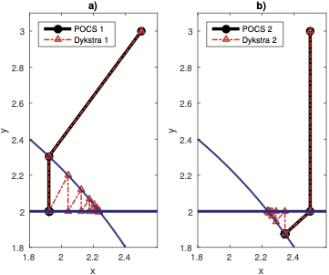{width=45%}

- POCS: distances 1.16 and 1.14 (order-dependent)
- **Dykstra**: distance **1.03** (unique minimum)

::: aside
@peters2019projection, Fig. 1.
:::

---

## Dykstra vs. POCS on Marmousi {.smaller data-transition="none"}

:::: {.columns}
::: {.column width="50%"}
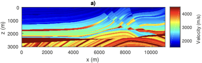

:::
::: {.column width="50%"}
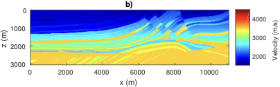

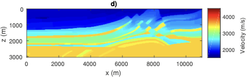
:::
::::

- Dykstra finds the **boundary projection** (closest to original)
- POCS may find **interior points** far from the boundary — over-constraining the model

::: aside
@peters2019projection, Fig. 2.
:::

---

## Impact on FWI — Dykstra vs. POCS {.smaller data-transition="none"}

![FWI with an incorrect source function with projections (with Dykstra’s algorithm) and FWI with two feasible points (with POCS) for various TV balls (as a percentage of the TV of the true model) and bound constraints. Also shown are the differences (the rightmost two columns) between results. The results show that using POCS inside a projected gradient algorithm instead of the projection leads to different results that also depend on the order in which we provide the sets to POCS. This example illustrates the differences between the methods, and it is not its intention to obtain excellent FWI results.](figures/pocsdyk.png)

@peters2019projection, Fig. 3.

---

## Projected gradient descent {.smaller}

:::: {.columns}
::: {.column width="50%"}
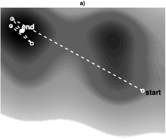
:::
::: {.column width="50%"}
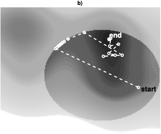
:::
::::

**Update rule:**

$$
\mathbf{m}^{k+1} = \mathcal{P}_\mathcal{C}\!\left(\mathbf{m}^k - \gamma\nabla_\mathbf{m} f(\mathbf{m}^k)\right)
$$

- Gradient step followed by projection onto $\mathcal{C}$
- Constraints **guide** optimization to different (better) local minimum

::: aside
@peters2019projection, Fig. 4.
:::

---

## Spectral Projected Gradient (SPG) {.smaller}

Three key improvements over standard projected gradient [@Birgin2000]:

. . .

1. **Spectral stepsize** $\alpha$ — mimics Hessian via Barzilai-Borwein [@Barzilai1988]:
   $$\alpha = \frac{\mathbf{s}_k^\top \mathbf{s}_k}{\mathbf{s}_k^\top \mathbf{y}_k}$$
   where $\mathbf{s}_k = \mathbf{m}^{k+1} - \mathbf{m}^k$ and $\mathbf{y}_k = \nabla f(\mathbf{m}^{k+1}) - \nabla f(\mathbf{m}^k)$

. . .

2. **Non-monotone line search** — allows temporary objective increase; reduces zigzagging

. . .

3. **Single projection per iteration** — update direction $\mathbf{p}^k = \mathcal{P}_\mathcal{C}(\mathbf{m}^k - \alpha\nabla f(\mathbf{m}^k)) - \mathbf{m}^k$; line search scales $\gamma$ only

::: aside
@peters2019projection
:::

---

## The 3-level nested optimization workflow {.smaller}

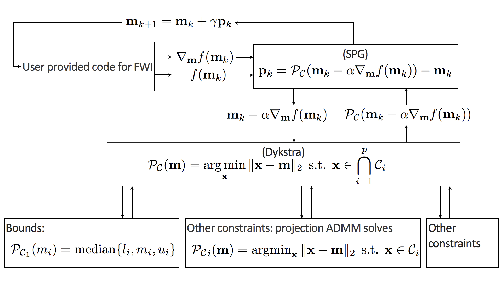{width=50%}

| Level | Method | Role |
|-------|--------|------|
| Top | **SPG** | Nonlinear optimization (data misfit) |
| Middle | **Dykstra** | Project onto intersection of constraints |
| Bottom | **ADMM** / closed-form | Individual set projections |

Each level is **parameter-free** by design.

::: aside
@peters2019projection, Fig. 5.
:::

---

## SPG w/ multiple constraints — Algorithm {.smaller}

:::{style="font-size: 0.75em;"}

| **Input**: projectors $\mathcal{P}_{\mathcal{C}_1}, \ldots, \mathcal{P}_{\mathcal{C}_p}$; initial $\mathbf{m}^0 \in \bigcap \mathcal{C}_i$ |
|:---|
| **Initialize**: $M$ (line-search history), $\eta \in (0,1)$, spectral step $\alpha$, $k=1$ |
| **Repeat**: |
| $\quad$ 1. Compute $f(\mathbf{m}^k)$ and $\nabla_\mathbf{m} f(\mathbf{m}^k)$ |
| $\quad$ 2. $\mathbf{r}^k = \text{DYKSTRA}(\mathbf{m}^k - \alpha\nabla f(\mathbf{m}^k),\; \mathcal{P}_{\mathcal{C}_1}, \ldots, \mathcal{P}_{\mathcal{C}_p})$ |
| $\quad$ 3. $\mathbf{p}^k = \mathbf{r}^k - \mathbf{m}^k$ |
| $\quad$ 4. **Line search**: find $\gamma$ s.t. $f(\mathbf{m}^k + \gamma\mathbf{p}^k) < \max(f_{k}, \ldots, f_{k-M}) + \epsilon\gamma\nabla f^\top \mathbf{p}^k$ |
| $\quad$ 5. $\mathbf{m}^{k+1} = \mathbf{m}^k + \gamma\mathbf{p}^k$ |
| $\quad$ 6. Update spectral step: $\alpha = \frac{\mathbf{s}_k^\top\mathbf{s}_k}{\mathbf{s}_k^\top\mathbf{y}_k}$ |
| **Until** convergence |

: Algorithm 1: Spectral Projected Gradient w/ Dykstra [@peters2019projection]. {.striped}

:::

---

## Numerical example — BG Compass model {.smaller}

:::: {.columns}
::: {.column width="50%"}
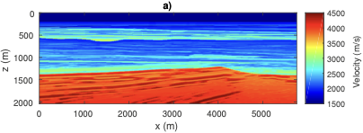
:::
::: {.column width="50%"}
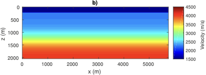
:::
::::

- 2D BG Compass model with realistic velocity "kickback"
- 56 sources/receivers, frequency-domain inversion 3--15 Hz
- Challenging: poor starting model, physics mismatch

::: aside
@peters2019projection, Fig. 6.
:::

---

## Bounds only — insufficient {.smaller}

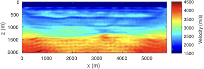{width=70%}

- Only top 700 m recovered reasonably
- Discontinuity at **wrong depth and shape**
- Bounds alone cannot prevent erroneous velocity structures

::: aside
@peters2019projection, Fig. 7.
:::

---

## Adding structure-promoting constraints {.smaller}

:::: {.columns}
::: {.column width="50%"}
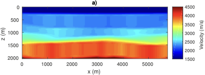

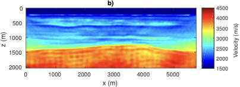
:::
::: {.column width="50%"}
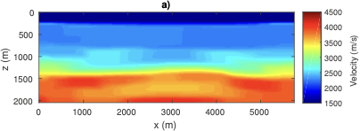

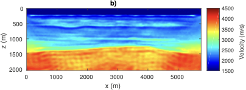
:::
::::

- **Two-cycle strategy**: strong constraints at low frequencies, relax at higher frequencies
- Both slope and TV constraints dramatically improve results

::: aside
@peters2019projection, Figs. 8--9.
:::

---

## Comparison with quadratic penalties {.smaller}

:::: {.columns}
::: {.column width="50%"}
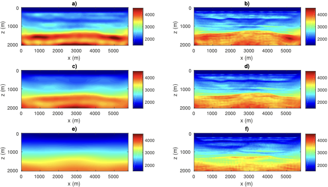{width=100%}
:::
::: {.column width="50%"}
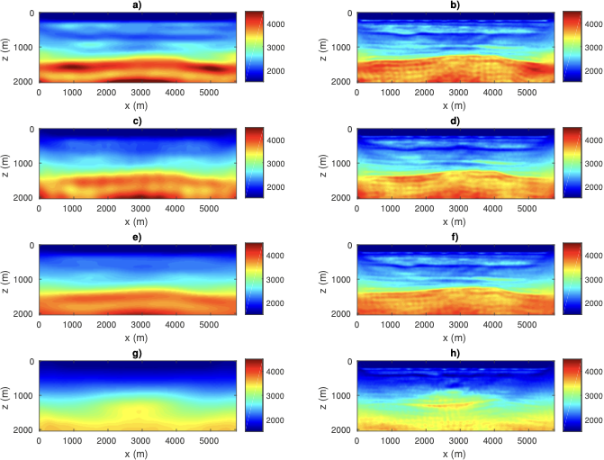{width=100%}
:::
::::

- Cannot directly encode **monotonicity** with quadratic penalties
- Parameters **lack physical meaning** and are **interdependent**
- Easy to over- or under-estimate $\Rightarrow$ many results contain artifacts

::: aside
@peters2019projection, Figs. 11--12.
:::

---

# Part III: Application to Salt {background-color="#002855"}

Based on [@esser2018tvwri] and [@esser2016salt]

---

## Constrained WRI formulation {.smaller}

The full framework combines **three constraints** with the WRI objective [@esser2018tvwri]:

$$
\min_m f(m) \quad \text{subject to} \quad m_i \in [b_i, B_i],\; \|m\|_{TV} \leq \tau,\; \|\max(0, D_z m)\|_1 \leq \xi
$$

. . .

| Constraint | Role | Parameter |
|------------|------|-----------|
| **Box** | Physical velocity bounds | $v_{\min}, v_{\max}$ |
| **TV norm** | Edge preservation, denoising | $\tau$ |
| **Hinge loss** | Discourage velocity decrease with depth | $\xi$ |

. . .

**Continuation strategy**: gradually relax $\xi$ over warm-started cycles while keeping box and TV fixed.

---

## Marmousi projections {.smaller}

:::: {.columns}
::: {.column width="30%"}
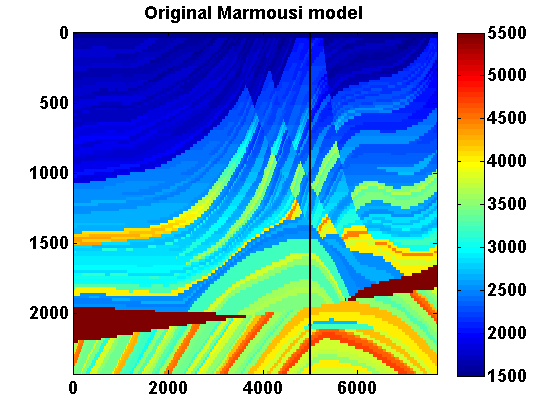
:::
::: {.column width="30%"}
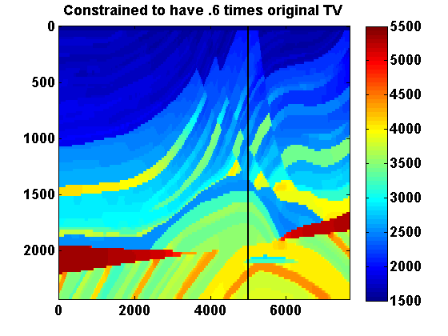
:::
::: {.column width="30%"}
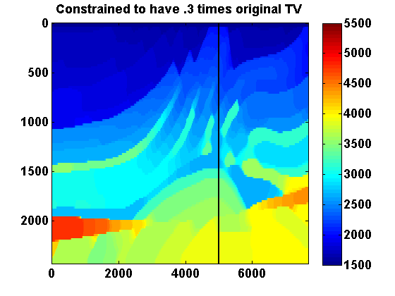
:::
::::

:::: {.columns}
::: {.column width="30%"}
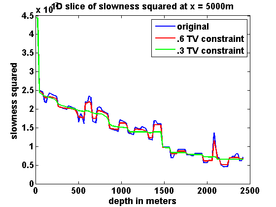
:::
::: {.column width="30%"}

:::
::::

::: aside
@esser2018tvwri, Figs. 3--4.
:::

---

## BP 2004 — poor starting model, no TV {.smaller}

:::: {.columns}
::: {.column width="33%"}

:::
::: {.column width="33%"}
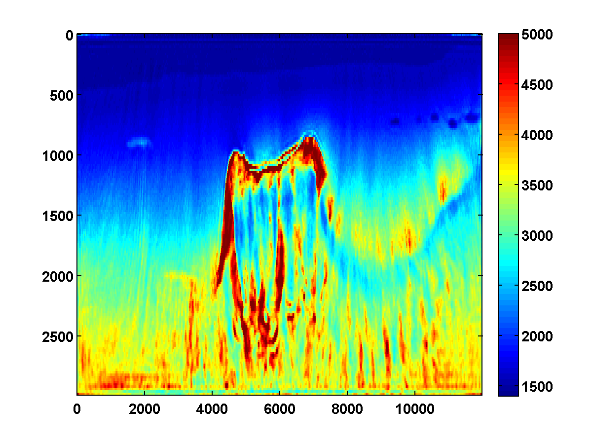
:::
::: {.column width="33%"}
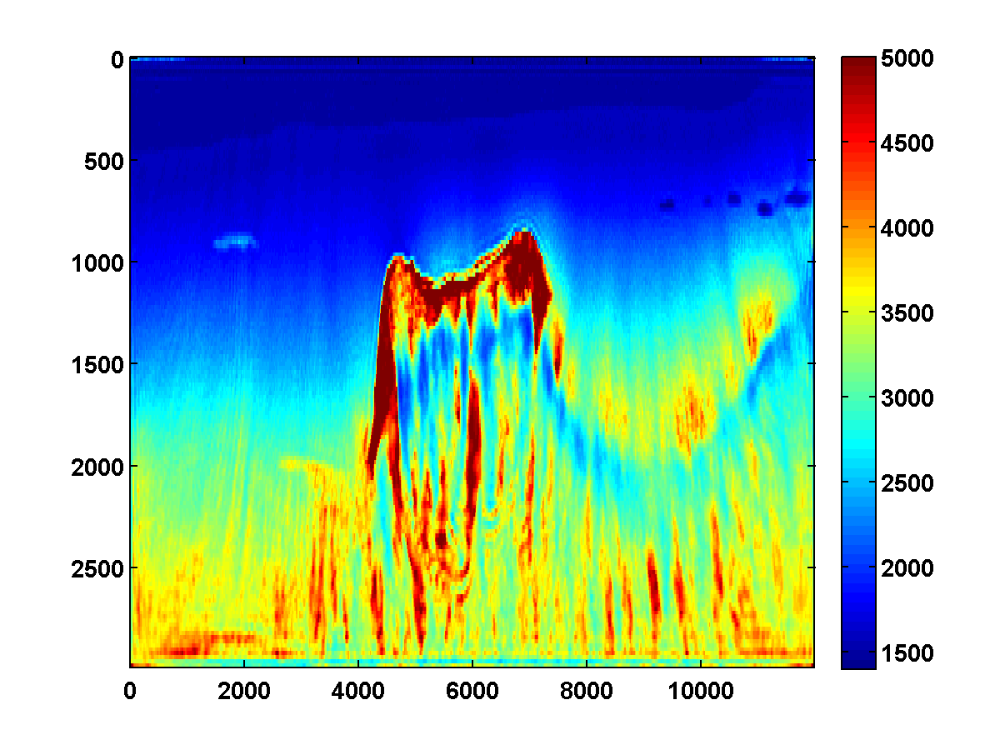
:::
::::

- WRI with **box constraints only** — noisy result, no improvement after multiple passes
- Velocity low after stepping into salt is **persistent** and cannot be overcome

::: aside
@esser2018tvwri, Fig. 6.
:::

---

## BP 2004 — TV constraints insufficient {.smaller}

:::: {.columns}
::: {.column width="33%"}
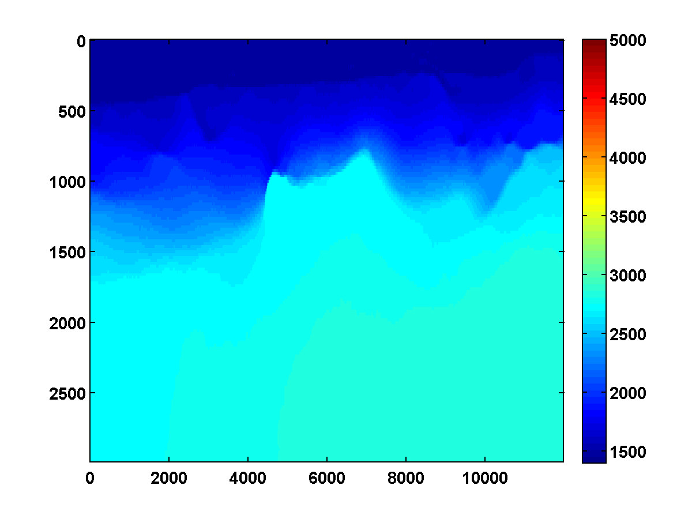
:::
::: {.column width="33%"}
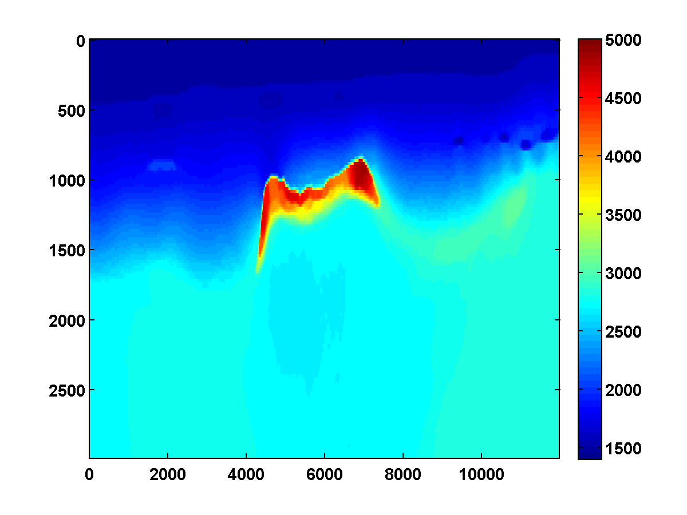
:::
::: {.column width="33%"}
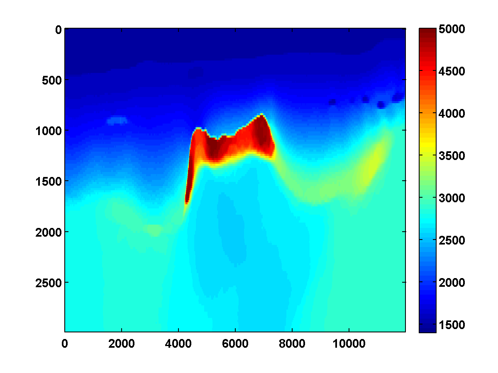
:::
::::

- TV + box constraints recover **top salt** accurately
- But imprint of velocity low is **still too strong** — stuck at poor solution
- Motivates the need for the **asymmetric hinge-loss** constraint

::: aside
@esser2018tvwri, Fig. 7.
:::

---

## The hinge-loss constraint for salt {.smaller}

Asymmetric one-sided TV constraint in the vertical direction [@esser2018tvwri]:

$$
\|\max(0, D_z m)\|_1 \leq \xi
$$

. . .

**Physical interpretation:**

- Penalizes the sum of **positive vertical differences** in slowness squared (= negative velocity jumps)
- Small $\xi$: velocity can **step into** high-velocity salt but **cannot easily step out**
- Large $\xi$: allows velocity lows to build up below salt

. . .

**Continuation strategy:**

- Start with small $\xi$ (nearly monotonic velocity increase)
- Gradually increase $\xi$ over successive warm-started passes
- Sequence: $\frac{\xi}{\xi_{\text{true}}} = .01,\, .05,\, .10,\, .15,\, .20,\, .25,\, .40,\, .90$

---

## WRI + TV + Hinge-loss continuation {.smaller}

:::: {.columns}
::: {.column width="25%"}
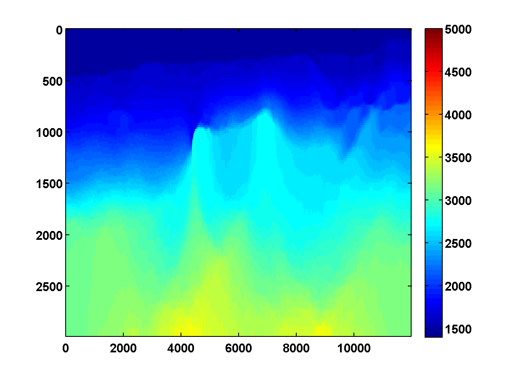
:::
::: {.column width="25%"}
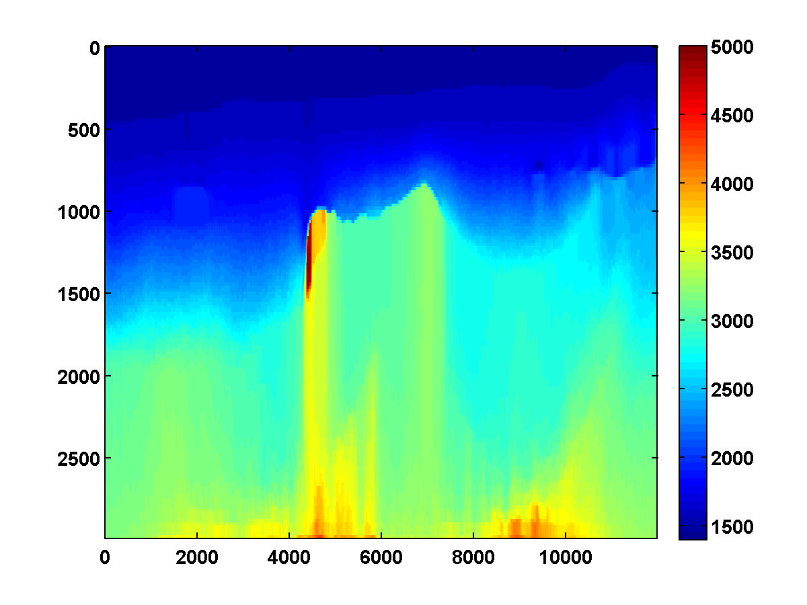
:::
::: {.column width="25%"}

:::
::: {.column width="25%"}

:::
::::

:::: {.columns}
::: {.column width="25%"}

:::
::: {.column width="25%"}

:::
::: {.column width="25%"}

:::
::: {.column width="25%"}

:::
::::

::: aside
@esser2018tvwri, Fig. 8. TV fixed at $\tau = 0.9\tau_{\text{true}}$; box: $1500$--$5000\,\mathrm{m/s}$.
:::

---

## Constrained FWI (adjoint state) {.smaller}

:::: {.columns}
::: {.column width="25%"}

:::
::: {.column width="25%"}

:::
::: {.column width="25%"}

:::
::: {.column width="25%"}

:::
::::

- Same continuation strategy applied to **conventional FWI** (adjoint-state method)
- Results nearly as good as WRI — constraints are the key ingredient

::: aside
@esser2018tvwri, Fig. 9.
:::

---

## Data and model error evolution {.smaller}

:::: {.columns}
::: {.column width="50%"}
{width=50%}

<!--  -->
:::
::: {.column width="50%"}
{width=50%}

<!--  -->
:::
::::

- Both WRI and FWI: model error **continues to decrease** with constraint relaxation
- Sudden drops correspond to relaxation passes; increases correspond to higher frequencies

::: aside
@esser2018tvwri, Figs. 10.
:::

---

## Data and model error evolution {.smaller}

:::: {.columns}
::: {.column width="33%"}
<!--  -->

:::
::: {.column width="33%"}

<!--  -->

:::
::::

- Both WRI and FWI: model error **continues to decrease** with constraint relaxation
- Sudden drops correspond to relaxation passes; increases correspond to higher frequencies

::: aside
@esser2018tvwri, Figs. 10.
:::

---

## Unconstrained vs. constrained WRI {.smaller}

:::: {.columns}
::: {.column width="50%"}
**Unconstrained WRI**


:::
::: {.column width="50%"}
**WRI + TV + Hinge loss**


:::
::::

- Left: unconstrained WRI gets stuck in local minimum
- Right: constrained WRI successfully recovers salt body

---

## WRI + TV + Hinge vs. Adjoint + TV + Hinge {.smaller}

:::: {.columns}
::: {.column width="50%"}
**WRI + TV + Hinge loss**


:::
::: {.column width="50%"}
**Adjoint state + TV + Hinge loss**


:::
::::

- Both approaches successfully recover salt from poor starting model
- WRI achieves lower model error; adjoint state also produces excellent results

---

## SEAM model — setup {.smaller}

:::: {.columns}
::: {.column width="33%"}

:::
::: {.column width="33%"}

:::
::: {.column width="33%"}

:::
::::

- Phase I SEAM model [@SEAM2010]: rugose top salt, steep sides, complicated base
- 96 sources, 196 receivers, 8000 m spread; 3--12 Hz bandwidth
- Starting model: 1D compaction trend — **no salt present**
- Unconstrained FWI fails catastrophically

::: aside
Adapted from [@esser2016salt]
:::

---

## SEAM — constrained FWI result {.smaller}

:::: {.columns}
::: {.column width="60%"}

:::
::: {.column width="40%"}

**Recovered features:**

- Rugose top salt boundary
- Uniform salt interior
- Correct depth/geometry of bottom salt
- Salt flanks
- Sub-salt velocity structure

**No assumptions about salt velocity** — recovered directly from data.

:::
::::

::: aside
[@esser2016salt]
:::

---

## SEAM — evolution {.smaller}

:::: {.columns}
::: {.column width="45%"}
{width=80%}

{width=80%}
:::
::: {.column width="45%"}
{width=80%}

{width=80%}
:::
::::

::: aside
@esser2016salt. Progressive relaxation of hinge-loss constraint.
:::

---

## SEAM model — movie {.smaller .center}


Evolution of the model as the inversion proceeds and constraints are relaxed. Initially, strong constraints introduce a salt-like body extending to bottom. As constraints relax, salt geometry develops and sub-salt structure appears.

---

## In memoriam {.smaller}

:::: {.columns}
::: {.column width="30%"}
{width=100%}
:::
::: {.column width="70%"}

> **John "Ernie" Esser$^\dagger$ (May 19, 1980 -- March 8, 2015)**

*The work presented in this lecture is in large part a tribute to Ernie Esser, who passed away in tragic circumstances. He was a young and very promising scientist whose contributions to constrained optimization for seismic inversion remain foundational.*

*To our knowledge, Ernie's work is the first successful attempt to replace labour-intensive manual salt-flooding workflows with an automatic heuristic: successive relaxations of asymmetric TV-norm constraints with warm-started passes through frequency batches.* [@esser2018tvwri]

:::
::::

---

## Summary {.smaller}

- **Penalties vs. constraints**: constraints are more predictable, require fewer parameters, and guarantee feasibility at every iterate

. . .

- **Key ingredients**: box constraints (physical bounds), TV norm (edge preservation), hinge loss (asymmetric salt constraint)

. . .

- **Algorithms**: Dykstra's algorithm for projections onto intersections; SPG for nonlinear optimization; 3-level nested workflow

. . .

- **Results**: automatic salt flooding from poor starting models on BP 2004 and SEAM benchmarks — replacing labor-intensive manual workflows

. . .

- **Both WRI and FWI** benefit from the constrained framework

---

## References
